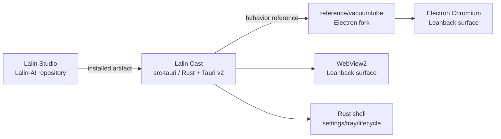

# ADR-001 — Lalin Cast Rust + Tauri v2 Port

## Decision status

**APPROVED FOR LOCAL TAURI P0 IMPLEMENTATION AND DIAL COMPATIBILITY SLICE.** ผู้ใช้สั่งเดินหน้าหลังจาก
review ความเป็นไปได้ของการ port VacuumTube มาเป็น Rust + Tauri v2 วันที่
2026-09-19 การอนุมัตินี้ครอบคลุมเฉพาะ candidate shell, remote WebView,
User-Agent compatibility, single-instance, settings boundary และ local DIAL
discovery/bridge; numeric TV-code pairing is now user-confirmed in the current
debug runtime, but this is still not production, packaged-app or clean-VM
acceptance

Complexity: **C-3**. Risk: **HIGH** (WebView2 compatibility, upstream endpoint,
network filtering, account state และ device discovery).

## Context

- `reference/vacuumtube` มี VacuumTube v1.8.2 fork สำหรับเป็น Electron fallback
  และมี provenance/launch contract อยู่แล้ว
- VacuumTube เป็น Electron wrapper ของ official YouTube Leanback surface ไม่ใช่
  custom YouTube client
- ผู้ใช้ต้องการสกัด feature หลักมาใช้กับ Rust + Tauri v2 เพื่อลด Electron shell
  และรักษาขอบเขต Lalin Cast เป็นแอปแยกจาก Studio
- Tauri v2 รองรับ remote WebView URL, per-window User-Agent, initialization
  script, native plugins, tray และ Rust commands/events; ความสามารถเหล่านี้ยัง
  ต้องพิสูจน์กับ YouTube Leanback บน Windows WebView2 จริง

## Decision

สร้าง `src-tauri` เป็น Tauri v2 runtime ของ Lalin Cast แยกจากทั้ง Lalin Studio และ
Electron fallback โดยให้ Rust เป็น owner ของ native shell และให้ WebView โหลด
official Leanback surface โดยตรง

The Electron fork remains the behavior reference and rollback path. No current
Play owner is replaced by this candidate.

## Feature extraction matrix

| VacuumTube capability | Tauri target | Local slice | Gate |
|---|---|---|---|
| Electron window/lifecycle | Rust `WebviewWindowBuilder` and Tauri run loop | port now | `cargo check` + Windows GUI smoke |
| Leanback URL | remote WebView2 URL | port now | endpoint loads and actual URL is recorded |
| Leanback User-Agent | Tauri WebView User-Agent | port now | compare request/navigation behavior with Electron |
| fullscreen, focus, close, single instance | Tauri window API + single-instance plugin | port now | reopen/focus/close lifecycle |
| settings persistence | Tauri store boundary | port now as best-effort shell preference seed | load/save without credentials; unavailable store must not block launch |
| controller (Gamepad API) | initialization script (`injected.js` `controller` section), ported from VacuumTube `util/controller.js`/`modules/controller-support.js` | wave 3 local slice implemented — see `docs/plans/W3_CONTROLS_PLAN.md` | keyCode map matches upstream verbatim (verifier diff against the pinned reference) plus real Xbox/DualSense controller evidence (human gate H8) |
| keyboard extras / keybinds | initialization script (`injected.js` `keybinds`/`volume`/`pauseOnBlur` sections) — `Ctrl+O`, `F11`, `Shift+Enter`, right-click back, `+`/`-`/`M` volume with OSD, `C` captions, `Ctrl+Shift+C` copy-URL, pause-on-blur, ported from VacuumTube `keybinds.js`/`mouse.js`/`no-f11.js`/`volume-control`/`pause-on-blur.js` | wave 3 local slice implemented — see `docs/plans/W3_CONTROLS_PLAN.md` | `injected.test.js` pure-function unit tests plus real-device keyboard evidence (human gate H8) |
| native settings window | Rust `settings.rs` (`settings` window, `settings_get`/`settings_set`/`settings_open_setup`/`settings_check_updates` commands, `apply_setting` whitelist) plus `fallback/settings.html/js/css` | wave 3 local slice implemented — see `docs/plans/W3_CONTROLS_PLAN.md` | whitelist/type-check unit tests plus real settings live-apply evidence (DIAL rename, language, fullscreen — human gate H9) |
| command-line deep link | Rust `launch.rs` (`parse_cli`/`parse_launch_url`), the single-instance callback, the `lalin-cast-deeplink` event, and `injected.js`'s `deeplink` section (`window.h5vcc.runtime.initialDeepLink` / hash-route), the last ported from VacuumTube `preload/modules/h5vcc/index.js` (lines 50–56) | wave 3 local slice implemented — see `docs/plans/W3_CONTROLS_PLAN.md` | parser unit tests (host whitelist, scheme, id/list format) plus real Leanback `initialDeepLink`/hash-route evidence (human gate H7) |
| codec filter (H.264-only) | initialization script (`injected.js` `codecFilter` section), ported from VacuumTube `h264ify.js` | wave 4 local slice implemented — see `docs/plans/W4_PLAYBACK_PLAN.md` | pure-fn `codecAllowed(type, filter)` unit tests plus real playback/"stats for nerds" evidence (human gate H11) |
| touch overlay | initialization script (`injected.js` `touchOverlay` section), ported from VacuumTube `touch-support.js` | wave 4 local slice implemented — see `docs/plans/W4_PLAYBACK_PLAN.md` | pure-fn `touchButtons(lang)` unit tests plus real touchscreen/handheld evidence (human gate H10) |
| sleep timer (not a VacuumTube feature; new in wave 4, SmartTube-parity differentiator) | Rust `sleep.rs` (`SleepState`, `sleep::schedule`/`remaining_seconds`, pure `validate_sleep_minutes`) plus `injected.js`'s `sleep` section (pause-all + OSD on the `lalin-cast-sleep` event) | wave 4 local slice implemented — see `docs/plans/W4_PLAYBACK_PLAN.md` | `validate_sleep_minutes` and cancel/generation unit tests plus real timer-firing evidence (human gate H10) |
| mini-player mode (not a VacuumTube feature; new in wave 4, VTPiP-parity differentiator) | Rust `window_mode.rs`/`lib.rs` (`MiniPlayerState`, `toggle_mini`, pure `mini_position`) wired to the media menu, the tray, the `lalin-cast-shell` `toggle-mini` action and `Ctrl+Shift+M` | wave 4 local slice implemented — see `docs/plans/W4_PLAYBACK_PLAN.md` | `mini_position` geometry-round-trip unit tests plus real multi-monitor evidence (human gate H10) |
| hardware-decoding toggle (not a VacuumTube feature; new in wave 4) | Rust media-window builder, a single fixed `additional_browser_args` constant (WebView2's default arguments plus `--disable-accelerated-video-decode`) constant applied only when `hardwareDecoding == false` | wave 4 local slice implemented — see `docs/plans/W4_PLAYBACK_PLAN.md` | `settings.rs` whitelist/type unit tests plus real "stats for nerds" decode-path evidence (human gate H11) |
| ARM64 release matrix and winget packaging (not a VacuumTube feature; new in wave 4) | GitHub Actions `release.yml`/`ci.yml` `continue-on-error` `aarch64-pc-windows-msvc` jobs, plus `packaging/winget/*` manifest templates | wave 4 local slice implemented, **experimental** — see `docs/plans/W4_PLAYBACK_PLAN.md` | YAML/workflow static checks plus a real ARM64 build on the first tag and a winget submission (human gate H12) |
| Studio launcher lifecycle / CLI + state-file IPC (not a VacuumTube feature; new in wave 5, the local half of the `CAST_PLATFORM_PLAN.md` slice P2 contract) | Rust `launch.rs`/`lifecycle.rs` (`--lifecycle launch\|focus\|close --request-id <id>` CLI flags, atomic `lifecycle.json` state file, `RunEvent::Exit` handling) | wave 5 local slice implemented — see `docs/plans/W5_DESKTOP_PLAN.md` and `docs/architecture/CAST_LAUNCHER_IPC.md` | CLI-parser and state-file unit tests plus a real Studio-side driver script exercising launch/focus/close against a built exe (human gate H13) |
| Window-position memory (not a VacuumTube feature; new in wave 5) | Rust `window_bounds.rs` (`restore_target` pure fn, save on `Moved`/`Resized`/`CloseRequested` debounced 1 s, the `windowBounds` store key rejected by `settings_set`) | wave 5 local slice implemented — see `docs/plans/W5_DESKTOP_PLAN.md` | `restore_target` off-screen/partial-overlap/undersized unit tests plus real multi-monitor/DPI evidence (human gate H14) |
| Start with Windows (not a VacuumTube feature; new in wave 5, HTPC demand) | Rust `autostart.rs` (`run_value`/`reg_args` pure fns, a `reg.exe` runner with a 5 s timeout, the `startWithWindows` setting re-applied to the registry on every startup while it is on — nothing is touched while it is off) | wave 5 local slice implemented — see `docs/plans/W5_DESKTOP_PLAN.md` | pure-fn unit tests plus real sign-in evidence that the Run key actually starts the app (human gate H14) |
| Offline auto-retry (not a VacuumTube feature; new in wave 5, HTPC boot-before-Wi-Fi) | Rust `status.rs` (`retry_delay`/`should_stop` pure fns, an `AutoRetryState` generation counter, the `lalin-cast-status-retry` event) plus the `fallback/status.js` countdown UI | wave 5 local slice implemented — see `docs/plans/W5_DESKTOP_PLAN.md` | delay/stop pure-fn unit tests plus real HTPC-boot evidence (human gate H15) |
| Diagnostics snapshot (not a VacuumTube feature; new in wave 5) | Rust `diagnostics.rs` (`format_diagnostics` pure fn) plus the `settings_diagnostics` command and the settings window's copy-to-clipboard button | wave 5 local slice implemented — see `docs/plans/W5_DESKTOP_PLAN.md` | a unit test asserting no device id/URL/TV code appears in the output; no dedicated human gate — covered by that test plus manual settings-window review |
| Now-playing title (not a VacuumTube feature; new in wave 5, standard Media Session API) | `injected.js` `media` section (`navigator.mediaSession.metadata.title`, validated + rate-limited `lalin-cast-media` event) plus Rust `MediaTitleState` and the window-title/`tooltip_text` update | wave 5 local slice implemented — see `docs/plans/W5_DESKTOP_PLAN.md` | validation/rate-limit unit tests plus real Leanback playback evidence that the title tracks what's playing (human gate H16) |
| Playback speed keys (not a VacuumTube feature; new in wave 5, SmartTube-parity differentiator) | `injected.js` `speed` section (`nextRate` pure fn, `Shift+,`/`Shift+.` keybinds, session-only `desiredRate`, an OSD) | wave 5 local slice implemented — see `docs/plans/W5_DESKTOP_PLAN.md` | `nextRate`/adopt-external-`ratechange` unit tests plus real Leanback playback evidence (human gate H16) |
| Help overlay (not a VacuumTube feature; new in wave 5) | `injected.js` `help` section (`helpRows(lang)` pure fn, `?`/`F1` keybinds, a `role="dialog"` overlay) | wave 5 local slice implemented — see `docs/plans/W5_DESKTOP_PLAN.md` | `helpRows` bilingual-parity unit tests plus real Leanback overlay/Escape-handling evidence (human gate H16) |
| SponsorBlock/DeArrow/Return Dislikes | JS adapter after CSP/runtime review | deferred | feature-by-feature parity |
| upstream ad-block controls | separate compatibility gate | deferred | setting behavior in real WebView |
| Electron request/response interception | Rust/native WebView2 adapter | not in P0 | WebView2 API proof and security review |
| DIAL discovery | supervised Rust SSDP + bounded HTTP Rust boundary | local slice implemented with retry/rebind | port/descriptor, listener recovery and same-Wi-Fi device evidence |
| H5VCC DIAL bridge | narrow initialization script + `dial_respond` command | local slice implemented with continuous device-id sync | route callback and real controller/device evidence |
| numeric TV-code pairing | not assumed | user-confirmed for current debug runtime | repeat/relink and packaged-app evidence |
| Network/surface status (not a VacuumTube feature; new in wave 2) | Rust `network.rs` (local PowerShell profile probe, pure JSON parser) and `surface.rs`/`status.rs` (TCP connectivity probe, validated `lalin-cast-surface` event), surfaced through the `setup` and `status` windows | wave 2 local slice — see `docs/plans/W2_LIVING_ROOM_PLAN.md` | parser/probe/validator unit tests plus real Windows Public/Private profile and blocked-Leanback-DOM evidence (human gate H6) |
| UI scale (not a VacuumTube feature; new in wave 6, living-room 4K readability) | Rust `settings.rs` (`uiScale` in `apply_setting`'s whitelist, an int restricted to `{100, 125, 150, 175, 200}`) calling `WebviewWindow::set_zoom(uiScale / 100.0)` immediately on change and again after `show()` on the next launch (post window-bounds restore) | wave 6 local slice — see `docs/plans/W6_POLISH_PLAN.md` | `apply_setting` set-membership unit tests (values outside the set rejected) plus real 4K-TV readability evidence (human gate H18) |
| Settings profiles (not a VacuumTube feature; new in wave 6) | Rust `settings.rs` pure fn `profile_settings(profile) -> Vec<(&'static str, Value)>` (`livingRoom`/`handheld`/`desktop`, each exactly 7 keys) driving `settings_apply_profile`, which applies every key through the same `apply_setting` path and side effects as `settings_set` — never a direct store write | wave 6 local slice — see `docs/plans/W6_POLISH_PLAN.md` | `profile_settings` unit tests (exact key set per profile, forbidden keys such as `language`/`dialFriendlyName`/`startWithWindows` absent) plus real profile-switch evidence on a TV and a handheld (human gate H18) |
| Reset to defaults (not a VacuumTube feature; new in wave 6) | Rust `settings.rs` pure fn `reset_plan() -> Vec<(&'static str, Value)>` driving `settings_reset_defaults`, which applies every key through `apply_setting` and deletes the `windowBounds` store key directly (the one key never routed through `apply_setting`, as documented below) | wave 6 local slice — see `docs/plans/W6_POLISH_PLAN.md` | a unit test asserting `language`/`dialFriendlyName`/`dialDeviceId`/`setupCompleted`/`startWithWindows` are absent from `reset_plan()`'s output, plus the two-step-confirm UI's own test coverage in `fallback/settings.test.js` |
| Launch command copy button (not a VacuumTube feature; new in wave 6, Steam-shortcut differentiator) | Rust `settings.rs` command `settings_launch_command`, a pure formatter built on the same `autostart::run_value` path-quoting logic already used for the Run-key writer, returning `"<absolute exe path>" --fullscreen` with no URL and no other argument; the settings page copies the result to the clipboard only on a button press (the same textarea-fallback pattern as diagnostics) | wave 6 local slice — see `docs/plans/W6_POLISH_PLAN.md` | a unit test on the pure formatter (quoting, no extra arguments) |
| Sleep at end of video (not a VacuumTube feature; new in wave 6, SmartTube parity) | `injected.js` `sleepAtEnd` section (pure `sleepAtEndDecision(state, eventType, now)`, an 8 s "armed" window on `ended` that pauses the first `play`/`playing` from YouTube's own autoplay-next and shows the existing `#lalin-cast-sleep-osd` element) reading the `sleepAtEndOfVideo` pref | wave 6 local slice — see `docs/plans/W6_POLISH_PLAN.md` | `sleepAtEndDecision` unit tests (armed/timeout/pref-off) plus real autoplay-next-on-Leanback evidence (human gate H19) |
| Tray/menu play-pause (not a VacuumTube feature; new in wave 6) | Rust tray item `tray-play-pause` and media-window menu item `play-pause`, both emitting the `lalin-cast-remote` event (`{ action: "toggle-play" }`, a one-action whitelist) to the `media` window via `emit_to`; `injected.js`'s `remote` section listens for it, rate-limited to one per 250 ms, and pauses any playing `<video>` or plays the first paused one | wave 6 local slice — see `docs/plans/W6_POLISH_PLAN.md` | `injected.test.js` toggle-play/rate-limit/off-whitelist unit tests plus real tray/menu evidence on Leanback (human gate H21) |
| Controller Y button → help overlay (not a VacuumTube feature; new in wave 6, closes a gap left by wave 5's help overlay) | `injected.js` `controller` section wires the previously-unmapped gamepad index 3 (Y / Triangle) to the existing `toggle-help` action, gated on `controllerEnabled` | wave 6 local slice — see `docs/plans/W6_POLISH_PLAN.md` | `injected.test.js` unit test (fires only when `controllerEnabled`) plus real controller evidence (human gate H21) |
| Stricter SSDP `MAN` validation (not a VacuumTube feature; new in wave 7, closes a gap wave 6 recorded as a characterization test) | Rust `dial.rs` pure fn `man_header_is_discover(value: &str) -> bool`, required by `is_dial_search` in addition to the existing `ST` check; accepts `MAN: ssdp:discover` with or without the UPnP-mandated surrounding quotes, case-insensitively, and rejects a missing/malformed header | wave 7 local slice — see `docs/plans/W7_DEEPLINK_PLAN.md` | `man_header_is_discover` unit tests (quoted/unquoted/case/missing/trailing-garbage) plus the wave 6 `accepts_m_search_even_with_an_incorrect_man_header` test rewritten to `rejects_…`, an intentional behavior change, plus real iPhone/Android YouTube-app discovery evidence (human gate H22) |
| `lalin-cast://` URL scheme (not a VacuumTube feature; new in wave 7, roadmap H1) | Rust `launch.rs` `parse_launch_url` extended to accept `lalin-cast://watch?v=<id>`/`lalin-cast://playlist?list=<id>` (case-insensitive scheme/host, the existing `is_valid_video_id`/`is_valid_playlist_id` validators, unchanged for `https`) alongside the existing `https` forms; `canonical()` still always returns an `https://www.youtube.com/...` URL. Opt-in HKCU registration of the scheme itself is via the approved `tauri-plugin-deep-link` crate (`deepLinkScheme` setting, `DeepLinkExt::deep_link().register("lalin-cast")`/`unregister`) — see the security rules below | wave 7 local slice — see `docs/plans/W7_DEEPLINK_PLAN.md` | `parse_launch_url` unit tests (accept/reject matrix, `https` unchanged, `canonical()` still `https`) plus real Explorer/browser-launch and toggle-off evidence (human gate H23) |

## Endpoint and identity boundary

The P0 default is the endpoint documented by the pinned upstream:
`https://www.youtube.com/tv`. `tv.youtube.com` is not silently substituted for
that path; it remains a separate verification target. The User-Agent compatibility
string is derived from the pinned VacuumTube source and is marked in provenance.
This is compatibility behavior for the official surface, not a claim that Lalin
is an official YouTube TV application.

## Ad-filter boundary

P0 does not add a custom YouTube-specific network bypass, DRM change, credential
relay or playback rewrite. The Tauri port may later expose a general filter
engine or retain a verified upstream setting only after a separate compatibility
and security review. A filter result must be reported as observed behavior, not
as a promise that every future ad format is blocked.

## Security and ownership rules

Lalin Cast has five windows, and each one's capability is scoped to only what that window's
own commands need — `media` (the remote YouTube surface), `update`, `setup`, `status` and
`settings` (four local-only windows, each serving its own bundled HTML page and nothing else):

- The remote YouTube WebView receives no broad Lalin filesystem, shell or process
  permission.
- The remote (`media`, origin `https://www.youtube.com/*`) capability grants
  only `core:default`, `core:event:allow-listen`, `core:event:allow-unlisten`,
  `allow-dial-respond`, `allow-dial-set-device-id`, and, added in wave 2,
  `core:event:allow-emit` — i.e. the DIAL response/device-id-set commands, the
  event listen/unlisten pair, and now the ability to emit an event, and nothing
  else; no filesystem, shell, process, update-install or arbitrary network
  command is exposed to that window.
- `core:event:allow-emit` is the **only** remote-capability addition in wave 2. It exists
  solely so `injected.js` can emit the `lalin-cast-surface` event (reporting that the
  YouTube page was redirected away from the TV surface, or that the expected Leanback
  markup is missing) to the Rust shell, which decides whether to open the local `status`
  window. It grants no new listen, command or network surface to the remote page: Rust
  re-validates every emitted payload (`kind` against an allow-list, `url` capped at 512
  characters and required to start with `https://`, `title` capped at 200 characters) and
  rate-limits accepted events to one per 30 seconds before acting on it.
- The Rust DIAL HTTP parser caps headers at 16 KiB and bodies at 100 KiB; only
  `/`, `/apps` and `/apps/*` are handled.
- Update install is a separate, local-only surface: the `update` window
  capability grants only `core:default`, `core:window:allow-close` and
  `allow-cast-update-install`, and `cast_update_install` itself rejects any
  call whose `tauri::Window::label()` is not exactly `"update"`. The remote
  YouTube window has no path to this command.
- The `setup` window (label `setup`, local `setup.html` only, first-run network/DIAL
  wizard) capability grants only `core:default`, `core:window:allow-close`,
  `allow-setup-refresh`, `allow-setup-open-network-settings` and `allow-setup-complete`.
  Every one of its commands rejects any caller whose `tauri::Window::label()` is not
  exactly `"setup"`; `setup_open_network_settings` opens the fixed `ms-settings:network-status`
  page and accepts no page-supplied path or argument.
- The `status` window (label `status`, local `status.html` only, shown when the app starts
  offline or the remote page reports a blocked/redirected TV surface) capability grants only
  `core:default`, `core:window:allow-close`, `allow-status-retry` and `allow-status-quit`,
  with the same label-gating on every command.
- Added in wave 3, the `settings` window (label `settings`, local `settings.html` only, 560×640,
  single instance, opened from the media menu, the tray, `Ctrl+O` or the controller's R3 button)
  capability (`capabilities/settings.json`) grants only `core:default`,
  `core:window:allow-close`, `allow-settings-get`, `allow-settings-set`,
  `allow-settings-open-setup` and `allow-settings-check-updates`. Every one of its commands
  rejects any caller whose `tauri::Window::label()` is not exactly `"settings"`.
  `settings_set` whitelists both the setting key and its value type in Rust itself, as the pure
  function `apply_setting(key, value, current) -> Result<Settings, String>` — the page cannot
  write an arbitrary key or type to the store, only the enumerated `language`,
  `dialFriendlyName` (through the existing sanitizer), `fullscreen`, `keepOnTop`, `pauseOnBlur`,
  `controllerEnabled` and `setupCompleted`, plus, added in wave 4, `sleepTimerMinutes` (an int
  restricted to `{0, 15, 30, 60, 90, 120}`, routed to `sleep::schedule`), `codecFilter` (the enum
  `"off"`/`"h264"`, save + emit prefs), `hardwareDecoding` (bool, save only), `touchOverlay`
  (bool, save + emit prefs) and `miniPlayer` (bool, routed to `toggle_mini` and never written to
  the store — see below), plus, added in wave 5, `startWithWindows` (bool, routed to
  `autostart::apply`/`reg.exe` and saved only when that call succeeds). `windowBounds` is
  **explicitly not** in this whitelist — `apply_setting` rejects it (unit test) — because it is
  the one wave 5 store key written by Rust alone, never through this command; see below.
- Added in wave 5, the `settings` window capability gains `allow-settings-diagnostics` (the
  `settings_diagnostics` command, same label-gating as every other command on this window) and the
  `status` window capability (`capabilities/status.json`) gains `core:event:allow-listen` and
  `core:event:allow-unlisten` — the pair the `status` page needs to receive the
  `lalin-cast-status-retry` auto-retry event from Rust; no other permission is added to either
  window in wave 5.
- Added in wave 5, the `lalin-cast-media` event (page → Rust, now-playing state) rides the existing
  `core:event:allow-emit` remote capability, the same as `lalin-cast-surface` and
  `lalin-cast-shell` before it — `capabilities/default.json` is unchanged in wave 5. Rust validates
  every payload before acting on it: `state` must be one of `playing`/`paused`/`idle`, `title` has
  control characters stripped and is capped at 120 characters, and accepted events are rate-limited
  to one per 250 ms (`surface::rate_limit_allows`, the same helper `lalin-cast-shell` uses). The
  only effect an accepted event has is updating the in-memory `MediaTitleState` used for the window
  title and the tray tooltip line — it triggers no other command, window, or file write.
- Added in wave 5, `startWithWindows` is applied only through `src/autostart.rs`'s `reg.exe` runner,
  never through PowerShell or a direct Win32 registry API call. The registry key path, value name,
  and command-line shape are all fixed, pure-function output (`reg_args(op, value) -> Vec<String>`);
  the only variable input is the current executable's own absolute path
  (`std::env::current_exe()`), which is rejected if it contains a `"` character or a control
  character before being quoted and passed to `reg.exe`. The runner sets `creation_flags(0x0800_0000
  /* CREATE_NO_WINDOW */)` on Windows, redirects `stdin`/`stdout`/`stderr` to null, and enforces a
  5-second timeout through a worker thread plus `mpsc::recv_timeout` — the same pattern
  `network::detect_network_profile` already uses. The `startWithWindows` store value is persisted
  only after the `reg.exe` call itself succeeds.
- Added in wave 5, the `lifecycle.json` state file written by `src/lifecycle.rs` carries no URL, no
  deep link, and no cookie/token — only an app-chosen lifecycle `type`, the caller-supplied
  `requestId` (validated against `[A-Za-z0-9_.-]{1,64}`, defaulting to `"cli"` otherwise), and
  process-technical fields (`pid`, `exitCode`, an error `code`/`message`, the app version, and a
  timestamp). Every write is atomic (`lifecycle.json.tmp` then `rename`). See
  `docs/architecture/CAST_LAUNCHER_IPC.md` for the full schema and transition table.
- Added in wave 5, `windowBounds` (the media window's position and size) is, like `MiniPlayerState`
  before it, never written through `settings_set` or any page-reachable command — it is written
  only by Rust itself, from the media window's own `Moved`/`Resized`/`CloseRequested` events
  (debounced 1 second), and is skipped entirely while the window is fullscreen, in mini-player mode,
  maximized, or minimized. `window_bounds::restore_target` is a pure function applied before the
  window is shown on the next launch, and it discards (rather than clamps) any saved rectangle that
  doesn't overlap a real monitor by at least 64×64 px or that is smaller than 320×180 px.
- Neither the `setup`, `status` nor `settings` window is reachable from the remote YouTube
  origin, and none of them exposes filesystem, shell, process or arbitrary network commands.
- Added in wave 3, the `lalin-cast-shell` event (page → Rust) rides the existing
  `core:event:allow-emit` remote capability — no new remote capability is added for it
  (`capabilities/default.json` is unchanged in wave 3, and remains unchanged in wave 4). Its
  payload is `{ action: "toggle-fullscreen" | "open-settings" }`, extended in wave 4 to
  `{ action: "toggle-fullscreen" | "open-settings" | "toggle-mini" }` — `toggle-mini` is the only
  action wave 4 adds to the whitelist. Rust validates `action` against this fixed allow-list and
  rate-limits accepted events to one per 500 ms, discarding anything else. It is the only channel
  through which the remote YouTube page can ask the shell to toggle fullscreen, open the settings
  window, or toggle mini-player mode — it grants no direct window, filesystem or process access.
- Added in wave 4, hardware decoding is applied to the media window through a single fixed Rust
  constant, `additional_browser_args` constant (WebView2's default arguments plus `--disable-accelerated-video-decode`), set only when the
  `hardwareDecoding` setting is `false`; `settings_set` accepts only a boolean for this key, so
  neither the page nor the settings store can ever supply a raw browser-argument string.
  Mini-player geometry (`MiniPlayerState`) is likewise never written to the settings store — it is
  process-local session state restored on `toggle_mini`, not a persisted key.
- Added in wave 6, the `settings` window capability (`capabilities/settings.json`) gains exactly
  three permissions: `allow-settings-apply-profile`, `allow-settings-reset-defaults` and
  `allow-settings-launch-command`, each label-gated to `"settings"` the same as every other command
  on this window; `capabilities/default.json` is unchanged (diff is empty) in wave 6.
- Added in wave 6, `settings_apply_profile` and `settings_reset_defaults` write the store **only**
  through the same `apply_setting` whitelist/side-effect path `settings_set` already uses — there is
  no direct store write in either command, and neither can reach a key outside `apply_setting`'s
  existing enumerated set. `windowBounds` remains the sole exception, deleted directly by
  `settings_reset_defaults` (`store.delete`), exactly as it is written directly by Rust and never
  through `apply_setting` elsewhere in this document.
- Added in wave 6, `uiScale` is added to `apply_setting`'s whitelist as an int **set-checked**
  against `{100, 125, 150, 175, 200}` — any other value, including an in-range-looking but
  unlisted number, is rejected (unit test); it is never interpolated into a shell command or
  browser argument, only passed to `WebviewWindow::set_zoom`.
- Added in wave 6, the `lalin-cast-remote` event (Rust → `media` page) rides the existing
  `core:event:allow-listen` remote capability the `media` window already has for
  `lalin-cast-prefs`/`lalin-cast-sleep` — no new remote capability is added for it
  (`capabilities/default.json` diff is empty). Its payload is a **one-action whitelist**,
  `{ action: "toggle-play" }`; `injected.js` discards anything else and rate-limits accepted events
  to one per 250 ms. The handler touches only `<video>` elements already on the page (`pause()`/
  `play()`) — it does not read, modify or navigate any other part of the YouTube DOM.
- No cookies, account tokens, pairing codes or session data are committed or
  logged; the local network-category probe (PowerShell) and the surface event's URL/title
  are never persisted or logged either. The wave 3 command-line deep link is validated by
  `parse_launch_url` before use and is likewise never logged or persisted (see
  `docs/plans/W3_CONTROLS_PLAN.md` and `PRIVACY.md`).
- Added in wave 7, `tauri-plugin-deep-link` is the one crate exception to the standing
  no-new-crate rule (founder-approved for this wave only). It is used **only** to register,
  unregister and check the `lalin-cast` URL-scheme entry under
  `HKCU\Software\Classes\lalin-cast` for the current Windows account (the `deepLinkScheme`
  setting) — no other capability of the plugin is called. `tauri-plugin-single-instance`'s own
  `deep-link` feature is **deliberately not enabled**, and neither `handle_cli_arguments` nor
  `on_open_url` is used: Windows already delivers a `lalin-cast://` URL as a new process's
  command-line argument, and that argument goes through the same, already-tested `parse_cli` +
  single-instance-callback path the wave 3 command-line deep link uses — enabling both delivery
  paths at once would create a second, redundant code path for the same URL with no benefit. No
  capability file in `capabilities/**` grants any `deep-link:*` permission (`capabilities/default.json`
  is byte-identical to before wave 7); the plugin's commands are reachable from Rust only, never
  from a page. `tauri.conf.json` deliberately carries **no** `plugins."deep-link"` block either:
  `register`/`unregister`/`is_registered` each take the protocol as an argument, so the plugin needs
  no configuration of its own, and Tauri's bundler reads that block to associate schemes at install
  time — which would register `lalin-cast://` for every user who installs the app regardless of the
  opt-in setting and make the opt-in promise in `README.md`/`PRIVACY.md` false. A unit test
  (`tauri_conf_declares_no_deep_link_plugin_config`) asserts the block stays absent. See `PRIVACY.md` for what is written to the registry and `docs/plans/W7_DEEPLINK_PLAN.md`
  for the full contract.
- Added in wave 7, the stricter `MAN` header check on SSDP `M-SEARCH` requests
  (`man_header_is_discover`) is an **intentional behavior change** to DIAL discovery, not a bug fix —
  wave 6 had left the missing check as a recorded characterization test. It is gated on real-device
  evidence, human gate H22 (iPhone/Android YouTube app must still find Lalin Cast after the change);
  a failure there reverts this check before release.
- Electron remains the fallback until Tauri endpoint, sign-in, playback,
  controller, fullscreen and lifecycle parity is evidenced.

## P0 acceptance criteria

1. `src-tauri` has a reproducible Tauri v2/Rust project and pinned
   configuration.
2. Rust builds the native shell with the Leanback URL and upstream-derived
   User-Agent configuration.
3. Single-instance focus and best-effort settings persistence have explicit
   boundaries; an unavailable local store does not block the media window.
4. Static checks pass; any GUI failure is recorded as host/runtime evidence and
   is not converted into a false success.
5. Electron fork and current Play remain untouched as rollback paths.

## Local implementation record

- `src-tauri` now contains the standalone Rust + Tauri v2 Cast runtime.
- The native shell builds a remote WebView for the pinned Leanback endpoint,
  applies the upstream-derived User-Agent, seeds a local settings store and
  ports fullscreen/keep-on-top/reload/quit native menu actions.
- Runtime RCA confirmed that a restricted host can deny the local settings
  store. Settings now fall back to safe defaults so persistence failure does
  not prevent the shell from starting; persistence itself remains unverified in
  the GUI gate.
- The approved DIAL slice now binds the LAN interface on UDP 1900 with
  `SO_REUSEADDR`, serves a DIAL XML descriptor on an ephemeral local HTTP port,
  persists a non-secret device identity, and exposes only the upstream-shaped
  `window.h5vcc.dial.DialServer` route surface. A supervisor retries startup,
  rebinds after listener errors or LAN IPv4 changes, and continuously syncs the
  official Leanback device id.
- Static evidence: `cargo fmt --check`, offline `cargo check` and
  `cargo test` (3 DIAL tests) and `tauri build --debug --no-bundle --ci`
  **PASS**. Runtime process evidence shows UDP 1900 and an HTTP `GET /` 200
  descriptor with `Application-URL`.
- The initial host SSDP probe did not receive a response. The active Ethernet
  profile was then changed from `Public` to `Private` to match the scoped
  firewall rules; after relaunch, the user confirmed same-Wi-Fi iPhone
  connection through the numeric TV-code flow.
- Packaged/clean-VM repeatability, endpoint/account/controller parity and
  ad-filter behavior remain **NOT_RUN/PARTIAL**; the local pairing result is
  not a production-readiness claim.
- Physical network-drop/reconnect recovery remains a separate runtime gate;
  the rebuilt local runtime has not yet been accepted as clean-VM or production
  ready.

## Rejected shortcuts

| Shortcut | Reason |
|---|---|
| Delete Electron before Tauri parity | removes the only existing behavior reference |
| Clone Leanback UI locally | loses official surface behavior and increases drift |
| Give remote YouTube page shell/process permissions | violates least privilege |
| Claim TV-code pairing from DIAL discovery | different capabilities and evidence |
| Implement custom ad bypass in P0 | high compatibility/security risk and unapproved scope |

## Sources

- [Tauri configuration](https://v2.tauri.app/reference/config/) — window URL and User-Agent configuration.
- [Tauri Webview API](https://v2.tauri.app/reference/javascript/api/namespacewebview/) — remote WebView and WebView configuration.
- [Tauri plugin development](https://v2.tauri.app/develop/plugins/) — Rust/native plugin boundary.
- [VacuumTube README](https://github.com/shy1132/VacuumTube) — upstream Leanback feature baseline.

## CHANGELOG

| Version | Date | Status | Summary | Commit Hash | Agent |
|---|---|---|---|---|---|
| 0.1.0b | 2026-09-19 | beta | Approved local Tauri P0 port boundary and VacuumTube feature matrix | uncommitted | LALIN |
| 0.2.0b | 2026-09-19 | beta | Implemented the Tauri shell candidate and recorded static build evidence | uncommitted | LALIN |
| 0.3.0b | 2026-09-19 | beta | Made local settings persistence best-effort after access-denied runtime RCA | uncommitted | LALIN |
| 0.4.0b | 2026-09-20 | beta | Implemented the approved bounded Rust DIAL listener, descriptor and H5VCC response bridge; phone pairing remains unverified | uncommitted | LALIN |
| 0.5.0b | 2026-09-20 | beta | Recorded user-confirmed same-Wi-Fi iPhone TV-code connection after the Ethernet profile/firewall fix; packaged and production gates remain open | uncommitted | LALIN |
| 0.6.0b | 2026-09-20 | beta | Added supervised DIAL retry/rebind, continuous device-id persistence and local runtime listener verification | uncommitted | LALIN |
| 0.7.0b | 2026-09-20 | beta | Exported the runtime as Lalin Cast and added signed updater integration | uncommitted | LALIN |
| 0.8.0b | 2026-09-20 | beta | H0: narrowed the documented remote capability to the `dial_*`/event surface only, documented the label-gated `update` window for `cast_update_install`, and corrected the DIAL unit test count from 2 to 3 | uncommitted | LALIN |
| 0.9.0b | 2026-09-20 | beta | Wave 2: documented the four-window boundary (`media`/`update`/`setup`/`status`), the `core:event:allow-emit` remote-capability addition and its rationale, and added the network/surface-status feature-matrix row (see `docs/plans/W2_LIVING_ROOM_PLAN.md`) | uncommitted | LALIN |
| 0.10.0b | 2026-09-20 | beta | Wave 3: split the controller/touch feature-matrix row into ported controller, keybinds, native settings window and command-line deep-link rows; documented the `settings` window capability and the `lalin-cast-shell` event on the unchanged remote capability (see `docs/plans/W3_CONTROLS_PLAN.md`) | uncommitted | LALIN |
| 0.11.0b | 2026-09-20 | beta | Wave 4: added feature-matrix rows for codec filter, touch overlay, sleep timer, mini-player, hardware decoding and the experimental ARM64/winget release matrix; documented the `toggle-mini` addition to the `lalin-cast-shell` whitelist, the single-constant `additional_browser_args` rule, and the wave 4 `settings_set` whitelist keys (see `docs/plans/W4_PLAYBACK_PLAN.md`) | uncommitted | LALIN |
| 0.12.0b | 2026-09-20 | beta | Wave 5: added feature-matrix rows for the Studio launcher lifecycle (CLI + `lifecycle.json`), window-position memory, start with Windows, offline auto-retry, diagnostics snapshot, now-playing title, playback speed keys and the help overlay; documented the `settings`/`status` capability additions, the validated/rate-limited `lalin-cast-media` event on the unchanged remote capability, the fixed-argument `reg.exe` autostart runner, the URL-free `lifecycle.json` schema, and that `windowBounds` is Rust-only (see `docs/plans/W5_DESKTOP_PLAN.md` and `docs/architecture/CAST_LAUNCHER_IPC.md`) | uncommitted | LALIN |
| 0.13.0b | 2026-09-21 | beta | Wave 6: added feature-matrix rows for UI scale, settings profiles, reset to defaults, the launch-command copy button, sleep at end of video, tray/menu play-pause and the controller Y-button help binding; documented the three new `settings` capability permissions, that profiles/reset route through the existing `apply_setting` whitelist only, that `uiScale` is set-checked, and the one-action `lalin-cast-remote` whitelist on the unchanged remote capability (see `docs/plans/W6_POLISH_PLAN.md`) | uncommitted | LALIN |
| 0.14.0b | 2026-09-21 | beta | Wave 7: added feature-matrix rows for the stricter SSDP `MAN` validation and the `lalin-cast://` URL scheme; documented that `tauri-plugin-deep-link` is the sole approved crate exception used only for HKCU registry registration, that `tauri-plugin-single-instance`'s `deep-link` feature is deliberately not enabled so the URL keeps arriving through the existing `parse_cli` path, that no `deep-link:*` capability permission is granted anywhere, and that the `MAN` hardening is an intentional DIAL behavior change gated on human gate H22 (see `docs/plans/W7_DEEPLINK_PLAN.md`) | uncommitted | LALIN |
