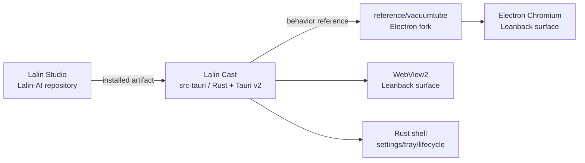

# ADR-001 — Lalin Cast Rust + Tauri v2 Port

## Decision status

**APPROVED FOR LOCAL TAURI P0 IMPLEMENTATION AND DIAL COMPATIBILITY SLICE.** ผู้ใช้สั่งเดินหน้าหลังจาก
review ความเป็นไปได้ของการ port VacuumTube มาเป็น Rust + Tauri v2 วันที่
2026-09-19 การอนุมัตินี้ครอบคลุมเฉพาะ candidate shell, remote WebView,
User-Agent compatibility, single-instance, settings boundary และ local DIAL
discovery/bridge; numeric TV-code pairing is now user-confirmed in the current
debug runtime, but this is still not production, packaged-app or clean-VM
acceptance

Complexity: **C-3**. Risk: **HIGH** (WebView2 compatibility, upstream endpoint,
network filtering, account state และ device discovery).

## Context

- `reference/vacuumtube` มี VacuumTube v1.8.2 fork สำหรับเป็น Electron fallback
  และมี provenance/launch contract อยู่แล้ว
- VacuumTube เป็น Electron wrapper ของ official YouTube Leanback surface ไม่ใช่
  custom YouTube client
- ผู้ใช้ต้องการสกัด feature หลักมาใช้กับ Rust + Tauri v2 เพื่อลด Electron shell
  และรักษาขอบเขต Lalin Cast เป็นแอปแยกจาก Studio
- Tauri v2 รองรับ remote WebView URL, per-window User-Agent, initialization
  script, native plugins, tray และ Rust commands/events; ความสามารถเหล่านี้ยัง
  ต้องพิสูจน์กับ YouTube Leanback บน Windows WebView2 จริง

## Decision

สร้าง `src-tauri` เป็น Tauri v2 runtime ของ Lalin Cast แยกจากทั้ง Lalin Studio และ
Electron fallback โดยให้ Rust เป็น owner ของ native shell และให้ WebView โหลด
official Leanback surface โดยตรง

The Electron fork remains the behavior reference and rollback path. No current
Play owner is replaced by this candidate.

## Feature extraction matrix

| VacuumTube capability | Tauri target | Local slice | Gate |
|---|---|---|---|
| Electron window/lifecycle | Rust `WebviewWindowBuilder` and Tauri run loop | port now | `cargo check` + Windows GUI smoke |
| Leanback URL | remote WebView2 URL | port now | endpoint loads and actual URL is recorded |
| Leanback User-Agent | Tauri WebView User-Agent | port now | compare request/navigation behavior with Electron |
| fullscreen, focus, close, single instance | Tauri window API + single-instance plugin | port now | reopen/focus/close lifecycle |
| settings persistence | Tauri store boundary | port now as best-effort shell preference seed | load/save without credentials; unavailable store must not block launch |
| controller/touch DOM behavior | initialization script / later JS adapter | deferred | real controller and touch evidence |
| SponsorBlock/DeArrow/Return Dislikes | JS adapter after CSP/runtime review | deferred | feature-by-feature parity |
| upstream ad-block controls | separate compatibility gate | deferred | setting behavior in real WebView |
| Electron request/response interception | Rust/native WebView2 adapter | not in P0 | WebView2 API proof and security review |
| DIAL discovery | supervised Rust SSDP + bounded HTTP Rust boundary | local slice implemented with retry/rebind | port/descriptor, listener recovery and same-Wi-Fi device evidence |
| H5VCC DIAL bridge | narrow initialization script + `dial_respond` command | local slice implemented with continuous device-id sync | route callback and real controller/device evidence |
| numeric TV-code pairing | not assumed | user-confirmed for current debug runtime | repeat/relink and packaged-app evidence |

## Endpoint and identity boundary

The P0 default is the endpoint documented by the pinned upstream:
`https://www.youtube.com/tv`. `tv.youtube.com` is not silently substituted for
that path; it remains a separate verification target. The User-Agent compatibility
string is derived from the pinned VacuumTube source and is marked in provenance.
This is compatibility behavior for the official surface, not a claim that Lalin
is an official YouTube TV application.

## Ad-filter boundary

P0 does not add a custom YouTube-specific network bypass, DRM change, credential
relay or playback rewrite. The Tauri port may later expose a general filter
engine or retain a verified upstream setting only after a separate compatibility
and security review. A filter result must be reported as observed behavior, not
as a promise that every future ad format is blocked.

## Security and ownership rules

- The remote YouTube WebView receives no broad Lalin filesystem, shell or process
  permission.
- The remote capability is limited to the official `www.youtube.com` origin and
  the DIAL response/event contract; no filesystem, shell, process or arbitrary
  network command is exposed.
- The Rust DIAL HTTP parser caps headers at 16 KiB and bodies at 100 KiB; only
  `/`, `/apps` and `/apps/*` are handled.
- No cookies, account tokens, pairing codes or session data are committed or
  logged.
- Electron remains the fallback until Tauri endpoint, sign-in, playback,
  controller, fullscreen and lifecycle parity is evidenced.

## P0 acceptance criteria

1. `src-tauri` has a reproducible Tauri v2/Rust project and pinned
   configuration.
2. Rust builds the native shell with the Leanback URL and upstream-derived
   User-Agent configuration.
3. Single-instance focus and best-effort settings persistence have explicit
   boundaries; an unavailable local store does not block the media window.
4. Static checks pass; any GUI failure is recorded as host/runtime evidence and
   is not converted into a false success.
5. Electron fork and current Play remain untouched as rollback paths.

## Local implementation record

- `src-tauri` now contains the standalone Rust + Tauri v2 Cast runtime.
- The native shell builds a remote WebView for the pinned Leanback endpoint,
  applies the upstream-derived User-Agent, seeds a local settings store and
  ports fullscreen/keep-on-top/reload/quit native menu actions.
- Runtime RCA confirmed that a restricted host can deny the local settings
  store. Settings now fall back to safe defaults so persistence failure does
  not prevent the shell from starting; persistence itself remains unverified in
  the GUI gate.
- The approved DIAL slice now binds the LAN interface on UDP 1900 with
  `SO_REUSEADDR`, serves a DIAL XML descriptor on an ephemeral local HTTP port,
  persists a non-secret device identity, and exposes only the upstream-shaped
  `window.h5vcc.dial.DialServer` route surface. A supervisor retries startup,
  rebinds after listener errors or LAN IPv4 changes, and continuously syncs the
  official Leanback device id.
- Static evidence: `cargo fmt --check`, offline `cargo check` and
  `cargo test` (2 DIAL tests) and `tauri build --debug --no-bundle --ci`
  **PASS**. Runtime process evidence shows UDP 1900 and an HTTP `GET /` 200
  descriptor with `Application-URL`.
- The initial host SSDP probe did not receive a response. The active Ethernet
  profile was then changed from `Public` to `Private` to match the scoped
  firewall rules; after relaunch, the user confirmed same-Wi-Fi iPhone
  connection through the numeric TV-code flow.
- Packaged/clean-VM repeatability, endpoint/account/controller parity and
  ad-filter behavior remain **NOT_RUN/PARTIAL**; the local pairing result is
  not a production-readiness claim.
- Physical network-drop/reconnect recovery remains a separate runtime gate;
  the rebuilt local runtime has not yet been accepted as clean-VM or production
  ready.

## Rejected shortcuts

| Shortcut | Reason |
|---|---|
| Delete Electron before Tauri parity | removes the only existing behavior reference |
| Clone Leanback UI locally | loses official surface behavior and increases drift |
| Give remote YouTube page shell/process permissions | violates least privilege |
| Claim TV-code pairing from DIAL discovery | different capabilities and evidence |
| Implement custom ad bypass in P0 | high compatibility/security risk and unapproved scope |

## Sources

- [Tauri configuration](https://v2.tauri.app/reference/config/) — window URL and User-Agent configuration.
- [Tauri Webview API](https://v2.tauri.app/reference/javascript/api/namespacewebview/) — remote WebView and WebView configuration.
- [Tauri plugin development](https://v2.tauri.app/develop/plugins/) — Rust/native plugin boundary.
- [VacuumTube README](https://github.com/shy1132/VacuumTube) — upstream Leanback feature baseline.

## CHANGELOG

| Version | Date | Status | Summary | Commit Hash | Agent |
|---|---|---|---|---|---|
| 0.1.0b | 2026-09-19 | beta | Approved local Tauri P0 port boundary and VacuumTube feature matrix | uncommitted | LALIN |
| 0.2.0b | 2026-09-19 | beta | Implemented the Tauri shell candidate and recorded static build evidence | uncommitted | LALIN |
| 0.3.0b | 2026-09-19 | beta | Made local settings persistence best-effort after access-denied runtime RCA | uncommitted | LALIN |
| 0.4.0b | 2026-09-20 | beta | Implemented the approved bounded Rust DIAL listener, descriptor and H5VCC response bridge; phone pairing remains unverified | uncommitted | LALIN |
| 0.5.0b | 2026-09-20 | beta | Recorded user-confirmed same-Wi-Fi iPhone TV-code connection after the Ethernet profile/firewall fix; packaged and production gates remain open | uncommitted | LALIN |
| 0.6.0b | 2026-09-20 | beta | Added supervised DIAL retry/rebind, continuous device-id persistence and local runtime listener verification | uncommitted | LALIN |
| 0.7.0b | 2026-09-20 | beta | Exported the runtime as Lalin Cast and added signed updater integration | uncommitted | LALIN |
