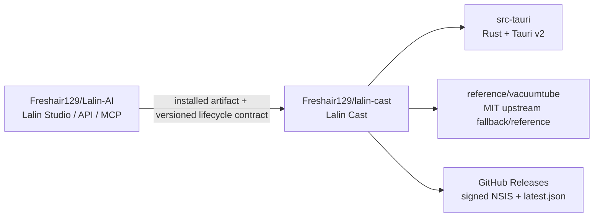

# ADR-003 — Lalin Cast Repository Split and Product Identity

## Decision status

**PROPOSED — NOT APPROVED FOR CODE, REPOSITORY PUSH OR RELEASE.** This document
is the design gate requested before the implementation split. Existing local
Media commits remain in the Lalin AI repository until the export is reviewed.

Complexity: **C-3**. Risk: **HIGH** (repository history, installed-app identity,
updater signing, release automation and cross-repository Studio integration).

## Evidence snapshot

- The current repository is `Freshair129/Lalin-AI` on `main`.
- The Media Tauri work is already committed locally through `58af113`
  (`fix(media): recover DIAL listeners and persist device identity`).
- The current Media sources are `apps/media-tauri` (Rust + Tauri v2) and
  `apps/media-desktop` (pinned VacuumTube Electron reference/fallback).
- `https://github.com/Freshair129/lalin-cast` exists, is public, uses `main` as
  its default branch, and was empty when inspected on 2026-09-20.
- The current Tauri candidate is still named `lalin-media`, displays “Lalin
  Media”, uses identifier `ai.lalin.media`, and loads
  `https://www.youtube.com/tv`.

## Assumptions

1. “แยก lalin-media” means separating the Media product only; Lalin Studio,
   API, MCP and the umbrella repository remain in `Freshair129/Lalin-AI`.
2. The Tauri runtime is the Lalin Cast shipping candidate. The Electron
   VacuumTube fork is retained as a behavior reference and rollback path, not as
   a second release channel.
3. The first release targets Windows x64 NSIS. macOS, Linux and ARM artifacts
   remain deferred until their own build and update gates exist.
4. The first public Lalin Cast release is allowed to be a new installer
   identity. A debug `lalin-media.exe` build is not treated as an updater
   predecessor.

## Decision proposal

### 1. Repository ownership

Create `Freshair129/lalin-cast` as the canonical source repository for the
Media product:



The new repository owns the Cast shell, WebView boundary, DIAL bridge,
product-specific settings, updater configuration, release workflow and Media
provenance. It does not own Studio UI, AI/audio services, the umbrella MCP
runtime or Studio's cross-process lifecycle contract.

### 2. Target repository layout

The proposed first export flattens the current app into a normal standalone
Tauri repository:

```text
lalin-cast/
├─ src-tauri/                  # current apps/media-tauri/src-tauri
├─ fallback/index.html         # current apps/media-tauri/fallback
├─ reference/vacuumtube/       # current apps/media-desktop, non-shipping reference
├─ docs/                       # Cast architecture, provenance, updater and RCAs
├─ assets/                     # Cast-owned icons; no Studio-relative paths
├─ .github/workflows/release.yml
├─ README.md
└─ LICENSE / notices
```

The export must remove all dependency on `F:\lalin`-relative paths. In
particular, the current Tauri icon paths that point into
`apps/desktop/src-tauri/icons` become Cast-owned assets before a standalone
build is claimed.

### 3. Product and package identity

The recommended identity for the first public release is:

| Surface | Current | Proposed |
|---|---|---|
| Product name | `Lalin Media` | `Lalin Cast` |
| Repository | `Lalin-AI` subdirectory | `Freshair129/lalin-cast` |
| Windows executable | `lalin-media.exe` | `lalin-cast.exe` |
| Rust package | `lalin-media` | `lalin-cast` |
| Rust library | `lalin_media_lib` | `lalin_cast_lib` |
| Tauri identifier | `ai.lalin.media` | `ai.lalin.cast` |
| Leanback endpoint | `https://www.youtube.com/tv` | unchanged |
| H5VCC/DIAL protocol paths | current official-compatible paths | unchanged |

Changing the Tauri identifier creates a new install/update identity. Existing
debug `lalin-media.exe` builds therefore require a one-time uninstall/reinstall
or side-by-side install; they must not be described as in-place upgradable.
This is the recommended choice because there is no public Lalin Media release
to preserve and the requested product/repository rename should be reflected in
the installed identity. If in-place upgrade from an existing Lalin Media
release is required, the identifier must remain `ai.lalin.media` and that is a
separate approval decision.

### 4. Runtime compatibility boundary

- Keep the real `https://www.youtube.com/tv` surface and the tested
  VacuumTube-derived compatibility User-Agent.
- Keep official H5VCC/DIAL route names and response shapes required by the
  YouTube surface; local branding may change, but protocol compatibility must
  not be broken by the rename.
- Keep the supervised SSDP/HTTP retry and device-id persistence behavior from
  commit `58af113`.
- Do not add a custom YouTube network bypass, DRM modification, credential
  relay or proxy as part of the repository split.
- Keep `reference/vacuumtube` and its MIT notice available for comparison and
  rollback until Tauri parity is accepted.

### 5. History and provenance

The split will be performed in an isolated export clone/worktree. The source
repository's `main` history must remain untouched. The export should preserve
the relevant file history where practical, record the source commit and path
rewrite, and exclude:

- `keys/` and all signing private keys;
- `**/target/`, `node_modules/`, runtime state and user data;
- Studio/API/MCP sources unrelated to Cast;
- cookies, account tokens, pairing state and local logs.

The new repository must retain the VacuumTube upstream URL, release `v1.8.2`,
commit `4dd3ee4`, archive hash and MIT notice. The source/patch boundary remains
documented even if the fallback is later removed from release artifacts.

## Alternatives rejected

| Alternative | Reason |
|---|---|
| Rename the entire `Lalin-AI` repository to `lalin-cast` | would incorrectly move Studio/API/MCP ownership and break the umbrella boundary |
| Copy only the compiled `lalin-media.exe` | loses source history, provenance, tests and reproducible release inputs |
| Keep the old product identity while claiming a full rename | creates ambiguous updater/install ownership |
| Reuse `keys/g-music.*` | crosses product trust boundaries and can invalidate release provenance |
| Make Studio depend on the Cast source tree | recreates the monorepo coupling the split is meant to remove |
| Publish a release before updater/install smoke | makes the first public artifact an unverified update channel |

## Approval gates

1. Approve this ADR, the split plan and the updater spec together.
2. Approve the recommended new identifier `ai.lalin.cast`, or explicitly choose
   to preserve `ai.lalin.media` for in-place migration.
3. Review the dry-run file inventory and history/provenance report.
4. Approve code rename, standalone build wiring and updater implementation.
5. Approve the exact commit and target repository push before any external
   write.
6. Approve a tagged release only after signed artifact, install and update
   smoke evidence is recorded.

## Non-goals

- no Studio rail redesign or new Media tab;
- no API/audio migration;
- no mobile remote or Room service;
- no promise that every YouTube ad format is blocked;
- no automatic migration claim for old `lalin-media` debug data;
- no push, release, GitHub secret creation or signing-key publication in this
  documentation phase.

## Sources

- [Lalin Media Tauri port ADR](ADR-002-LALIN-MEDIA-TAURI-PORT.md)
- [Lalin Media platform plan](LALIN_MEDIA_PLATFORM_PLAN.md)
- [Lalin Media migration map](LALIN_MEDIA_MIGRATION_MAP.md)
- [Target repository](https://github.com/Freshair129/lalin-cast)
- [VacuumTube upstream](https://github.com/shy1132/VacuumTube)

## CHANGELOG

| Version | Date | Status | Summary | Commit Hash | Agent |
|---|---|---|---|---|---|
| 0.1.0b | 2026-09-20 | candidate | Proposed standalone Lalin Cast repository boundary, identity and approval gates | uncommitted | LALIN |
