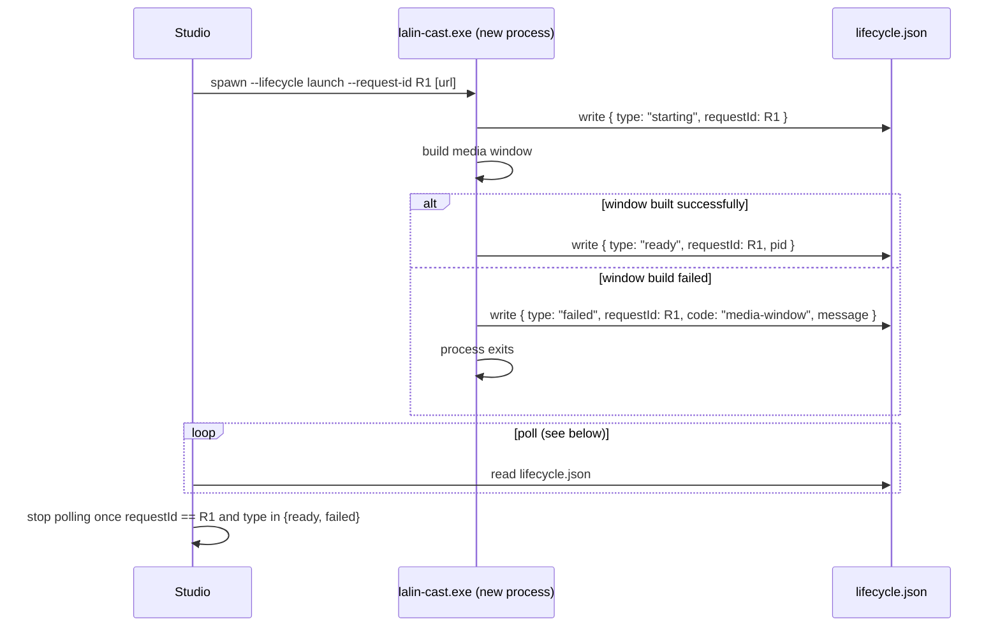
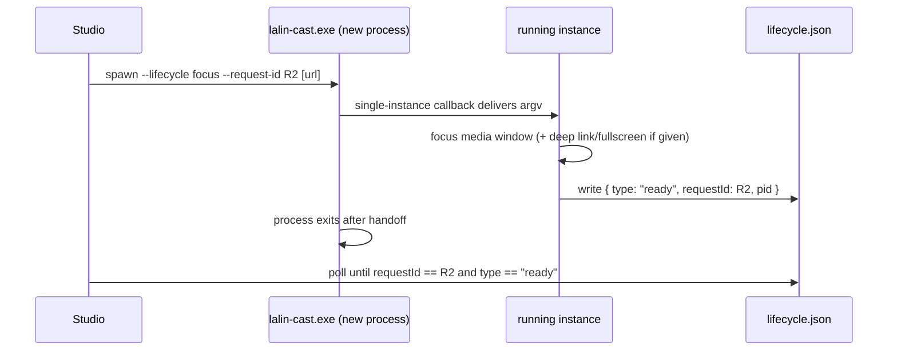
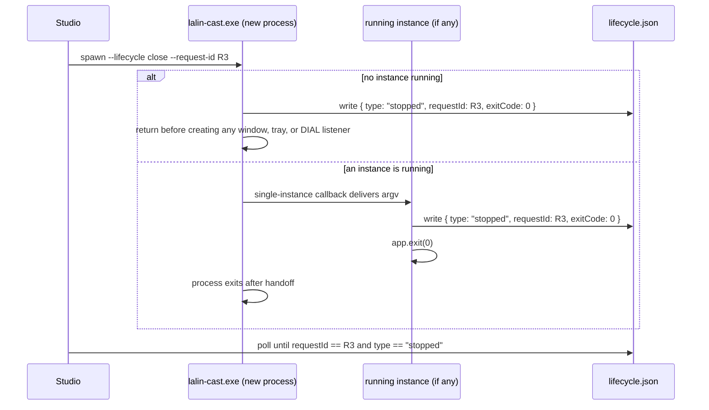

# Lalin Cast — Studio Launcher IPC Specification

## Status and risk

**CANDIDATE — documents the wave 5 CLI + state-file slice implemented on
`feat/wave5-desktop`** (see `docs/plans/W5_DESKTOP_PLAN.md`). This is the local, file-based half of
the contract from `CAST_PLATFORM_PLAN.md` slice P2. A real Studio-side driver process and the
launch/focus/close/timeout evidence against a built `lalin-cast.exe` are still open — see human gate
H13 below. Wave 6 (`docs/plans/W6_POLISH_PLAN.md`) adds two pieces of automated evidence toward
H13 without changing this contract itself: the read-only [`scripts/lifecycle-driver.ps1`](../../scripts/README.md)
driver (a parameterized version of the example below) and a `smoke` job in `ci.yml` that builds a
debug `lalin-cast.exe` on `windows-latest` and runs it through `--version` and
`--lifecycle close --request-id ci-smoke`, asserting on the resulting `lifecycle.json`. Neither
replaces the real Studio-side driver evidence H13 still needs — see "Evidence expected under H13"
below.

Complexity: **C-2**. Risk: **LOW** (no network surface; a local file and process argv only) —
narrowed from the original P2 slice's **HIGH** rating now that the transport is a plain local file
instead of a live IPC channel.

## Goals

- Let an external launcher (Lalin Studio, a Steam-style shortcut, or a human at a PowerShell prompt)
  start Lalin Cast, bring an already-running instance to the front, or ask it to quit, from the
  command line only.
- Let that launcher find out whether the request succeeded, without needing a socket, named pipe, or
  running IPC server of its own — just a file it can poll.
- Keep every write local, atomic, and free of anything that shouldn't be persisted (no URLs, no
  cookies, no tokens).

## Non-goals

- no live/streaming channel (WebSocket, named pipe, gRPC, or similar) — this contract is
  request-once-per-process-launch, file-polled;
- no queue of pending media items, no playlist control, no "seek to timestamp" or similar remote
  command — the only payload this contract carries beyond lifecycle is the existing deep-link URL
  argument from wave 3 (see `docs/plans/W3_CONTROLS_PLAN.md`), unchanged by this spec;
- no authentication of the caller — any local process that can start `lalin-cast.exe` or read a file
  under `%LOCALAPPDATA%\ai.lalin.cast\` can drive or observe this contract, the same trust boundary
  as any other local desktop app;
- no cross-machine or remote launcher — `lifecycle.json` is a local file on the same Windows user
  account, not a network-reachable resource;
- no change to the existing deep-link/URL argument behavior from wave 3 — this spec only adds the
  `--lifecycle`/`--request-id` flags and the state file around it.
- no `lalin-cast://` URL scheme as a Studio IPC channel — that scheme (wave 7,
  `docs/plans/W7_DEEPLINK_PLAN.md`) exists for end users and the operating system (File Explorer, a
  browser, or another app) to open a link into Lalin Cast, not for Studio to drive it. Studio should
  keep launching and controlling Lalin Cast the way this spec already documents: `--lifecycle`
  plus a trailing YouTube URL argument, the path with existing unit-test and CI-smoke coverage.
  Nothing about the CLI grammar, the state file, or the sequences below changes because the scheme
  exists.

## Contract mapping

The TypeScript contract already defined in `CAST_PLATFORM_PLAN.md` (`MediaLifecycleCommand` /
`MediaLifecycleState`) is realized here as a CLI + local JSON file pair, not a live message channel:

| `MediaLifecycleCommand` (TS) | CLI invocation |
|---|---|
| `{ type: "launch", requestId }` | `lalin-cast.exe --lifecycle launch --request-id <id> [<youtube-url>]` |
| `{ type: "focus", requestId }` | `lalin-cast.exe --lifecycle focus --request-id <id> [<youtube-url>]` |
| `{ type: "close", requestId }` | `lalin-cast.exe --lifecycle close --request-id <id>` |

| `MediaLifecycleState` (TS) | `lifecycle.json` `type` | Extra fields written |
|---|---|---|
| `{ type: "starting", requestId }` | `"starting"` | — |
| `{ type: "ready", requestId, pid? }` | `"ready"` | `pid` |
| `{ type: "stopped", requestId, exitCode? }` | `"stopped"` | `exitCode` |
| `{ type: "failed", requestId, code, message }` | `"failed"` | `code`, `message` |

`requestId` is written on every transition, taken from whichever CLI invocation most recently caused
it (see the sequences below) — it is always present, not only on the variants shown with it in the
TypeScript union above.

`starting` is written from inside the app's Tauri setup hook — after the single-instance plugin has
already exited any second process — so only the one process that will actually own the window ever
writes it; a forwarded `launch`/`focus`/`close` never produces a `starting` record, only the
`ready`/`stopped` it results in.

## CLI grammar

Flags are independent tokens, may appear in any order, and the *last* occurrence of a repeated flag
wins:

| Flag | Value | Meaning |
|---|---|---|
| `--lifecycle <cmd>` | `launch` \| `focus` \| `close` | Any other value is ignored, the same as if the flag were absent |
| `--request-id <id>` | `[A-Za-z0-9_.-]{1,64}` | If absent or malformed: `"cli"` for a command forwarded to a running instance, `"startup"` for a first process launch |

The trailing YouTube URL argument, `--fullscreen`, and `--version` from wave 3
(`docs/plans/W3_CONTROLS_PLAN.md`) are unchanged and compose with these flags — for example
`--lifecycle launch --request-id <id> --fullscreen <url>` is a valid single invocation. `--version`
still takes priority and exits before any lifecycle handling runs, the same as before this spec.

## State file: schema and location

Path: `<app_local_data_dir>/lifecycle.json`, i.e. `%LOCALAPPDATA%\ai.lalin.cast\lifecycle.json` on
Windows (Tauri's `app.path().app_local_data_dir()` — **not** the same directory as
`media-settings.json`, which lives under `%APPDATA%\ai.lalin.cast\`; see `PRIVACY.md` section 2).

```json
{
  "type": "starting" | "ready" | "stopped" | "failed",
  "requestId": "cli",
  "pid": 1234,
  "exitCode": 0,
  "code": "media-window",
  "message": "…",
  "version": "0.1.0",
  "updatedAt": 1758380400
}
```

- `pid` is present only on `ready`.
- `exitCode` is present only on `stopped`.
- `code` and `message` are present only on `failed`; `message` never contains a URL, a file path
  supplied by the caller, or user-identifying data.
- `version` is `env!("CARGO_PKG_VERSION")`.
- `updatedAt` is Unix seconds at write time.
- Every other field not relevant to the current `type` is simply omitted, not written as `null`.

### Atomic write

Every write goes through the same pattern: serialize the new state, write it to
`lifecycle.json.tmp` in the same directory, then `rename` that temp file onto `lifecycle.json`. A
reader therefore only ever observes either the previous complete state or the new complete state,
never a partially-written file — there is no window where the file is truncated or holds invalid
JSON.

## Sequences

### Launch (no instance running yet)



### Focus (an instance is already running)



### Close



### Timeout (Studio-side, no code change in Lalin Cast)

```mermaid
sequenceDiagram
    participant Studio
    participant File as lifecycle.json
    Studio->>File: poll on a short interval
    Note over Studio: 10 s elapse with requestId never matching,<br/>or stuck at "starting"
    Studio->>Studio: treat the request as timed out
    Studio->>Studio: surface a timeout error to the operator;<br/>optionally retry with --lifecycle close to clean up
```

The app itself never times out a lifecycle request — every state it can reach (`starting`, `ready`,
`stopped`, `failed`) is eventually written, and `RunEvent::Exit` guarantees a final `stopped` write
on every exit path if the last written state wasn't already `stopped`. A timeout is purely something
the polling side (Studio) decides to give up on.

## Exit codes

This contract does not define a stable, documented **process** exit code for every path — Studio
should rely on `lifecycle.json`'s `type` field, not the OS exit code, to decide what happened:

| Invocation | Process exit code |
|---|---|
| `--version` | `0`, after printing the version, no window created |
| `--lifecycle launch`, media window built successfully | process keeps running (this is the long-lived app instance) |
| `--lifecycle launch`, media window build failed | app exits after writing `failed`; the exact non-zero code is not part of this contract and may change between Tauri versions — check `lifecycle.json`, not the exit code |
| `--lifecycle focus` / `--lifecycle close`, forwarded to a running instance | the *new* short-lived process exits `0` once the single-instance handoff completes; the actual effect (focus applied, or the running instance stopping) is reported through `lifecycle.json`, written by the already-running instance |
| `--lifecycle close`, no instance running | the process that ran the check exits `0` after writing `stopped`, without creating a window |

## What is not covered

- selecting or queuing a specific media item beyond the single trailing URL argument already
  supported since wave 3 — there is no "add to queue" or "play next" command;
- a push channel from Lalin Cast back to Studio (Studio must poll; Lalin Cast never calls out to a
  Studio-owned endpoint);
- concurrent, independently-tracked requests — `lifecycle.json` holds only the single latest
  transition. If two `requestId`s are in flight close together, a Studio driver watching for an
  older `requestId` while a newer one overwrites the file must handle that race itself (in practice,
  Studio should not send a second lifecycle command before the first one's `requestId` has resolved
  to `ready`/`stopped`/`failed`);
- any authentication, signing, or tamper-evidence on `lifecycle.json` — it is a plain local file
  under the user's own profile, protected only by normal NTFS file permissions on that profile;
- remote/cross-machine launching — this is strictly a same-machine, same-Windows-account contract.

## Studio-side polling guidance

Studio (or any other driver) should:

1. Generate its own `requestId` before spawning `lalin-cast.exe` (matching
   `[A-Za-z0-9_.-]{1,64}`), and pass it with `--request-id`.
2. Spawn the process with the appropriate `--lifecycle` flag (and, for `launch`/`focus`, an optional
   trailing URL).
3. Poll `lifecycle.json` on a short, regular interval (for example every 200 ms — the exact interval
   is the driver's own choice, not part of this contract) until either:
   - the file's `requestId` matches the one just sent **and** `type` is `ready`, `stopped`, or
     `failed`, or
   - **10 seconds** elapse without that match (recommended timeout — see the sequence above).
4. On `failed`, surface `code`/`message` to the operator; on timeout, treat the request as failed
   without a specific `code` and let the operator retry or investigate.
5. Never write to `lifecycle.json` — it is a read-only signal from Lalin Cast's point of view; a
   driver that writes to it gains nothing (Lalin Cast always overwrites it on its own next
   transition) and risks corrupting the atomic-write invariant for any other reader.

## PowerShell driver example (for human gate H13)

The following is a minimal, read-only-on-the-state-file example driver: it never edits
`lifecycle.json`, and it launches the executable with a fixed, hard-coded set of arguments (no
user-supplied string is interpolated into the command line) — the same "fixed arguments" discipline
`docs/architecture/ADR-001-CAST-TAURI-PORT.md` requires of `reg.exe` calls inside the app itself.
This is a documentation example for a human operator to adapt and run under H13, not code shipped
inside Lalin Cast.

```powershell
# Studio-side launcher driver example — reads lifecycle.json only, never writes it.
$ExePath    = "C:\Path\To\lalin-cast.exe"          # fixed, operator-configured path
$RequestId  = "h13-" + [guid]::NewGuid().ToString("N").Substring(0, 8)
$StatePath  = Join-Path $env:LOCALAPPDATA "ai.lalin.cast\lifecycle.json"
$TimeoutSec = 10

# Fixed argument list — no interpolation of caller-supplied strings beyond the
# request id generated above and a single, hard-coded target URL.
$Arguments = @("--lifecycle", "launch", "--request-id", $RequestId,
               "https://www.youtube.com/watch?v=dQw4w9WgXcQ")

Start-Process -FilePath $ExePath -ArgumentList $Arguments | Out-Null

$Deadline = (Get-Date).AddSeconds($TimeoutSec)
$Result = $null
while ((Get-Date) -lt $Deadline) {
    if (Test-Path $StatePath) {
        try {
            $State = Get-Content -Raw -Path $StatePath | ConvertFrom-Json
        } catch {
            $State = $null   # tolerate a read racing an in-progress rename; retry
        }
        if ($State -and $State.requestId -eq $RequestId -and
            $State.type -in @("ready", "stopped", "failed")) {
            $Result = $State
            break
        }
    }
    Start-Sleep -Milliseconds 200
}

if ($null -eq $Result) {
    Write-Warning "Timed out after $TimeoutSec s waiting for requestId $RequestId"
} elseif ($Result.type -eq "failed") {
    Write-Warning "Launch failed: $($Result.code) — $($Result.message)"
} else {
    Write-Host "Launch resolved: $($Result.type) (pid=$($Result.pid))"
}
```

Evidence expected under H13: run this driver (or Studio's own equivalent) against a real built
`lalin-cast.exe` and record the observed `launch`, `focus`, and `close` transitions, plus one
deliberately-broken run (for example a locked/missing executable path) to confirm the timeout path
above behaves as documented.

### Automated evidence path (wave 6)

Two pieces of repo automation from `docs/plans/W6_POLISH_PLAN.md` exercise this same contract on
every push, as a standing floor of evidence under this same driver-and-timeout-path shape, alongside
(not instead of) the manual H13 sign-off above:

- **`scripts/lifecycle-driver.ps1`** — a read-only, parameterized version of the example driver
  above (`-Command launch|focus|close`, `-RequestId`, `-ExePath`, `-TimeoutSeconds`, default 10s). It
  never writes `lifecycle.json`, uses the same fixed-argument-list discipline, and exits `0` on a
  matched `ready`/`stopped` transition, `1` on `failed`, or `2` on timeout (or when `-ExePath` is
  not found) — see
  [`scripts/README.md`](../../scripts/README.md) for full usage. A developer or CI can run it
  directly against a locally built exe instead of retyping the PowerShell example above by hand.
- **CI `smoke` job (`ci.yml`)** — runs on `windows-latest` after the main `checks` job, builds
  `lalin-cast.exe` in debug, asserts `--version` prints `lalin-cast <Cargo.toml version>`, then runs
  `lalin-cast.exe --lifecycle close --request-id ci-smoke` and asserts the resulting
  `lifecycle.json` has `type == stopped`, `requestId == ci-smoke`, and `exitCode == 0`. It is marked
  `continue-on-error: true` until it has been observed stable across two consecutive runs (human gate
  H20) — until then, a failure here is a signal to investigate, not a blocking CI failure.

Both are same-machine, same-`close`-command checks — they do not cover `launch`/`focus` against an
already-running instance, multi-process races, or a genuinely separate Studio process, which remain
H13's own scope.

## Sources

- `docs/architecture/CAST_PLATFORM_PLAN.md` — the `MediaLifecycleCommand`/`MediaLifecycleState`
  contract boundary (slice P2) this spec implements the local half of.
- `docs/plans/W5_DESKTOP_PLAN.md` — the wave 5 constants/contract this spec is written from
  (CLI grammar, state-file schema, transition table).
- `docs/plans/W3_CONTROLS_PLAN.md` — the pre-existing `parse_cli`/deep-link contract this spec
  extends without changing.

## CHANGELOG

| Version | Date | Status | Summary | Commit Hash | Agent |
|---|---|---|---|---|---|
| 0.1.0b | 2026-09-20 | candidate | Documented the wave 5 CLI + `lifecycle.json` Studio launcher IPC contract: flag grammar, state-file schema/location, atomic write, launch/focus/close/timeout sequences, exit codes, scope boundary, Studio polling guidance and a PowerShell H13 driver example | uncommitted | LALIN |
| 0.2.0b | 2026-09-21 | candidate | Wave 6: pointed to `scripts/lifecycle-driver.ps1` and the CI `smoke` job as the automated evidence path toward H13, without changing the underlying CLI/state-file contract (see `docs/plans/W6_POLISH_PLAN.md`) | uncommitted | LALIN |
| 0.3.0b | 2026-09-21 | candidate | Wave 7: added a non-goal stating that the new `lalin-cast://` URL scheme is for end users and the OS, not a Studio IPC channel, and that Studio should keep using `--lifecycle` plus a trailing URL argument — no change to the CLI grammar or state-file contract itself (see `docs/plans/W7_DEEPLINK_PLAN.md`) | uncommitted | LALIN |
