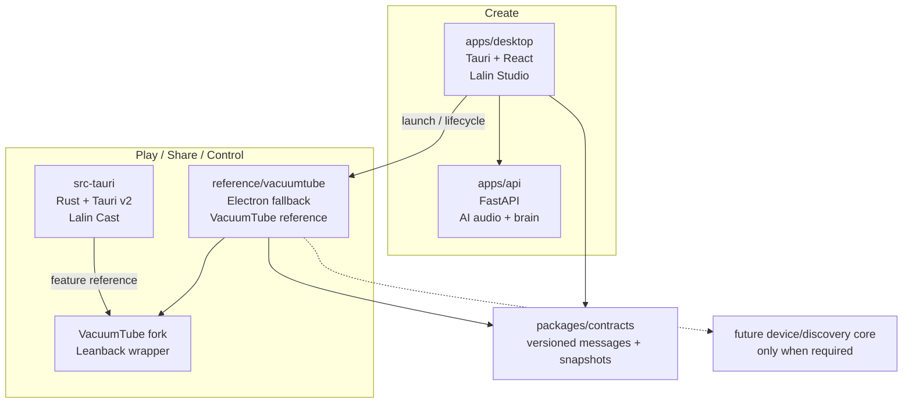

# Lalin Cast — Platform Architecture Plan

## Status and approval boundary

**APPROVED FOR LOCAL P1/P2 IMPLEMENTATION AND TAURI P0.** This plan follows the
umbrella-repository [ADR-001](https://github.com/Freshair129/Lalin-AI/blob/main/docs/architecture/ADR-001-LALIN-UMBRELLA-PLATFORM.md)
(historical, umbrella repo). The umbrella direction and this
document were approved on 2026-09-19. The Tauri port boundary is additionally
defined by [ADR-001](ADR-001-CAST-TAURI-PORT.md) (this repository). P3
endpoint/account capability checks and P5 distribution remain separate gates.

Complexity: **C-3**. Risk: **HIGH**. Baseline: current repository tree on
`main`; the original proposal boundary is retained, while approved local T1/T2
implementation results are recorded below.

## Success criteria for the first vertical slice

The first slice is complete only when all of the following are evidenced in a
real local Windows runtime. P1/P2 are implemented locally; P3/P4 evidence is
still pending:

1. Lalin Studio can launch, focus and close Lalin Cast without adding a Media
   tab to the Studio rail.
2. Lalin Cast starts from a reproducible VacuumTube fork pinned to a reviewed
   release/tag/commit and retains the upstream license notice.
3. The runtime loads the tested official YouTube Leanback endpoint; the selected
   endpoint is recorded rather than inferred from the app name.
4. The available official sign-in/pairing path is tested honestly. Missing
   desktop TV-code support is shown as unavailable; DIAL discovery is not
   mislabeled as TV-code pairing.
5. The upstream ad-block setting can be enabled, disabled and reported in the
   Media UI. No custom bypass is introduced in this slice.
6. Controller/keyboard navigation, fullscreen and close/reopen lifecycle work in
   the Media runtime without creating a second Studio playback owner.
7. Failure states are visible and recoverable: missing fork assets, blocked
   endpoint, unavailable pairing, process exit and launch timeout do not appear
   as a false success.

These are local engineering gates, not production, account, clean-VM or hosted-CI
acceptance.

## Proposed runtime topology



The first slice does not require a network service, cloud relay, signaling
server, Room server or YouTube proxy. The Media process owns its own browser
surface and lifecycle. Studio remains the owner of creation UI and AI audio
workflows.

## Ownership matrix

| Component | First responsibility | Boundary | Status |
|---|---|---|---|
| `apps/desktop` | Studio shell, creation workflows and Media launcher | may send lifecycle/intent contracts; must not embed Electron or own Media playback | current |
| `reference/vacuumtube` | Electron fallback/reference, Leanback surface and upstream behavior | must not import Tauri runtime internals or Studio UI | retained reference |
| `src-tauri` | Rust/Tauri shell, remote WebView, DIAL and updater boundary | no broad permission for remote YouTube page; no custom ad bypass in P0 | Cast runtime |
| VacuumTube fork | upstream wrapper behavior and supported Media settings | preserve upstream provenance; local changes stay narrow and reviewable | proposed baseline |
| `apps/api` | LLM, ASR, TTS, dubbing, mastering and audio jobs | no YouTube proxy or ad relay in this slice | current |
| `apps/mcp` | local AI/tool access through API/contracts | no direct Electron/browser control without a later contract | current |
| `packages/contracts` | versioned cross-app messages and snapshots | runtime-neutral TypeScript/schema code only | current seed; extend later |
| `packages/media-core` | reusable media primitives after a real second consumer exists | no speculative package in this slice | future candidate |
| `packages/device-core` | discovery/capability normalization after DIAL evidence | no claim of pairing support from discovery alone | future candidate |
| `apps/media-remote` | mobile/remote control | depends on stable Media contract and explicit auth model | future candidate |
| `apps/ride` | rider/mobile experience | depends on Media Core and mobile product scope | future candidate |
| `services/room-server`, signaling, cloud relay | shared-room/cloud coordination | outside local-first vertical slice | future candidate |

## VacuumTube provenance and packaging

### Baseline

| Field | Recorded value |
|---|---|
| Upstream | `https://github.com/shy1132/VacuumTube` |
| Baseline release | `v1.8.2` |
| Baseline commit | `4dd3ee4` (release reference checked 2026-09-19) |
| Runtime | Electron `^42.5.0` in the upstream manifest |
| License | MIT; retain upstream copyright/license notice |
| Documented surface | YouTube Leanback at `www.youtube.com/tv` |
| Documented capabilities | adblock controls, controller/touch support and DIAL discoverability |

The fork must carry a provenance note containing the upstream URL, release/tag,
commit, license, local patches and verification date. An upstream upgrade is a
separate change: update the pin, inspect the diff, rerun the endpoint/account,
ad-filter and lifecycle gates, and update this plan.

### Packaging decision

The current fallback remains a separately buildable Electron workspace/app. The
Tauri port is a separately buildable candidate app. Do not package either Media
runtime into the Studio installer until process launch, versioning, crash
reporting and uninstall/upgrade behavior have their own acceptance evidence. If
distribution later bundles both apps, each app still retains an attributable
runtime and version.

## Contract boundary

The initial contract is intentionally small and is now implemented for the
Studio-to-Media lifecycle path:

```ts
type MediaLifecycleCommand =
  | { type: "launch"; requestId: string }
  | { type: "focus"; requestId: string }
  | { type: "close"; requestId: string };

type MediaLifecycleState =
  | { type: "starting"; requestId: string }
  | { type: "ready"; requestId: string; pid?: number }
  | { type: "stopped"; requestId: string; exitCode?: number }
  | { type: "failed"; requestId: string; code: string; message: string };
```

Media item/queue/device contracts are added only when the first slice demonstrates
a second consumer or a required cross-process state transition.

## Official surface, pairing and ad-filter gates

| Gate | Required evidence | Honest failure state |
|---|---|---|
| Endpoint | browser/runtime screenshot or trace showing the selected official surface | endpoint unavailable/redirected; record actual URL |
| Sign-in | real local sign-in flow without storing credentials in repo | sign-in unavailable; do not claim paired |
| TV code | only if the surface genuinely exposes it to this runtime | `NOT_AVAILABLE_ON_DESKTOP` |
| DIAL | supervised local UDP 1900 bind + HTTP descriptor; same-Wi-Fi iPhone TV-code connection user-confirmed in debug runtime | physical network-drop recovery and packaged/repeatability evidence still required |
| Ad filter | upstream setting behavior in the pinned build | `UPSTREAM_SETTING_UNVERIFIED` |
| Custom bypass | separate approved design and compatibility review | out of scope for this plan |

No credentials, account tokens, cookies or user session data are committed or
logged by the implementation.

## Ordered implementation slices

| Slice | Scope | Exit check |
|---|---|---|
| P0 | documentation, provenance, naming and boundary review | ADR/plan/migration map approved; no code yet |
| P1 | fork/bootstrap Media workspace from pinned baseline | reproducible local start; license/provenance check |
| P2 | Studio launcher and Media lifecycle | launch/focus/close/timeout/error tests; no Studio rail change |
| T0 | Tauri port documentation and native boundary | ADR-002, feature matrix and capability boundary approved |
| T1 | Tauri shell candidate | Rust build, process-start smoke, remote URL/User-Agent config, single-instance/settings seed |
| T2 | bounded Rust DIAL + H5VCC compatibility slice | Rust tests, UDP 1900 bind, HTTP descriptor and same-Wi-Fi discovery/client test |
| P3 | official endpoint, auth/pairing and upstream ad-block controls | real-runtime evidence with unsupported states recorded |
| P4 | controller/TV presentation and single-owner playback handoff | keyboard/controller/fullscreen/lifecycle checks pass |
| P5 | package/distribution decision | separate app artifacts and upgrade/uninstall evidence |
| P6 | only after review: extract shared contracts/core or add Remote/Room/Ride | second-consumer proof and new product scope approved |

## Out of scope and deferred findings

- packaged/clean-VM/repeatability evidence for the now user-confirmed debug TV-code pairing;
- custom YouTube ad bypass, DRM changes, or a proxy that rewrites playback;
- Tauri WebView2 network interception until a separate native adapter review;
- cloud account sync, Room, signaling, relay and multi-user authorization;
- moving current `apps/desktop/src/playback` before Media parity;
- adding empty target folders or a second workspace orchestrator;
- final installer, updater and production distribution claims.

## Local implementation record

| Slice | Local result | Evidence |
|---|---|---|
| P1 fork/bootstrap | implemented | `reference/vacuumtube`, pinned source archive and provenance note |
| P2 launcher/lifecycle | contract implemented; process smoke blocked | Tauri `media_lifecycle`, Studio launcher, status polling and single-instance focus patch; Electron minimal smoke hit host `0xC0000005` |
| T0 Tauri port boundary | implemented in docs | `ADR-001-CAST-TAURI-PORT.md` defines shell, WebView, User-Agent, permissions and ad-filter gates |
| T1 Tauri shell candidate | **PASS / static + process start** | Rust checks/build pass; sandbox `cargo run` stays alive with a window handle and degrades settings persistence to a warning; GUI/WebView2 endpoint smoke pending |
| T2 DIAL compatibility slice | **PASS / local + user-confirmed iPhone connection** | 3 Rust tests pass; supervised debug runtime binds LAN UDP 1900, returns HTTP `GET /` 200 with `Application-URL`, retries bind/rebinds on LAN address change, and persists the synced Leanback device id; after Ethernet changed to `Private` and app relaunch, user confirmed iPhone TV-code connection |
| P3 endpoint/auth/pairing/ad-filter | **PARTIAL / pairing only** | numeric TV-code connection is user-confirmed for the current debug runtime; endpoint/account/controller and ad-filter behavior remain open |
| P4 controller/fullscreen/ownership parity | **NOT_RUN** | requires real Media runtime and playback comparison |
| P5 packaging/distribution | **NOT_RUN** | upstream app identity retained during P1/P2 |

Local automated evidence: contracts build **PASS**; Media `node --check`
**PASS**; direct Electron `--version` **PASS**; Studio 22 test files / 187
tests **PASS**; Studio TypeScript/Vite build **PASS**; Rust `cargo check`
**PASS** and `cargo fmt --check` **PASS**; Tauri Media DIAL unit tests,
`cargo check --offline`, `cargo fmt --check` and debug no-bundle build **PASS**;
Tauri Media sandbox
process-start smoke **PASS** with a window handle and a non-fatal settings-store
warning; runtime DIAL bind and descriptor smoke **PASS**. The initial host SSDP
probe was inconclusive, but after the Ethernet profile was changed to `Private`
and the app relaunched, the user confirmed physical-iPhone TV-code connection.
A minimal Electron `app.whenReady()` fixture also crashed with Windows
`0xC0000005`, so Electron GUI smoke remains **BLOCKED_BY_HOST** and is not
attributed to the Lalin lifecycle code. Native GUI inspection and Leanback
endpoint rendering remain pending. These results do not establish production,
clean-VM, account or release readiness.

## Verification plan

| Level | Evidence |
|---|---|
| Static | provenance note, contract/schema review, `git diff --check`, doc links |
| Local | Electron start/build, endpoint/auth/pairing/ad-filter behavior, lifecycle |
| Cross-app | Studio launcher to Media ready/failed/stopped states; single-owner check |
| Packaging | separate artifact identity and clean install/update test, if scoped |
| Production | **NOT_RUN** until hosted/release/account evidence exists |

## CHANGELOG

| Version | Date | Status | Summary | Commit Hash | Agent |
|---|---|---|---|---|---|
| 0.2.0b | 2026-09-19 | beta | Recorded local P1/P2 implementation and separated pending real-runtime gates | uncommitted | LALIN |
| 0.3.0b | 2026-09-19 | beta | Added approved Rust + Tauri v2 port boundary and T0/T1 candidate slices | uncommitted | LALIN |
| 0.4.0b | 2026-09-19 | beta | Recorded Tauri process-start smoke and best-effort settings fallback | uncommitted | LALIN |
| 0.5.0b | 2026-09-20 | beta | Added approved T2 Rust DIAL/H5VCC slice and separated local descriptor evidence from phone pairing | uncommitted | LALIN |
| 0.6.0b | 2026-09-20 | beta | Recorded user-confirmed local iPhone TV-code connection after the Ethernet profile/firewall fix; packaging and parity gates remain open | uncommitted | LALIN |
| 0.7.0b | 2026-09-20 | beta | Added supervised DIAL retry/rebind and continuous Leanback device-id persistence after the disconnect RCA | uncommitted | LALIN |
| 0.8.0b | 2026-09-20 | beta | Rebased the plan onto the standalone Lalin Cast repository and signed updater boundary | uncommitted | LALIN |
| 0.9.0b | 2026-09-20 | beta | Repointed the dangling umbrella-repo ADR-001 link to its historical GitHub path and disambiguated it from the local ADR-001-CAST-TAURI-PORT.md | uncommitted | LALIN |
| 0.1.0b | 2026-09-19 | candidate | Proposed the Media vertical slice, ownership matrix, VacuumTube provenance and ordered gates | uncommitted | LALIN |
