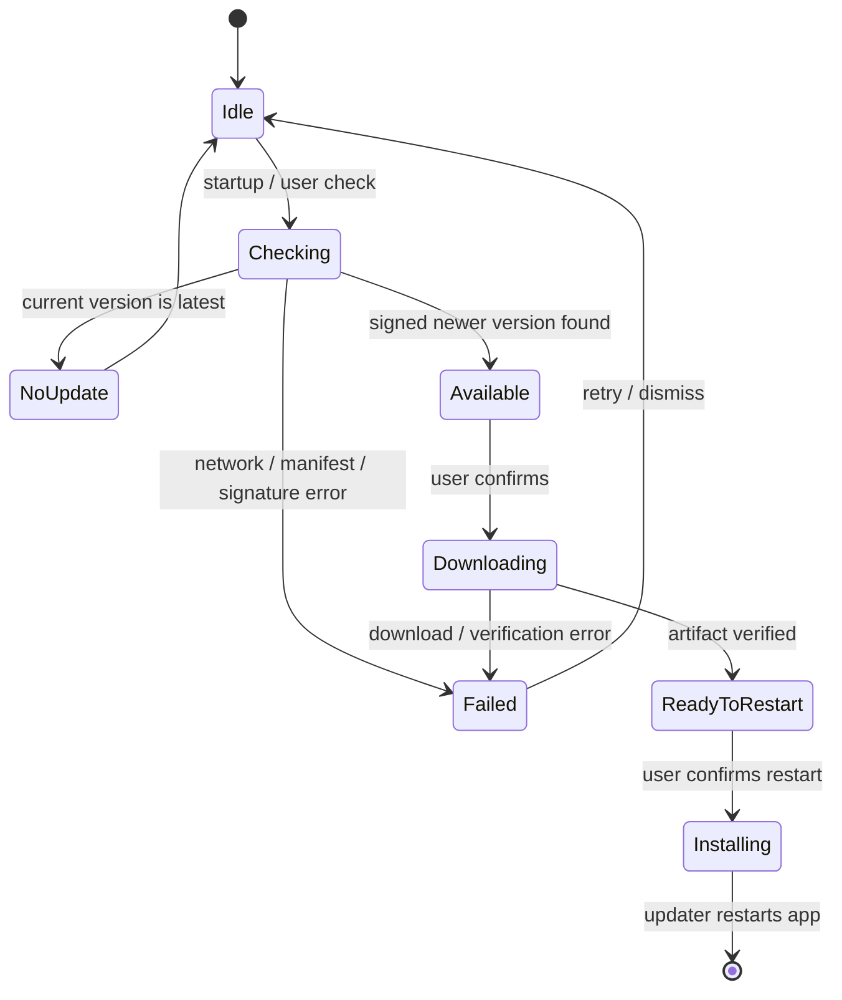

# Lalin Cast — Signed Updater and GitHub Release Specification

## Status and risk

**CANDIDATE — documentation phase only.** This spec defines the later code and
workflow change; it does not create keys, GitHub secrets, releases or updater
configuration yet.

Complexity: **C-3**. Risk: **HIGH** (signed update trust, installer identity,
remote artifacts and release permissions).

## Goals

- Let the installed Windows Lalin Cast app check for a newer signed release.
- Download and install the exact signed artifact published by GitHub Releases.
- Keep update failures non-destructive and visible to the user.
- Make release output reproducible from a Git tag and an approved GitHub Actions
  workflow.
- Keep signing trust separate from the existing G-Music/Lalin Studio key.

## Non-goals

- no custom update server;
- no unsigned or signature-bypass mode;
- no update of Lalin Studio, API, Electron reference or unrelated apps;
- no auto-install without an explicit user confirmation;
- no claim that a GitHub draft release is already an update channel.

## Proposed implementation

Use the official Tauri v2 updater plugin in the standalone Cast repository:

| Layer | Proposed contract |
|---|---|
| Rust | `tauri-plugin-updater` registered by the Cast Tauri application |
| Frontend bridge | `@tauri-apps/plugin-updater` through a narrow update command/module |
| Capability | updater default permission only for the Cast window |
| Manifest | static signed `latest.json` generated/uploaded by `tauri-action` |
| Endpoint | `https://github.com/Freshair129/lalin-cast/releases/latest/download/latest.json` |
| Artifact | Windows x64 NSIS installer and updater signature generated by Tauri |
| User action | check, review version/notes, download, install and restart |
| Channel | stable only for the first release; prerelease channels deferred |

The official Tauri updater requires signing. The public key belongs in the Cast
Tauri configuration; the private key remains only in a protected GitHub Actions
secret and local developer secret store. The updater must fail closed if the
signature is absent or invalid.

## Product identity dependency

The updater is tied to the Tauri application identity. The recommended first
release identity is `ai.lalin.cast`. If the user instead chooses to preserve
`ai.lalin.media`, that decision must be recorded before adding updater config;
the endpoint and signing key remain Cast-specific either way.

## Application behavior

### Check lifecycle

1. On app startup, schedule one non-blocking check after the first window is
   ready. A network failure does not prevent playback or DIAL startup.
2. Expose a user-invoked “Check for updates” action in the native/app menu.
3. If no update exists, show a short non-error status and keep the window usable.
4. If an update exists, show version, release notes and download size when
   available; do not install until the user confirms.
5. Download to the updater-managed temporary location, verify the signature,
   install and restart only after the user confirms.
6. On failure, retain the current installed version and expose a retry/manual
   release link. Never delete the current executable as part of a failed check.

### State model



## Tauri configuration contract

The later implementation must add, in the Cast repository only:

- the updater Rust plugin dependency and registration;
- the updater frontend package or narrow Rust command boundary;
- `bundle.createUpdaterArtifacts: true`;
- the Cast public key and static endpoint in `tauri.conf.json`;
- Windows installer mode (`passive` is the proposed default);
- the updater capability permission;
- release metadata and user-visible update states.

The public key is not a secret. It may be committed after the new Cast key is
generated and reviewed. The private key and password must never be added to
`keys/`, source control, issue text or build logs.

## GitHub Actions release contract

The proposed workflow lives at `.github/workflows/release.yml` in
`Freshair129/lalin-cast` and triggers only on tags matching `v*`.

Required job properties:

```yaml
permissions:
  contents: write

env:
  TAURI_SIGNING_PRIVATE_KEY: ${{ secrets.LALIN_CAST_TAURI_SIGNING_PRIVATE_KEY }}
  TAURI_SIGNING_PRIVATE_KEY_PASSWORD: ${{ secrets.LALIN_CAST_TAURI_SIGNING_PRIVATE_KEY_PASSWORD }}
```

The actual workflow must:

1. check out the exact tag;
2. install the pinned Node/Rust/Tauri build dependencies;
3. run standalone checks and tests;
4. verify that the signing secrets are present without printing their values;
5. invoke `tauri-apps/tauri-action@v1` for the Cast project;
6. set `includeUpdaterJson: true`;
7. create a draft release named `Lalin Cast v__VERSION__` initially;
8. upload the NSIS installer, updater signature and `latest.json`;
9. record the tag, commit and artifact names in the job summary.

The workflow must not reference the root G-Music project path, G-Music signing
secret, root backend build or Studio installer. The first release remains a
manual publish decision after review.

### Portable zip is outside the update channel (wave 12)

The portable zip asset (`Lalin-Cast_<version>_<arch>_portable.zip`, added to the release in wave 12
— see `docs/plans/W12_RELEASE_ASSETS_PLAN.md`) is **not listed in `latest.json`** and is not part of
the signed updater manifest described above. The updater's check/download/install flow only ever
looks at the installed-mode NSIS installer and its signature; it has no knowledge of the portable
zip at all. A portable-mode install can still call the check-for-updates action to see whether a
newer version exists, but the "install" action is disabled in that mode (see the README's
[Portable mode](../../README.md#portable-mode--โหมดพกพา) section) — there is no in-place update path
for a portable install, signed or otherwise. Getting a new portable version is always a manual
download-and-replace, per `packaging/portable/README-PORTABLE.txt`.

## Secret and key lifecycle

1. Generate a new Tauri updater keypair specifically for Lalin Cast outside the
   repository.
2. Store the private key and password in GitHub Actions secrets with the
   `LALIN_CAST_` prefix.
3. Verify the public key matches the private key before committing config.
4. Store only the public key in the Cast repository.
5. If the private key is exposed, revoke the update trust path by shipping a
   planned key rotation release; do not silently replace the public key.

The existing `keys/g-music.key` and `keys/g-music.key.pub` are never reused.

## Acceptance matrix

| Gate | Evidence | Status before implementation |
|---|---|---|
| Static config | valid Tauri config, capability and endpoint | NOT_RUN |
| Signer preflight | new Cast public/private pair matches; no secret output | NOT_RUN |
| Local build | standalone Windows x64 NSIS + updater artifacts | NOT_RUN |
| Manifest | `latest.json` contains version, URL and signature | NOT_RUN |
| Clean install | no prior Cast state; app starts and DIAL binds | NOT_RUN |
| Update | previous published Cast version upgrades and restarts | NOT_RUN |
| Invalid signature | update is rejected and current version stays installed | NOT_RUN |
| Offline endpoint | app remains usable and reports retryable status | NOT_RUN |
| Rollback/manual recovery | prior release or installer remains usable | NOT_RUN |

## Sources

- [Tauri updater plugin](https://v2.tauri.app/plugin/updater/)
- [Tauri GitHub Actions pipeline](https://v2.tauri.app/distribute/pipelines/github/)
- [Tauri configuration reference](https://v2.tauri.app/reference/config/)

## CHANGELOG

| Version | Date | Status | Summary | Commit Hash | Agent |
|---|---|---|---|---|---|
| 0.1.0b | 2026-09-20 | candidate | Proposed signed Tauri updater, static GitHub manifest and Cast release workflow | uncommitted | LALIN |
| 0.2.0b | 2026-09-21 | candidate | Wave 12 (U3): documented that the portable zip asset added to the release is not listed in `latest.json` and is outside the signed updater's check/download/install flow entirely — a portable install can still see that a newer version exists, but has no in-place update path, signed or otherwise (see `docs/plans/W12_RELEASE_ASSETS_PLAN.md`) | uncommitted | LALIN |
