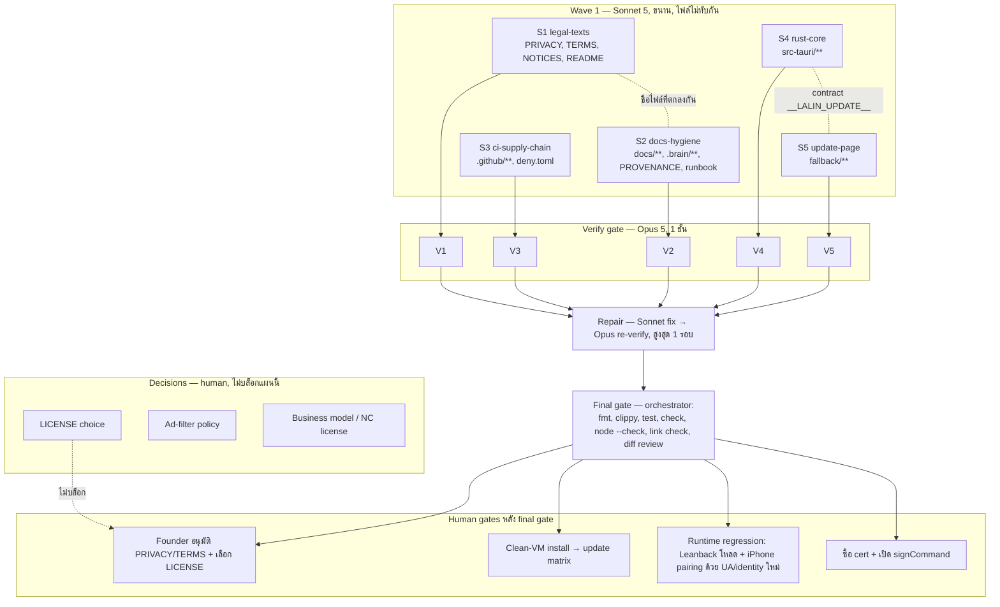

# Lalin Cast — H0 Release Readiness: DAG และแผนดำเนินการ

## สถานะและขอบเขต

**CANDIDATE — approved for execution on branch `feat/h0-release-readiness`.** แผนนี้แปลง
action items จาก launch review (2026-09-20) ที่ทำได้ในโค้ด/เอกสารโดย **ไม่ต้องรอการตัดสินใจของมนุษย์**
ให้เป็นงานขนาน 5 สาย (S1–S5) ที่ไม่แตะไฟล์เดียวกัน ตามด้วย verify gate 1 ชั้น และ final gate
ของ orchestrator

Complexity: **C-2**. Risk: **MEDIUM** (แก้ capability/updater/DIAL identity แต่ทุกอย่างอยู่บน branch
และมี regression test ในเครื่อง; runtime regression กับ YouTube Leanback จริงเป็น human gate แยก)

| Item จาก review | อยู่ในแผนนี้ | เหตุผล |
|---|---|---|
| #1 THIRD_PARTY_NOTICES | ✅ S1 | ไม่ต้องตัดสินใจ |
| #1 LICENSE ของ Lalin Cast | ❌ | founder ต้องเลือก MIT / Apache-2.0 / proprietary — S1 เตรียม `docs/LICENSE_DECISION.md` ให้เลือก |
| #2 native update confirm + capability trim | ✅ S4 + S5 | |
| #3 Authenticode signing | ❌ | ต้องซื้อ cert (human) — S3 เตรียม hook ใน workflow ไว้ (`signCommand` placeholder, ปิดไว้) |
| #4 identity token แทน VacuumTube | ✅ S4 (+S2 บันทึก provenance) | runtime regression กับ Leanback = human gate H3 |
| #5 PRIVACY / TERMS / disclaimer | ✅ S1 (draft) | founder อนุมัติข้อความก่อน merge |
| #6 clean-VM install/update gate | ❌ | human gate H2 |
| #7, #11, #15 | ❌ | escalations |
| #8 i18n TH/EN + ลบ `adFilterMode` | ✅ S4 | |
| #9 CI, pin SHA, DIAL bind LAN IP, parser tests | ✅ S3 + S4 | |
| #10 tray DIAL status / first-run wizard / error pages | ❌ | wave 2 (แตะทุกไฟล์ของ S4 — รอ S4 เสร็จก่อน) |
| #12 key-custody runbook | ✅ S2 | |
| #14 ลิงก์เสีย / version drift / RCA path | ✅ S2 | |

## ค่าคงที่ที่ตัดสินใจแล้ว (ทุกสายต้องใช้ตรงกัน)

| ค่า | ค่าใหม่ | ที่ใช้ |
|---|---|---|
| App version | `env!("CARGO_PKG_VERSION")` (ห้าม hardcode `0.1.0`) | S4 |
| User-Agent | `Mozilla/5.0 (PS4; Leanback Shell) Cobalt/25.lts.40.1035033; compatible; LalinCast/<version>` | S4, S2 (provenance) |
| DIAL `APP_AGENT` / SSDP `SERVER` | `Windows/10 UPnP/1.0 LalinCast/<version>` | S4 |
| DIAL `manufacturer` / `modelName` | `Lalin` / `Lalin Cast` | S4 |
| DIAL `friendlyName` | store key `dialFriendlyName` (sanitize: trim, ≤ 64 chars, ไม่มี CR/LF/`<>`), default **`Lalin Cast`** — **ไม่ต่อ hostname** | S4, S1 (privacy) |
| Store keys | `fullscreen`, `keepOnTop`, `language` (`"th"`/`"en"`), `dialDeviceId`, `dialFriendlyName` — **ลบ `adFilterMode`** | S4, S1 |
| Language default | `th` ถ้า Windows UI language primary id = LANG_THAI (0x1E) ผ่าน `windows-sys` `GetUserDefaultUILanguage()`; ไม่งั้น `en`; toggle ได้จากเมนู | S4 |
| Update window | label `update`, `WebviewUrl::App("update.html")`, ~480×340, ไม่ resizable, เปิดเมื่อพบอัปเดต (startup check ที่ 8 วินาที และเมนู) หรือเมื่อ manual check ได้ผล "up to date"/"error" | S4, S5 |
| Update page contract | `window.__LALIN_UPDATE__ = { lang: "th"\|"en", state: "available"\|"upToDate"\|"error", version?: string, notes?: string, pubDate?: string, message?: string }` ถูก inject ผ่าน `initialization_script` ของหน้าต่าง `update`; ปุ่มติดตั้งเรียก `window.__TAURI__.core.invoke("cast_update_install")`; ปุ่มปิดเรียก `window.__TAURI__.window.getCurrentWindow().close()` | S4, S5 |
| Capabilities | `media` (remote `https://www.youtube.com/*`): `core:default`, `core:event:allow-listen`, `core:event:allow-unlisten`, `allow-dial-respond`, `allow-dial-set-device-id` **เท่านั้น**; `update` (local): `core:default`, `core:window:allow-close`, `allow-cast-update-install` | S4 |
| `cast_update_install` | รับ `window: tauri::Window`; ถ้า `window.label() != "update"` → `Err` | S4 |
| Window title | `Lalin Cast — {document title}` (ตัดที่ 120 chars); ถ้าไม่มี title → `Lalin Cast` | S4 |
| ไฟล์เอกสารใหม่ที่ root | `PRIVACY.md`, `TERMS.md`, `THIRD_PARTY_NOTICES.md`, `docs/LICENSE_DECISION.md` | S1 (สร้าง), S2 (ลิงก์) |
| Runbook ใหม่ | `docs/runbooks/SIGNING_KEY_CUSTODY.md` | S2 |
| Dependencies ใหม่ที่อนุญาต | `windows-sys` (feature `Win32_Globalization`) เท่านั้น เพราะอยู่ใน `Cargo.lock` แล้ว; ห้ามเพิ่ม crate อื่น (registry อาจ offline) | S4 |

## DAG

**Dependency scan (ทำไมแบ่งแบบนี้):** `lib.rs` ถูกแตะโดย #2, #4, #8 และ `dial.rs` ถูกแตะโดย #4, #9 —
ถ้าแยก agent ตาม item จะชนกันและ `cargo check` ของ agent หนึ่งจะเห็นไฟล์ครึ่ง ๆ กลาง ๆ ของอีก agent
จึงรวมงาน Rust ทั้งหมดไว้ที่ S4 และแยกเฉพาะส่วนที่ตัดขาดได้ด้วย contract (หน้า update → S5)
ส่วนเอกสารแยกตาม directory (root docs → S1, `docs/`+`.brain/` → S2) และ CI แยกที่ `.github/`

## File ownership matrix (บังคับ)

| Stream | เขียนได้เฉพาะ | ห้ามแตะ |
|---|---|---|
| S1 legal-texts | `PRIVACY.md`, `TERMS.md`, `THIRD_PARTY_NOTICES.md`, `README.md`, `docs/LICENSE_DECISION.md` | อื่น ๆ ทั้งหมด |
| S2 docs-hygiene | `docs/**` (ยกเว้น `docs/LICENSE_DECISION.md` และไฟล์นี้), `.brain/**`, `LALIN_PROVENANCE.md` | `README.md`, `src-tauri/**` |
| S3 ci-supply-chain | `.github/**`, `deny.toml` | อื่น ๆ ทั้งหมด |
| S4 rust-core | `src-tauri/**` (รวม `Cargo.toml`, `Cargo.lock`, `tauri.conf.json`, `capabilities/**`, `permissions/**`, `injected.js`, `src/**`) | `fallback/**`, เอกสารทุกไฟล์ |
| S5 update-page | `fallback/**` | อื่น ๆ ทั้งหมด |

กฎร่วม: ห้าม `git commit`/`push`/เปลี่ยน branch; ห้ามติดตั้งซอฟต์แวร์; ห้ามลบไฟล์นอกสิทธิ์; ถ้าต้องการให้แก้ไฟล์
นอกสิทธิ์ ให้ส่งเป็น `openQuestions` กลับ orchestrator; ห้าม log/commit TV code, cookie, token, key

## Stream specs และ acceptance criteria

### S1 legal-texts

1. `THIRD_PARTY_NOTICES.md` — รายการ crate ทั้งหมดใน `src-tauri/Cargo.lock` พร้อม license (จาก `cargo metadata`
   หรือ `Cargo.lock` + registry), ข้อความเต็มของ VacuumTube MIT (จาก `reference/vacuumtube/LICENSE`),
   DIAL/Netflix copyright notice สำหรับ binary implementation, Tauri (MIT/Apache-2.0), WebView2 runtime note,
   trademark attributions (YouTube/Google/Cobalt เป็นเครื่องหมายของเจ้าของ; Lalin ไม่เกี่ยวข้อง)
2. `PRIVACY.md` (TH แล้ว EN ในไฟล์เดียว) — ครอบคลุม: ไม่มี telemetry/crash report/บัญชี Lalin; ค่าที่เก็บ local
   (`media-settings.json` + keys ตามตารางค่าคงที่); `dialDeviceId`/Leanback device id ถูก persist; DIAL friendly name
   (default "Lalin Cast", ตั้งเองได้) และ SSDP ตอบบน LAN; updater ติดต่อ `github.com`; YouTube/Google Privacy Policy
   ครอบคลุมสิ่งที่เกิดในหน้า YouTube; logging policy (ไม่ log PII/รหัส); วิธีลบข้อมูล (ลบโฟลเดอร์ app data); ติดต่อ
3. `TERMS.md` — unofficial/not affiliated; ผู้ใช้ผูกพัน YouTube ToS; ฟีเจอร์อาจหยุดทำงานเมื่อ YouTube เปลี่ยน; ไม่มี
   warranty; อายุ 13+ ตาม YouTube; อ้างอิง NOTICES; **ห้าม** คำว่า ad-free/ปลอดโฆษณา, official, Chromecast, Google Cast, cast (ในความหมาย Google Cast) — ใช้ "แอป YouTube บนมือถือค้นหาเจอผ่าน DIAL"
4. `README.md` — เพิ่มส่วน "Disclaimer" + ลิงก์ 3 ไฟล์ + `docs/LICENSE_DECISION.md`; อัปเดต "Current scope" ให้ตรงกับ
   พฤติกรรมใหม่ (identity token ของ Lalin, native update window, language toggle, friendly name ตั้งได้, HTTP bind ที่ LAN IP);
   แก้ข้อความจำนวน test เป็น "three DIAL unit tests"; คง static-check/build commands เดิม
5. `docs/LICENSE_DECISION.md` — เปรียบเทียบ MIT / Apache-2.0 / proprietary สำหรับ Lalin Cast (ข้อดี/เสีย, ผลต่อ
   contributor, ผลต่อการใช้ upstream MIT), คำแนะนำ, และ checklist ที่ founder ต้องทำเมื่อเลือก

**Acceptance:** ทุกไฟล์มีอยู่; NOTICES ครอบคลุมทุก package ใน `Cargo.lock`; ไม่มีคำต้องห้าม; README ลิงก์ resolve;
ภาษาไทยเป็นภาษาหลัก มี EN ตาม

### S2 docs-hygiene

1. แก้ลิงก์เสีย 4 จุดใน `docs/architecture/*.md` (`ADR-001-LALIN-UMBRELLA-PLATFORM.md`,
   `ADR-002-LALIN-MEDIA-TAURI-PORT.md`, `LALIN_MEDIA_MIGRATION_MAP.md`, `LALIN_MEDIA_PLATFORM_PLAN.md`) ให้ชี้ไป
   `https://github.com/Freshair129/Lalin-AI/blob/main/docs/architecture/<file>` พร้อมหมายเหตุ "historical, umbrella repo"
2. `docs/DOCS_INDEX.md` — เพิ่ม entries: แผนนี้, `PRIVACY.md`, `TERMS.md`, `THIRD_PARTY_NOTICES.md`,
   `docs/LICENSE_DECISION.md`, runbook ใหม่; เพิ่มหมายเหตุ "version ของเอกสาร (0.x.yb) เป็น doc revision ไม่ใช่ app version
   (`Cargo.toml`)"
3. `.brain/rca/*.md` — เพิ่มหมายเหตุบรรทัดแรกว่า path `apps/media-tauri`/`apps/media-desktop` เป็น path ประวัติศาสตร์
   ก่อน split (ปัจจุบัน `src-tauri`/`reference/vacuumtube`) — ห้ามแก้เนื้อหา evidence
4. `LALIN_PROVENANCE.md` — อัปเดตแถว User-Agent เป็น token ใหม่ + บันทึกว่าการเปลี่ยน identity (UA/SSDP/modelName) ทำใน
   H0 และ runtime regression ยัง NOT_RUN
5. `docs/architecture/ADR-001-CAST-TAURI-PORT.md` — เพิ่ม CHANGELOG row + อัปเดต "Security and ownership rules" ให้ตรง
   capability ใหม่ (remote origin เหลือ `dial_*` + events; update install เฉพาะหน้าต่าง `update`); แก้ "2 DIAL tests" → จำนวนจริง
6. `docs/runbooks/SIGNING_KEY_CUSTODY.md` — บทบาท (key holder / backup holder เป็น placeholder role ไม่ใส่ชื่อจริง),
   ที่เก็บ (GitHub secret + offline backup), การตรวจว่า public key ตรง, rotation drill, ขั้นตอนเมื่อ key รั่ว (ตาม
   `LALIN_CAST_UPDATER_SPEC.md`), ห้ามใช้ key ของ G-Music

**Acceptance:** ลิงก์ relative ทุกอันใน `docs/**` และ `README.md` resolve (ยกเว้นไฟล์ที่ S1 สร้าง ให้ถือว่า non-blocking);
ไม่มี path เก่าที่ไม่มีหมายเหตุ

### S3 ci-supply-chain

1. `.github/workflows/ci.yml` — trigger `pull_request` + `push` ไป `main`; runs-on `windows-latest`; steps: checkout,
   rust-toolchain stable + clippy, `cargo fmt --check`, `cargo clippy --all-targets -- -D warnings`, `cargo test`,
   `cargo check`, `node --check src-tauri/injected.js`, cargo-deny action (licenses + advisories + bans) — ทุก action
   pin ที่ **full commit SHA** พร้อม comment `# vX.Y.Z` และต้อง verify SHA จริง (ผ่าน `gh api repos/<owner>/<repo>/git/ref/tags/<tag>`
   หรือหน้า GitHub) — ถ้า verify ไม่ได้ให้คง tag และบันทึกใน notes ห้ามเดา SHA
2. `.github/workflows/release.yml` — pin SHA แบบเดียวกัน; เพิ่ม `cargo clippy` ก่อน build; เพิ่ม step เขียน
   `$GITHUB_STEP_SUMMARY` (tag, commit, artifact names ตาม updater spec ข้อ 9); เพิ่ม `signCommand` hook แบบ **ปิดไว้**
   (comment/`if: false`) พร้อมหมายเหตุ H4; ไม่เปลี่ยน secret names
3. `.github/dependabot.yml` — `cargo` (directory `/src-tauri`) และ `github-actions` weekly
4. `deny.toml` — licenses allow: MIT, Apache-2.0, Apache-2.0 WITH LLVM-exception, BSD-2-Clause, BSD-3-Clause, ISC,
   Zlib, BSL-1.0, CC0-1.0, Unicode-3.0, Unicode-DFS-2016, MPL-2.0, OpenSSL (ถ้าจำเป็น); advisories: vulnerability deny,
   unmaintained warn; bans: multiple-versions warn; sources: crates.io only

**Acceptance:** YAML parse ได้ (ตรวจด้วย `node -e` + `js-yaml` ถ้ามี หรือ Python `yaml` ถ้ามี — ถ้าไม่มีทั้งคู่ให้ review ด้วยตา
และบันทึก); ทุก `uses:` pin SHA ที่ verify แล้วหรือมีหมายเหตุ; ไม่มี secret ใน log

### S4 rust-core

1. **Identity:** ใช้ค่าคงที่ตามตาราง; `USER_AGENT` สร้างจาก `CARGO_PKG_VERSION`; `APP_AGENT`/`SERVER`/`manufacturer`/
   `modelName`/`friendlyName` ตามตาราง; อัปเดต unit tests ให้ assert ค่าใหม่และ assert ว่า **ไม่มี** `VacuumTube` ใน
   descriptor/SSDP response/UA
2. **DIAL bind:** HTTP listener bind `(local_ip, 0)`; ทดสอบด้วย unit test ว่า `URLBase`/`LOCATION`/`Application-URL`
   ใช้ `local_ip`; รักษา supervisor rebind
3. **friendlyName:** อ่าน `dialFriendlyName` จาก store (dial.rs อ่าน store ได้อยู่แล้ว), sanitize, default `Lalin Cast`;
   unit test sanitizer
4. **Update flow ย้ายเป็น native:** ลบ `allow-cast-update-check`/`allow-cast-update-install` ออกจาก
   `capabilities/default.json`; สร้าง `capabilities/update.json` (`windows: ["update"]`, `core:default`,
   `core:window:allow-close`, `allow-cast-update-install`); ลบ command `cast_update_check` ออกจาก invoke handler
   (ทำ check ใน Rust ผ่าน `updater::check_update` แทน); startup: 8 วินาทีหลังหน้าต่าง media แสดง → check แบบ non-blocking
   → ถ้ามี update เปิดหน้าต่าง `update` (state `available`); เมนู "check-updates" → check → เปิดหน้าต่าง `update`
   ด้วย state `available`/`upToDate`/`error`; หน้าต่าง `update` ใช้ `WebviewUrl::App("update.html")`,
   `initialization_script` ตั้ง `window.__LALIN_UPDATE__` ตาม contract (JSON-escape ทุกค่า), single instance (focus ถ้ามีอยู่);
   `cast_update_install(window: tauri::Window, app: AppHandle)` ปฏิเสธถ้า label ≠ `update`; ลบ event
   `lalin-cast-update-check` และ code update ทั้งหมดออกจาก `injected.js` (คง DIAL bridge + device-id sync + `data-lalin-cast` mark)
5. **i18n + settings:** `src/i18n.rs` — `Lang { Th, En }`, `detect_default()` (windows-sys `GetUserDefaultUILanguage`,
   primary language id `0x1E` → Th), `t(lang, key) -> &'static str` สำหรับ label เมนูทั้งหมด + title หน้าต่าง update;
   store key `language`; เมนูเพิ่ม item toggle ภาษา (label "English" เมื่อเป็นไทย / "ภาษาไทย" เมื่อเป็นอังกฤษ) และ rebuild
   menu ทันทีด้วย `window.set_menu`; ลบ `adFilterMode` seed; `Cargo.toml` เพิ่ม `windows-sys` พร้อม feature
   `Win32_Globalization` (target `cfg(windows)`); ถ้า resolve offline ไม่ได้ ให้ default `en` ไม่ใช้ windows-sys และบันทึกใน notes
6. **Window title:** `on_document_title_changed` → `Lalin Cast — {title}` ตัด 120 chars; ว่าง → `Lalin Cast`
7. **CSP:** `app.security.csp` = `"default-src 'self'; script-src 'self'; style-src 'self' 'unsafe-inline'; img-src 'self' data:"`
   (มีผลเฉพาะหน้า local)
8. **Tests เพิ่ม (dial.rs):** header > 16 KiB → reject; body > 100 KiB → reject; request ไม่มี CRLF/ไม่สมบูรณ์ → reject/timeout
   ตามพฤติกรรมเดิม; path นอก whitelist (`/foo`, `/apps/../x`) → 404; method นอก GET/POST/DELETE → 405 หรือ 404 ตามเดิม
   (บันทึกพฤติกรรม); `is_dial_search` กับ message ว่าง/ไม่ใช่ M-SEARCH/ST อื่น; identity strings; friendly-name sanitize;
   `i18n.rs` tests (fallback, toggle)
9. **Quality gate ที่ต้องผ่านก่อนคืนงาน:** `cargo fmt --manifest-path src-tauri/Cargo.toml`,
   `cargo clippy --manifest-path src-tauri/Cargo.toml --all-targets -- -D warnings`,
   `cargo test --manifest-path src-tauri/Cargo.toml`, `cargo check --manifest-path src-tauri/Cargo.toml`,
   `node --check src-tauri/injected.js`; ห้ามเพิ่ม crate อื่นนอกจาก `windows-sys`; regenerate `permissions/autogenerated`
   ผ่าน build ได้ (ไฟล์ `cast_update_check.toml` ควรหายไปเมื่อ command ถูกลบ — ถ้ายังอยู่ให้ลบด้วยมือและบันทึก)

**Acceptance:** ทุกคำสั่งใน 9 ผ่าน; `grep -rn VacuumTube src-tauri/src src-tauri/injected.js` ว่าง (ยกเว้น comment ที่อ้าง
provenance); `capabilities/default.json` ไม่มี `cast_update_*`; `injected.js` ไม่มี `update`

### S5 update-page

1. `fallback/update.html` + `fallback/update.js` + `fallback/update.css` (ไม่มี inline script/CSS handler) — อ่าน
   `window.__LALIN_UPDATE__` ตาม contract; แสดง 3 state; ข้อความ TH/EN ตาม `lang`; ปุ่ม "ติดตั้งและเปิดใหม่ / Install and
   restart" (disabled ระหว่างติดตั้ง, แสดงข้อผิดพลาด + ปุ่มลองใหม่ถ้า `invoke` reject), ปุ่ม "ไว้ภายหลัง / Later" และ `Escape`
   → `window.__TAURI__.window.getCurrentWindow().close()`; ถ้า `__TAURI__` ไม่มี ให้แสดงข้อความและปิดปุ่ม; ดีไซน์ dark
   (พื้น `#171717`, accent `#3ea6ff`) เข้ากับ Leanback; รองรับความกว้าง 480px; ไม่โหลด resource ภายนอก
2. `fallback/index.html` — เพิ่ม `<meta http-equiv="Content-Security-Policy">` และข้อความ TH/EN ว่า Lalin Cast
   โหลด YouTube TV ในหน้าต่างหลัก (ไม่เปลี่ยนบทบาทไฟล์)

**Acceptance:** `node --check fallback/update.js` ผ่าน; ไม่มี inline `<script>`/`on*=`; ทุก state render ได้เมื่อจำลอง
`window.__LALIN_UPDATE__` ใน Node/jsdom-free harness (ตรวจด้วยการอ่านโค้ด + unit-style self-test ใน `update.js` ที่รันเฉพาะ
เมื่อ `globalThis.__LALIN_TEST__`)

## Verify gate rubric (Opus 5, 1 ชั้น, ต่อสาย)

Verifier เป็น skeptic ที่ต้องพยายาม **ปฏิเสธ** งาน โดยตรวจ:

1. **Scope:** `git status --porcelain` — ไฟล์ที่เปลี่ยนต้องอยู่ในสิทธิ์ของสายนั้นเท่านั้น (ไฟล์ของสายอื่นที่ปรากฏใน status
   ไม่นับ เพราะทำงานขนาน — ตรวจเฉพาะว่าสายนี้ไม่ได้แก้ไฟล์นอกสิทธิ์ โดยดูจาก `changedFiles` ที่คืนมา + diff)
2. **Acceptance ของสาย** ทุกข้อในหัวข้อข้างบน — รันคำสั่งจริง ไม่เชื่อ notes
3. **Constants** ตรงตาราง (UA, identity, store keys, contract, capabilities)
4. **Security:** ไม่มี secret/PII; remote capability ไม่มี `cast_update_*`; `cast_update_install` ตรวจ label
5. **Claims:** ไม่มีคำต้องห้ามในเอกสาร
6. **Regression:** พฤติกรรมเดิมที่ต้องคง — DIAL supervisor/rebind, device-id sync, single-instance, settings best-effort

ผลลัพธ์: `pass: boolean`, `blocking[]` (file, issue, fix), `nonBlocking[]`, `summary`. ถ้า `pass=false` → Sonnet fixer แก้เฉพาะ
`blocking` ในไฟล์ของสาย → Opus verify ซ้ำ 1 ครั้ง; ยัง fail → ส่งต่อ final gate พร้อมรายการค้าง

## Final gate (orchestrator)

1. `git status`/`git diff --stat` — ไม่มีไฟล์นอก ownership matrix, ไม่มีไฟล์ขยะ (target/, node_modules/)
2. รัน integrated: fmt --check, clippy -D warnings, test, check, `node --check` ทั้ง `injected.js` และ `fallback/update.js`
3. Link check ทั้ง repo (relative `.md` links)
4. Diff review ด้วยตา: `capabilities/*.json`, `updater.rs`, `lib.rs` (menu/update/title), `dial.rs` (identity, bind,
   friendlyName), `injected.js`, `ci.yml`
5. `grep -rn "VacuumTube" src-tauri/` ต้องว่าง; `grep -rni "ad-free\|ปลอดโฆษณา\|Chromecast\|Google Cast" *.md docs/` ต้องว่าง
   (ยกเว้นบริบทที่บอกว่า "ห้ามใช้")
6. รายงานผล + รายการ human gates H1–H4 + ไม่ commit จนกว่าผู้ใช้จะสั่ง

## Out of scope / wave 2

- tray DIAL status + first-run network-profile wizard + หน้า error/offline/blocked-UA (item #10) — เริ่มหลัง S4 merge
- `lalin-cast://` deep link, Studio launcher IPC, controller support (H1)
- Authenticode signing จริง (H4), clean-VM matrix (H2), runtime regression (H3), LICENSE choice (H1)

## Rollback

ทั้งหมดอยู่บน `feat/h0-release-readiness` โดยไม่ commit จนกว่าจะผ่าน final gate — `git checkout -- . && git clean -fd`
(ยกเว้นไฟล์นี้) คืนสภาพเดิม; `main` ไม่ถูกแตะ

## CHANGELOG

| Version | Date | Status | Summary | Commit Hash | Agent |
|---|---|---|---|---|---|
| 0.1.0b | 2026-09-20 | candidate | DAG, file ownership, 5 parallel streams, Opus verify gate and orchestrator final gate for H0 | uncommitted | LALIN |
