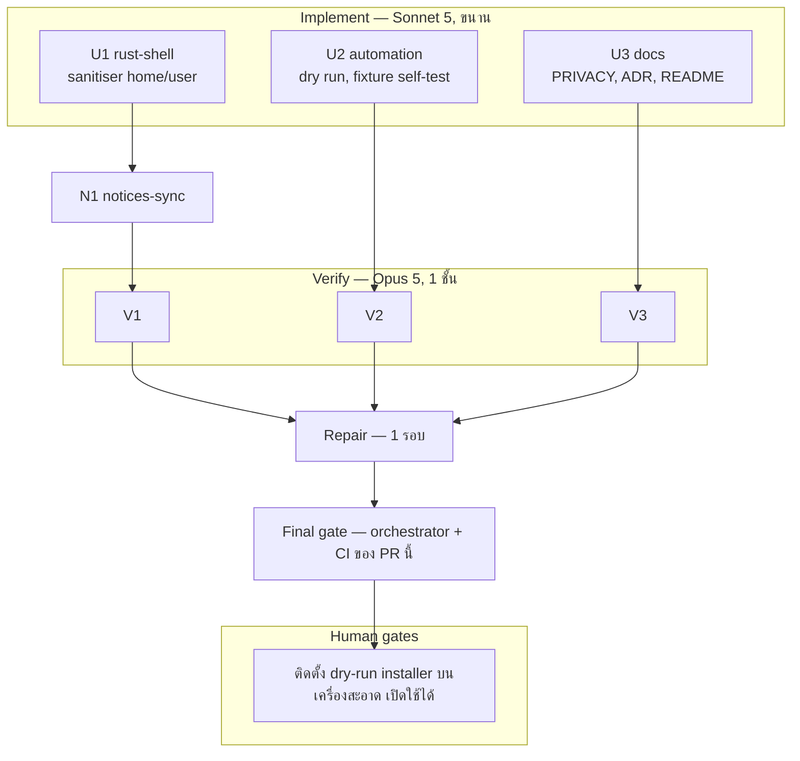

# Lalin Cast — Wave 10 "Release rehearsal": DAG และแผนดำเนินการ

## สถานะและขอบเขต

**CANDIDATE — approved for execution on branch `feat/wave10-release-rehearsal`** (แตกจาก `main` ที่ `7212e1a`)

### ทำไมต้องซ้อมปล่อยก่อน

repository นี้ **ไม่เคยมี tag และไม่เคยมี release** `release.yml` จึงไม่เคยรันจริงแม้แต่ครั้งเดียว ตัวติดตั้ง NSIS
ไม่เคยถูก build บน CI และ `release.yml` เรียก `tauri-apps/tauri-action` ด้วย `projectPath: .` ทั้งที่ root ไม่มี
`package.json` ไม่มีใครรู้ว่าวันที่ tag `v0.2.0` มันจะผ่านหรือไม่ ถ้าไม่ผ่าน เราจะรู้ตอนที่ tag ถูก push ไปแล้ว

wave นี้จึงซ้อม **ด้วย action ตัวเดียวกันที่ SHA เดียวกัน** เพื่อให้สิ่งที่ dry run เจอคือสิ่งที่ release จริงจะเจอ

### สิ่งที่ปิดได้ในรอบนี้

| ข้อ | ก่อน | หลัง wave 10 |
|---|---|---|
| ตัวติดตั้ง build ได้จริงหรือไม่ | ไม่มีใครรู้ | รู้ทุกครั้งที่ไฟล์ที่เกี่ยวกับการ bundle เปลี่ยน |
| installer จดทะเบียน `lalin-cast://` เองหรือไม่ (ครึ่งหนึ่งของ H23) | ต้องติดตั้งบนเครื่องจริงแล้วเปิด regedit | CI ตรวจสคริปต์ NSIS ที่ render แล้วให้อัตโนมัติ |
| check `notices` ทำ PR แดงได้จริงหรือไม่ (H27) | รอ dependency bump ครั้งหน้า | CI พิสูจน์ด้วย fixture ทุกครั้ง |
| log เปิดเผยชื่อบัญชี Windows ได้ถ้า path มีช่องว่าง | ข้อจำกัดที่บันทึกไว้ใน PRIVACY | ปิดแล้ว home folder และชื่อบัญชีถูกแทนที่ทุกที่ |

**ห้ามเพิ่ม crate, ห้ามเพิ่ม feature ของ `windows-sys`, ห้าม `unsafe` ใหม่** และ **ห้ามแตะ `release.yml`**
(dry run เป็นไฟล์ใหม่แยกต่างหาก เพื่อไม่ให้การซ้อมเปลี่ยนสิ่งที่กำลังซ้อม)

Complexity: **C-2**. Risk: **MEDIUM** (dry run ตรวจได้บน CI เท่านั้น เพราะเครื่อง dev ไม่มี tauri-cli — ทั้ง worker และ
verifier จะตรวจได้แค่แบบ static ผลจริงจะรู้ตอน CI ของ PR นี้รัน)

## ค่าคงที่และ contract (ทุกสายต้องใช้ตรงกัน)

### 1. Release dry run (U2: `.github/workflows/release-dryrun.yml` ใหม่)

- trigger: `workflow_dispatch` และ `pull_request` ที่มี `paths:` ครอบไฟล์ที่มีผลต่อการ bundle:
  `src-tauri/tauri.conf.json`, `src-tauri/Cargo.toml`, `src-tauri/Cargo.lock`, `src-tauri/icons/**`,
  `.github/workflows/release.yml`, และ `.github/workflows/release-dryrun.yml` เอง
  (ไฟล์ตัวเองอยู่ในรายการ ดังนั้น PR ของ wave นี้จะ trigger มันและพิสูจน์ว่ามันทำงาน)
- runner `windows-latest`, target `x86_64-pc-windows-msvc` เท่านั้น (ARM64 ยัง experimental อยู่ใน `release.yml`)
- ใช้ `tauri-apps/tauri-action` **ที่ SHA เดียวกับ `release.yml`** และ `projectPath` เดียวกัน
  แต่ **ไม่ใส่** `tagName` / `releaseName` / `releaseId` เพื่อไม่ให้สร้างหรืออัปโหลด release ใด ๆ
  ต้องอ่าน README/source ของ action ที่ SHA นั้นเพื่อยืนยันพฤติกรรมนี้ และบันทึกหลักฐานใน notes
- ปิดการสร้าง updater artifact ด้วย config override (`--config` ที่ตั้ง `bundle.createUpdaterArtifacts` เป็น `false`)
  เพราะ dry run ต้อง **ไม่ใช้ secret ใด ๆ** — ห้ามอ้าง `LALIN_CAST_TAURI_SIGNING_PRIVATE_KEY` หรือ secret อื่น
- `permissions: contents: read` ระดับ workflow (ไม่ต้องเขียนอะไรกลับ)
- หลัง build:
  1. หา `installer.nsi` ที่ render แล้วใต้ `src-tauri/target/**/nsis/**` **ถ้าไม่เจอให้ fail** (fail closed —
     ห้ามผ่านแบบไม่ได้ตรวจอะไร)
  2. fail ถ้าสคริปต์มีข้อความ `Classes\lalin-cast` (ไม่สนตัวพิมพ์) ซึ่งเป็น registry path ที่ installer จะใช้ถ้า
     จดทะเบียน scheme เอง
  3. หาไฟล์ติดตั้ง `*-setup.exe` และอัปโหลดเป็น artifact ชื่อ `lalin-cast-dryrun-installer` เก็บ 7 วัน
     (ใช้กับ human gate H2 และ H28 บนเครื่องจริง)
  4. เขียน job summary: ขนาด installer, ผลการตรวจ scheme, และหมายเหตุว่า **ไม่ได้ลงนาม**
- ทุก `uses:` pin SHA 40 หลัก; ทุก step ที่เป็น pwsh ใช้ argument คงที่

### 2. Self-test ของ check notices (U2: `.github/workflows/ci.yml`, `scripts/**`)

- fixture ขนาดเล็กใน `scripts/fixtures/notices-mismatch/` สองไฟล์: `Cargo.lock` และ `THIRD_PARTY_NOTICES.md`
  ที่ตั้งใจให้ไม่ตรงกันหนึ่งแถว
- job `notices` เดิมเพิ่ม step ที่รัน `node scripts/check-notices.mjs <fixture lock> <fixture notices>` แล้ว
  **ต้องได้ exit code ไม่เป็นศูนย์** ถ้าได้ศูนย์ให้ step นี้ fail (พิสูจน์ว่าตัวตรวจไม่ได้ผ่านทุกอย่าง)
- step เดิมที่ตรวจไฟล์จริงต้องคงอยู่และยังเป็นตัวแรก

### 3. Sanitiser ที่ปกป้องชื่อบัญชี (U1: `src-tauri/src/log.rs`)

pure fn ใหม่ `sanitize_log_message_with(raw, home: Option<&str>, user: Option<&str>) -> String`
และให้ `sanitize_log_message(raw)` เรียกมันด้วยค่าที่อ่าน **ครั้งเดียว** จาก env `USERPROFILE` และ `USERNAME`
เก็บใน `std::sync::OnceLock` (ห้ามเพิ่ม crate)

ลำดับการทำงาน (สำคัญ เพราะแต่ละขั้นพึ่งผลของขั้นก่อน):

1. ตัวอักษรควบคุมทุกตัวกลายเป็นช่องว่าง
2. ถ้า `home` มีค่าและยาว ≥ 3 ตัวอักษร: แทนทุกครั้งที่พบ (ไม่สนตัวพิมพ์) ด้วย `<home>` ทั้งรูปแบบ `\` และ `/`
   — **ขั้นนี้ต้องมาก่อนกฎ path** เพื่อให้ `C:\Users\First Last\AppData` ถูกแทนทั้งก้อน ไม่ใช่แค่ถึงช่องว่าง
3. ถ้า `user` มีค่าและยาว ≥ 3 ตัวอักษร: แทนทุกครั้งที่พบแบบ **ทั้งคำ** (ไม่ติดตัวอักษรหรือตัวเลขทั้งสองข้าง,
   ไม่สนตัวพิมพ์) ด้วย `<user>`
4. URL: scheme ใด ๆ ที่ตรงรูป `[A-Za-z][A-Za-z0-9+.-]*://` (ไม่สนตัวพิมพ์) ถึงช่องว่างถัดไป → `<url>`
   (แทน `URL_SCHEMES` สามตัวเดิม จึงปิดกรณี scheme ที่ไม่อยู่ในรายการด้วย)
5. path ของ Windows: `X:\`, `X:/`, และ `\\` ถึงช่องว่างถัดไป → `<path>`
6. ตัดที่ 512 ตัวอักษร (นับตัวอักษร ไม่ใช่ไบต์)

tests ที่ต้องมี (ทุกข้อเรียก `sanitize_log_message_with` ด้วยค่าที่กำหนดเอง ไม่อ่าน env จริง):

- `C:\Users\First Last\AppData\x.log` กับ home `C:\Users\First Last` → ไม่มีคำว่า `First` หรือ `Last` เหลือเลย
- home แบบ `/` และตัวพิมพ์ต่างกัน
- ชื่อบัญชีถูกแทนเมื่อเป็นคำเดี่ยว แต่ **ไม่** ถูกแทนเมื่อเป็นส่วนหนึ่งของคำอื่น (เช่น `bob` ใน `bobcat`)
- ชื่อบัญชีสั้นกว่า 3 ตัวอักษรไม่ถูกแทน (กันการทำลายข้อความทั่วไป)
- `HTTPS://`, `ftp://`, `file:///` ถูกแทน
- `C:/Users/x` ถูกแทน
- `home`/`user` เป็น `None` → ผลตรงกับพฤติกรรมเดิมทุกกรณีที่ test เดิมครอบ
- **test ทุกตัวของ wave 9 ต้องยังผ่าน** (ปรับได้เฉพาะกรณีที่ contract ใหม่ตั้งใจเปลี่ยนผล และต้องอธิบายใน notes)

ข้อจำกัดที่ยังเหลือและต้องบันทึกตรง ๆ: path ที่ **ไม่อยู่ใต้ home folder** และมีช่องว่าง (เช่น `D:\Media Library\x`)
ยังถูกปิดบังถึงช่องว่างแรกเท่านั้น แต่ไม่มีชื่อบัญชีอยู่ในนั้นแล้ว

### 4. เอกสาร (U3)

- PRIVACY (ไทย+อังกฤษ) หัวข้อไฟล์ log: ปรับให้ตรงกับ contract 3 — ระบุได้ชัดว่าโฟลเดอร์ home และชื่อบัญชี Windows
  ถูกแทนที่ก่อนเขียน **ทุกที่ที่ปรากฏ** และบอกข้อจำกัดที่เหลือตามจริง ห้ามสัญญาเกิน
- ADR-001: feature row สำหรับ release dry run + ปรับ security rule ของ sanitiser + CHANGELOG row
- README: ส่วน Development กล่าวถึง dry run, artifact ที่ได้, และว่าไม่ได้ลงนาม
- DOCS_INDEX: แผนนี้
- `docs/runbooks/RELEASE_CHECKLIST.md` เป็นของ U2 ไม่ใช่ U3

### 5. N1 notices-sync (หลัง U1)

- ไม่มี crate ใหม่จึงคาดว่าไม่เปลี่ยน — ยืนยันด้วย `node scripts/check-notices.mjs`

## DAG

**Dependency scan:** ไม่มีสาย injected และไม่มีสาย pages — `src-tauri/injected*.js` และ `fallback/**` ต้องไม่มี diff

**ข้อสังเกตเรื่อง final gate:** เครื่อง dev ไม่มี tauri-cli จึงไม่มีใครใน pipeline นี้รัน dry run ได้จริง final gate
ของ wave นี้จึงรวมผล CI ของ PR เข้าไปด้วย — ถ้า dry run แดงบน CI ต้องแก้ก่อน merge

## File ownership matrix (บังคับ)

| Stream | เขียนได้เฉพาะ | ห้ามแตะ |
|---|---|---|
| U1 rust-shell | `src-tauri/**` ยกเว้น `injected.js`, `injected.test.js`, `capabilities/default.json` | `injected*.js`, **`capabilities/default.json`**, `fallback/**`, เอกสาร, `.github/**`, `scripts/**` |
| U2 automation | `.github/workflows/release-dryrun.yml` (ใหม่), `.github/workflows/ci.yml`, `scripts/**`, `CHANGELOG.md`, `docs/runbooks/RELEASE_CHECKLIST.md` | **`.github/workflows/release.yml`**, dependabot, ISSUE_TEMPLATE, โค้ด, เอกสารอื่น |
| U3 docs | `README.md`, `PRIVACY.md`, `LALIN_PROVENANCE.md`, `docs/**` (ยกเว้น `docs/plans/**`, `docs/runbooks/RELEASE_CHECKLIST.md`), `.brain/**` | `THIRD_PARTY_NOTICES.md`, `TERMS.md`, `SECURITY.md`, `CHANGELOG.md`, โค้ด, `.github/**`, `scripts/**` |
| N1 notices-sync | `THIRD_PARTY_NOTICES.md` | อื่น ๆ |

กฎร่วมเหมือน wave 1–9 **ห้ามเพิ่ม crate/feature/`unsafe`** และ **ห้ามแตะ `release.yml`**

## Stream specs และ acceptance criteria

### U1 rust-shell

1. `sanitize_log_message_with` + `OnceLock` ตาม contract 3 ครบทุกขั้นตามลำดับ
2. tests ครบทุกข้อใน contract 3 และ test ของ wave 9 ยังผ่าน
3. `capabilities/default.json`, `Cargo.toml`, `Cargo.lock` diff ว่าง; `unsafe` ยังเท่ากับ 4
4. **Quality gate:** fmt, clippy -D warnings, test, check, `grep -rn VacuumTube src-tauri/src` ว่าง

### U2 automation

1. `release-dryrun.yml` ตาม contract 1 ครบ พร้อมหลักฐานจากการอ่าน tauri-action ที่ SHA ที่ pin
2. fixture + step self-test ตาม contract 2 และแสดงผลรันจริงบนเครื่องทั้งกรณีไฟล์จริง (ผ่าน) และ fixture (ล้ม)
3. CHANGELOG + RELEASE_CHECKLIST (H28, และบันทึกว่า H27 ถูกแปลงเป็น CI แล้ว)
4. **Acceptance:** YAML parse ได้ทั้งสามไฟล์ workflow, ทุก `uses:` pin SHA, `release.yml` diff ว่าง,
   ไม่มีการอ้าง secret ใดใน `release-dryrun.yml`

### U3 docs

1. ทุกข้อใน contract 4
2. **Acceptance:** ลิงก์ resolve, forbidden-word grep ว่าง, ข้อความเรื่อง log ตรงกับ sanitiser ใหม่ทุกคำ

### N1 notices-sync (หลัง U1)

- ตาม contract 5

## Verify gate rubric (Opus 5)

เหมือน wave 9 เพิ่ม:

- ลำดับ sanitiser: home ต้องถูกแทน **ก่อน** กฎ path (ทดสอบได้ด้วยเคส path ที่มีช่องว่างใต้ home)
- การแทนชื่อบัญชีเป็นแบบทั้งคำจริง และมีเพดานความยาวขั้นต่ำ
- ไม่มีเส้นทางใดเขียนลงไฟล์โดยไม่ผ่าน sanitiser (คงเดิมจาก wave 9)
- `release-dryrun.yml` ไม่อ้าง secret ไม่สร้าง/อัปโหลด release, fail closed เมื่อหา `installer.nsi` ไม่เจอ,
  และใช้ tauri-action ที่ SHA เดียวกับ `release.yml`
- step self-test ของ `notices` ล้มจริงถ้าตัวตรวจคืนศูนย์กับ fixture
- `release.yml`, `injected*.js`, `fallback/**` ไม่มี diff
- ไม่มี crate/feature/`unsafe` เพิ่ม
- Regression wave 1–9 ทั้งหมด

## Final gate (orchestrator)

1. integrated: fmt --check, clippy -D warnings, test, check, `node` ทุก suite, `node scripts/check-notices.mjs`
   ทั้งไฟล์จริงและ fixture, YAML parse, PowerShell parse
2. `git diff` ว่างของ `release.yml`, `capabilities/default.json`, `injected*.js`, `fallback/**`, `Cargo.toml`,
   `Cargo.lock`; `unsafe` = 4
3. **ผล CI ของ PR นี้ รวมถึง job dry run** — ต้องเขียวก่อน merge
4. รายงาน + human gate H28; ไม่ commit จนกว่าผู้ใช้จะสั่ง

## Out of scope / wave 11

LICENSE (H1 — ผู้ก่อตั้งต้องเลือก), Authenticode signing (H4 — ต้องมีใบรับรอง), ARM64 ใน dry run, portable mode,
userstyles แบบ sandbox, Lalin Remote, macOS/Linux

## Rollback

`git checkout -- . && git clean -fd` บน `feat/wave10-release-rehearsal` (ยกเว้นไฟล์นี้) คืนสภาพ `7212e1a`

## CHANGELOG

| Version | Date | Status | Summary | Commit Hash | Agent |
|---|---|---|---|---|---|
| 0.1.0b | 2026-09-21 | candidate | Wave 10 DAG, the unsigned release dry-run contract through the same pinned tauri-action with a fail-closed installer scheme check, the notices self-test fixture, and home/account-name masking in the sanitiser; 3 parallel streams + notices sync, gates | uncommitted | LALIN |
