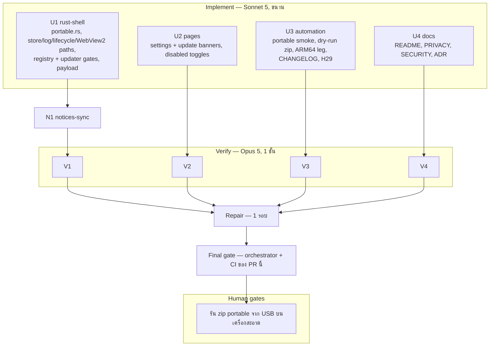

# Lalin Cast — Wave 11 "Portable mode": DAG และแผนดำเนินการ

## สถานะและขอบเขต

**CANDIDATE — approved for execution on branch `feat/wave11-portable`** (แตกจาก `main` ที่ `98e5d6e`)

### ทำไมต้องเป็น portable

portable mode อยู่ในรายการ "out of scope" ของทุก wave ตั้งแต่ wave 9 และเป็นข้อเดียวที่เหลือซึ่ง **ไม่ต้องรอการตัดสินใจของ
ผู้ก่อตั้งหรือของที่ต้องซื้อ** (LICENSE = H1, Authenticode = H4) ส่วน userstyle ต้องมี ADR แยกตาม ADR-004 ข้อ 4,
low-memory ถูกปิดถาวรโดย ADR-004 ข้อ 5, Lalin Remote และ macOS/Linux ใหญ่เกิน wave เดียว

ผู้ใช้กลุ่มเป้าหมาย: เครื่อง HTPC/เครื่องที่ใช้ร่วมกันที่ไม่อยากติดตั้งอะไร, การพกไปบน USB, และเครื่องที่ผู้ใช้ไม่มีสิทธิ์
admin แต่เขียนโฟลเดอร์ของตัวเองได้

### สิ่งที่ได้หลัง wave นี้

| ข้อ | ก่อน | หลัง wave 11 |
|---|---|---|
| ที่เก็บข้อมูล | `%APPDATA%` / `%LOCALAPPDATA%\ai.lalin.cast` เสมอ | ถ้ามี marker ข้าง exe: ทุกอย่างอยู่ใน `lalin-cast-data\` ข้าง exe |
| การเขียน registry | Run key (startWithWindows), `lalin-cast://` (deepLinkScheme) | portable: **ไม่เขียนเลย** และปฏิเสธการเปิดสองตัวเลือกนี้ |
| updater | ติดตั้งทับด้วย NSIS installer | portable: ยังบอกได้ว่ามีเวอร์ชันใหม่ แต่ **ไม่ติดตั้ง** (installer ติดตั้งลงโฟลเดอร์ติดตั้งของตัวเอง ไม่ใช่ข้าง exe) |
| หลักฐาน | — | CI smoke รัน exe จริงในโหมด portable และตรวจว่า `lifecycle.json` ไปอยู่ข้าง exe |
| แจกจ่าย | installer อย่างเดียว | dry run ผลิต zip portable เป็น artifact (การแนบกับ release จริงเลื่อนไป wave ถัดไป เพราะห้ามแตะ `release.yml`) |
| ARM64 | build ใน `release.yml` แบบ experimental แต่ไม่เคยรัน | dry run มีขา ARM64 แบบ `continue-on-error` |

**ห้ามเพิ่ม crate, ห้ามเพิ่ม feature ของ `windows-sys`, ห้าม `unsafe` ใหม่**, **ห้ามแตะ `release.yml`**,
**ห้ามแตะ `capabilities/*.json` ทุกไฟล์** (wave นี้ไม่มี command ใหม่ ข้อมูลใหม่ไปกับ payload เดิม)

Complexity: **C-3**. Risk: **MEDIUM-HIGH** — แตะทุกจุดที่ resolve path ของข้อมูล ถ้าพลาดจุดเดียว โหมด portable
จะรั่วข้อมูลไปที่ `%LOCALAPPDATA%` หรือแย่กว่านั้นคือโหมดปกติเปลี่ยนที่เก็บจนผู้ใช้เดิมเสียการตั้งค่า

## ค่าคงที่และ contract (ทุกสายต้องใช้ตรงกัน)

### 1. การตรวจจับ (U1: `src-tauri/src/portable.rs` ใหม่)

- marker: ไฟล์ชื่อ **`lalin-cast.portable`** (เนื้อหาไม่สำคัญ อาจว่าง) ในโฟลเดอร์เดียวกับ exe
  ที่ได้จาก `std::env::current_exe()` — ไม่ใช่ working directory, ไม่ใช่ argument, ไม่ใช่ env var
- data root: **`<exe dir>\lalin-cast-data`**
- ตัดสิน **ครั้งเดียว** ตอนเริ่มโปรแกรม เก็บใน `std::sync::OnceLock` แล้วไม่เปลี่ยนตลอดอายุ process
- ถ้าพบ marker แต่สร้าง/เขียน data root ไม่ได้ (เช่นอยู่ใน `Program Files`): **ไม่เข้า portable** กลับไปใช้ที่ปกติ
  และเขียน warning ลง log หนึ่งบรรทัด (ห้ามใส่ path เต็มโดยไม่ผ่าน sanitiser — ซึ่งเป็นกติกาอยู่แล้ว) — เหตุผล:
  ดีกว่าให้แอปเปิดไม่ได้เลยบนเครื่องที่ผู้ใช้ไม่รู้ว่ามี marker ติดมา
- การทดสอบ "เขียนได้": `create_dir_all` แล้วสร้างและลบไฟล์ทดลองหนึ่งไฟล์ในนั้น
- แยก logic เป็น pure fn ที่รับ `exe_dir: &Path` เพื่อให้ test ได้ด้วย temp dir โดยไม่แตะ exe จริง:
  `fn detect(exe_dir: &Path) -> Mode` โดย `enum Mode { Installed, Portable { data_root: PathBuf } }`
- public API ขั้นต่ำ: `portable::mode() -> &'static Mode`, `portable::is_portable() -> bool`,
  และ helper ที่ให้ path ของแต่ละชนิดข้อมูลตามข้อ 2

### 2. ที่เก็บข้อมูลแต่ละชนิด

| ข้อมูล | Installed (ต้องเหมือนเดิมทุกไบต์) | Portable |
|---|---|---|
| settings store | `app.store("media-settings.json")` (relative → `%APPDATA%\ai.lalin.cast\`) | `app.store(<data_root>\media-settings.json)` แบบ absolute |
| log | `<app_local_data_dir>\logs\` | `<data_root>\logs\` |
| `lifecycle.json` | `<app_local_data_dir>\lifecycle.json` | `<data_root>\lifecycle.json` |
| WebView2 profile | ค่า default ของ Tauri (ไม่เรียก `data_directory`) | `data_directory(<data_root>\WebView2)` บน **ทุก** window builder ทั้ง 5 (media, settings, setup, status, update) |

- **ทุก** call site ของ `app.store("media-settings.json")` (ตอนนี้ ~15 จุดใน `dial.rs`, `i18n.rs`, `lib.rs`,
  `settings.rs`, `setup.rs`, `window_bounds.rs`) ต้องไปผ่าน helper เดียว เช่น `portable::settings_store_path()`
  ที่คืน `PathBuf::from("media-settings.json")` ในโหมด installed — **ห้ามเปลี่ยนพฤติกรรมโหมด installed**
  เพราะผู้ใช้เดิมจะเสียการตั้งค่าทั้งหมด
- ต้อง **อ่าน source ของ `tauri-plugin-store` เวอร์ชันที่ล็อกใน `Cargo.lock`** (ใน `~/.cargo/registry/src`)
  เพื่อยืนยันว่า path แบบ absolute ถูกใช้ตรง ๆ ไม่ถูกต่อท้าย `AppData` และบันทึกหลักฐาน (ไฟล์:บรรทัด) ใน notes
- ต้องใช้ `PathBuf` ค่าเดียวกันทุกครั้ง (plugin cache store ตาม path ที่ resolve แล้ว — path ต่างรูปจะได้สอง instance)
- WebView2: ทุก window ต้องใช้ data directory **เดียวกัน** ห้ามแยกต่อ window (สภาพปัจจุบันทุก window ใช้ default ร่วมกัน
  โหมด portable ต้องรักษาความสัมพันธ์นี้) ตรวจ signature ของ `WebviewWindowBuilder::data_directory` ใน tauri 2.11.5
- test แบบ source-scan: ไม่มี string literal `store("media-settings.json")` เหลือนอก `portable.rs`, และทุก
  `WebviewWindowBuilder::new(` ใน `src/` ผ่าน helper ที่ใส่ data directory (เช่น `portable::apply_data_dir(builder)`)

### 3. สิ่งที่ปิดในโหมด portable (U1)

- **startWithWindows**: ข้ามการ reconcile ตอนเริ่ม (`lib.rs` ~บรรทัด 1043); `apply_setting` ที่ตั้งเป็น `true`
  คืน `Err` ข้อความคงที่ `"not available in portable mode"`; การตั้งเป็น `false` ยังทำได้ (ไม่มีผลเสีย)
- **deepLinkScheme**: เหมือนกันทุกข้อ (ข้ามการ reconcile ตอนเริ่ม, ปฏิเสธ `true`)
- เหตุผลที่ต้องปฏิเสธใน Rust ไม่ใช่แค่ซ่อนปุ่ม: Rust คือเส้นแบ่งความปลอดภัยจริง (หลักเดียวกับ label guard)
  และ registry ที่ชี้ไป exe บน USB จะค้างอยู่หลังถอด USB
- **updater**: ไม่มี startup check (`schedule_startup_check` ไม่ทำอะไรใน portable); การตรวจแบบสั่งเองยังรายงานได้ว่า
  มีเวอร์ชันใหม่; `cast_update_install` คืน `Err("not available in portable mode")` ก่อนดาวน์โหลดอะไร
- ไม่มีการลบหรือแก้ registry ที่มีอยู่เดิม (ถ้าเคยติดตั้งแบบปกติไว้ ของเดิมอยู่ต่อ — portable แค่ไม่แตะ)
  **รวมถึงตอนตั้งเป็น `false`**: ในโหมด portable การปิดตัวเลือกบันทึกแค่ store ของ portable ไม่เรียก
  `autostart::set_enabled(false)` หรือ `unregister` (แก้ใน final gate — ร่างแรกของ contract ขัดกันเองในข้อนี้)

### 4. Payload ที่เพิ่ม (U1 ผลิต, U2 ใช้)

- `SettingsSnapshot` เพิ่ม field ระดับบนสุด `portable: bool` (serialize เป็น `portable`) — **ไม่ใช่ store key**
  และ `apply_setting` ต้องไม่รู้จักมัน
- payload ที่ update window ได้รับ (ผลของ `map_update_info` หรือโครงสร้างที่ `update.js` อ่าน) เพิ่ม `portable: bool`
- diagnostics (`diagnostics.rs`) เพิ่ม `portable: bool` — **ไม่ใส่ path ของ data root** (เป็นข้อมูลส่วนตัว)
- ไม่มี command ใหม่ ไม่มี event ใหม่ ไม่มี permission ใหม่

### 5. หน้า local (U2: `fallback/settings.*`, `fallback/update.*`)

- settings: เมื่อ `portable === true` แสดงแถบข้อความด้านบน "โหมดพกพา — ข้อมูลทั้งหมดเก็บในโฟลเดอร์ `lalin-cast-data`
  ข้างไฟล์โปรแกรม / Portable mode — all data is kept in the `lalin-cast-data` folder next to the program"
  และ disable toggle `startWithWindows` กับ `deepLinkScheme` พร้อมคำอธิบายสั้นว่าทำไม (ไทยก่อน อังกฤษตาม)
- ถ้า `portable` ไม่มีใน payload (เช่น test เก่า) ให้ถือเป็น `false`
- update: เมื่อ `portable === true` ซ่อน/disable ปุ่มติดตั้ง และแสดงคำแนะนำให้ดาวน์โหลด zip เวอร์ชันใหม่แล้ว
  **ย้ายโฟลเดอร์ `lalin-cast-data` ไปด้วย** — ไม่มีลิงก์ภายนอกใหม่ (ห้ามเพิ่มการเปิด URL)
- ข้อความใหม่ทั้งหมดใช้ระบบ i18n เดิมของหน้า ห้ามใช้ `innerHTML` กับข้อมูลที่มาจาก Rust
- node tests ครอบทั้ง `portable: true`, `false`, และไม่มี field

### 6. CI (U3: `.github/workflows/ci.yml`, `.github/workflows/release-dryrun.yml`)

**Portable smoke** — เพิ่มใน job `smoke` หลัง step เดิมทั้งหมด (step เดิมห้ามเปลี่ยน):

1. copy `src-tauri/target/debug/lalin-cast.exe` ไปที่ `$env:RUNNER_TEMP\lalin-portable\` และสร้าง
   `lalin-cast.portable` ว่างข้างมัน
2. จำ `LastWriteTimeUtc` ของ `%LOCALAPPDATA%\ai.lalin.cast\lifecycle.json` (ที่ step เดิมเขียนไว้)
3. รัน `--lifecycle close --request-id ci-portable` timeout 60 วินาที (รูปแบบเดียวกับ step เดิม)
4. **fail** ถ้า `<temp>\lalin-portable\lalin-cast-data\lifecycle.json` ไม่มี หรือไม่ใช่
   `stopped` / `ci-portable` / `exitCode 0`
5. **fail** ถ้า `lifecycle.json` ใน `%LOCALAPPDATA%` มี `requestId` เป็น `ci-portable` หรือ `LastWriteTimeUtc`
   เปลี่ยนไป (พิสูจน์ว่าโหมด portable ไม่รั่วไปที่เดิม)
6. step พิมพ์ไฟล์ทั้งสองเมื่อ failure

**Dry run**:

- zip portable จากขา x64: หลัง build ให้หา `src-tauri/target/release/lalin-cast.exe` (**fail closed** ถ้าไม่เจอ)
  แล้วทำ zip ที่มี `lalin-cast.exe` + `lalin-cast.portable` ว่าง + `README-PORTABLE.txt` (ไทย+อังกฤษ สั้น ๆ:
  วิธีใช้, ต้องมี WebView2 runtime, โฟลเดอร์ข้อมูลมี session ที่ล็อกอินอยู่) อัปโหลดเป็น artifact
  `lalin-cast-dryrun-portable` เก็บ 7 วัน; job summary บอกขนาดและว่าไม่ได้ลงนาม
  `README-PORTABLE.txt` เก็บเป็นไฟล์จริงใน repo ที่ `packaging/portable/README-PORTABLE.txt`
- ขา ARM64: matrix หรือ job แยกสำหรับ `aarch64-pc-windows-msvc` ใช้ tauri-action SHA เดิม, `continue-on-error: true`,
  ต้องไม่ทำให้ขา x64 ถูกยกเลิก (ดู `fail-fast` ตามที่ `release.yml` ทำ), ใช้การตรวจ `installer.nsi` แบบ fail-closed
  เดียวกัน อัปโหลด installer เป็น `lalin-cast-dryrun-installer-arm64` ถ้า build ได้
- เพิ่ม `packaging/portable/**` ใน `paths:` ของ dry run
- ขั้นตอน fail-closed ของ wave 10 ห้ามผ่อน; ยังไม่อ้าง secret ใด ๆ; `permissions: contents: read`

### 7. เอกสาร (U4)

- README: ส่วน "โหมดพกพา / Portable mode" — วิธีเปิด (marker), ที่เก็บข้อมูล, สิ่งที่ปิด (startup, scheme, auto-update),
  ต้องมี WebView2 runtime, ใช้ร่วมกับตัวติดตั้งไม่ได้พร้อมกัน (single-instance ใช้ identifier เดียวกัน — เปิดตัวที่สอง
  จะไปเรียกตัวแรกแทน), วิธีอัปเดต (แตก zip ใหม่ + ย้าย `lalin-cast-data`)
- PRIVACY (ไทย+อังกฤษ): ตารางที่เก็บข้อมูลทั้งสองโหมด และ **คำเตือนชัดเจน**: `lalin-cast-data\WebView2` มี cookie
  และ session YouTube ที่ล็อกอินอยู่ ใครได้โฟลเดอร์นี้ไป (เช่น USB หาย) ใช้บัญชีนั้นได้ — แนะนำให้ออกจากระบบก่อนส่งต่อ
  หรือลบโฟลเดอร์; ลบโฟลเดอร์ = ลบข้อมูลทั้งหมดของแอปในโหมดนั้น
- SECURITY.md: ประโยคเดียวเรื่องความเสี่ยงของ data folder ที่พกพาได้ (U4 เป็นเจ้าของไฟล์นี้ใน wave นี้)
- ADR-001: feature row + CHANGELOG row; DOCS_INDEX: แผนนี้
- ห้ามสัญญาเกิน: ไม่พูดว่า "ไม่ทิ้งร่องรอยบนเครื่อง" — WebView2 runtime, Windows prefetch/jump list, temp ของ updater
  ฯลฯ อยู่นอกการควบคุมของแอป ให้พูดว่า "ข้อมูลที่แอปเขียนเอง"

### 8. N1 notices-sync (หลัง U1)

- ไม่มี crate ใหม่จึงคาดว่าไม่เปลี่ยน — ยืนยันด้วย `node scripts/check-notices.mjs` และ `git diff` ของ `Cargo.lock`

## DAG

**Dependency scan:** U2 อ่าน `portable` จาก payload ตาม contract 4 โดยไม่รอ U1 (ใช้ fixture ใน test);
U3 พึ่งพฤติกรรมของ U1 แต่พิสูจน์ได้เฉพาะบน CI ของ PR; ไม่มีสาย injected — `src-tauri/injected*.js` ต้องไม่มี diff

## File ownership matrix (บังคับ)

| Stream | เขียนได้เฉพาะ | ห้ามแตะ |
|---|---|---|
| U1 rust-shell | `src-tauri/**` ยกเว้น `injected.js`, `injected.test.js`, `capabilities/**` | `injected*.js`, **`capabilities/**`**, `fallback/**`, เอกสาร, `.github/**`, `scripts/**`, `packaging/**` |
| U2 pages | `fallback/settings.*`, `fallback/update.*` | ไฟล์อื่นใน `fallback/**`, `src-tauri/**`, เอกสาร |
| U3 automation | `.github/workflows/ci.yml`, `.github/workflows/release-dryrun.yml`, `packaging/portable/**` (ใหม่), `scripts/**`, `CHANGELOG.md`, `docs/runbooks/RELEASE_CHECKLIST.md` | **`.github/workflows/release.yml`**, dependabot, ISSUE_TEMPLATE, โค้ด, เอกสารอื่น |
| U4 docs | `README.md`, `PRIVACY.md`, `SECURITY.md`, `LALIN_PROVENANCE.md`, `docs/**` (ยกเว้น `docs/plans/**`, `docs/runbooks/RELEASE_CHECKLIST.md`), `.brain/**` | `THIRD_PARTY_NOTICES.md`, `TERMS.md`, `CHANGELOG.md`, โค้ด, `.github/**`, `packaging/**` |
| N1 notices-sync | `THIRD_PARTY_NOTICES.md` | อื่น ๆ |

## Stream specs และ acceptance criteria

### U1 rust-shell

1. `portable.rs` ตาม contract 1 พร้อม unit tests บน temp dir: ไม่มี marker → Installed; มี marker + เขียนได้ →
   Portable พร้อม data root ถูกต้อง; มี marker แต่ data root เป็นไฟล์ (สร้างโฟลเดอร์ไม่ได้) → Installed
2. contract 2 ครบทุกแถว พร้อมหลักฐานจาก source ของ `tauri-plugin-store` และ source-scan tests
3. contract 3 ครบ พร้อม tests ของ gate ที่ทดสอบได้โดยไม่มี AppHandle (แยก decision เป็น pure fn)
4. contract 4 พร้อม serialization test ที่ตรึงชื่อ field `portable`
5. **Quality gate:** fmt, clippy `--all-targets -D warnings`, test, check; `capabilities/**`, `Cargo.toml`,
   `Cargo.lock`, `injected*.js` diff ว่าง; `unsafe` ยังเท่ากับ 4

### U2 pages

1. contract 5 ครบ ทั้งสองหน้า
2. **Acceptance:** `node fallback/settings.test.js`, `node fallback/update.test.js` และ suite อื่นทุกตัวใน
   `fallback/` ผ่าน; ไม่มี `innerHTML` ใหม่ที่รับข้อมูลจาก payload

### U3 automation

1. contract 6 ครบ พร้อมเหตุผลว่า step ใดพิสูจน์อะไร และ fail closed ตรงไหน
2. CHANGELOG (wave 11 สองภาษา) + RELEASE_CHECKLIST: **H29** — แตก zip portable จาก dry run ลง USB บนเครื่องสะอาด
   เปิดแอป ตั้งค่าบางอย่าง ปิดแล้วเปิดใหม่ ยืนยันว่าค่าอยู่, ยืนยันว่า `%APPDATA%\ai.lalin.cast` และ
   `%LOCALAPPDATA%\ai.lalin.cast` ไม่ถูกสร้าง/แก้, ไม่มี Run key และ `HKCU\Software\Classes\lalin-cast` ใหม่
3. **Acceptance:** YAML parse ทุก workflow, ทุก `uses:` pin SHA 40 หลักและ tauri-action SHA ตรงกับ `release.yml`,
   ไม่มี `secrets.` ใน `release-dryrun.yml`, `release.yml` diff ว่าง, PowerShell ใน step ใหม่ parse ได้

### U4 docs

1. contract 7 ครบ
2. **Acceptance:** ลิงก์ relative resolve, forbidden-word grep ว่าง, ไม่มีประโยค "ไม่ทิ้งร่องรอย"/"leaves no trace"
   หรือคำสัญญาเกินแบบเดียวกัน

## Verify gate rubric (Opus 5)

เหมือน wave 10 เพิ่ม:

- **โหมด installed ต้องไม่เปลี่ยนแม้แต่ path เดียว**: store ยังเป็น relative `media-settings.json`, log/lifecycle ยัง
  resolve ผ่าน `app_local_data_dir`, ไม่มี `data_directory` ถูกเรียกเมื่อไม่ใช่ portable
- ทุกจุดที่แตะ store / log / lifecycle / window builder ผ่าน helper — หาจุดที่หลุดด้วย grep เอง
- marker ตรวจจากโฟลเดอร์ของ exe เท่านั้น ไม่ใช่ cwd; ตัดสินครั้งเดียว
- portable ปฏิเสธการเปิด startWithWindows/deepLinkScheme ใน Rust (ไม่ใช่แค่ UI) และไม่ reconcile registry ตอนเริ่ม
- `cast_update_install` ปฏิเสธก่อนดาวน์โหลด; ไม่มี startup check
- diagnostics ไม่มี path ของ data root
- `capabilities/**`, `release.yml`, `injected*.js` diff ว่าง; ไม่มี crate/feature/`unsafe` เพิ่ม
- CI portable smoke fail จริงเมื่อ `lifecycle.json` ไม่ไปอยู่ข้าง exe หรือเมื่อไฟล์ใน `%LOCALAPPDATA%` ถูกแตะ
- เอกสารเตือนเรื่อง session ใน `lalin-cast-data\WebView2` และไม่สัญญาเกิน
- Regression wave 1–10 ทั้งหมด

## Final gate (orchestrator)

1. integrated: fmt --check, clippy -D warnings, test, check, `node` ทุก suite, `check-notices` (จริง + fixture),
   YAML parse, PowerShell parse
2. ทดสอบจริงบนเครื่อง dev: build debug, copy ไป temp dir + marker, รัน `--lifecycle close` แล้วดูว่า
   `lalin-cast-data\` ถูกสร้างพร้อม `lifecycle.json`, `logs\`, และ (ถ้ามี window) `WebView2\`
3. `git diff` ว่างของ `release.yml`, `capabilities/**`, `injected*.js`, `Cargo.toml`, `Cargo.lock`; `unsafe` = 4
4. **ผล CI ของ PR นี้ รวม portable smoke และ dry run** — ต้องเขียวก่อน merge (ขา ARM64 แดงได้ แต่ต้องรายงาน)
5. รายงาน + human gate H29; ไม่ commit จนกว่าผู้ใช้จะสั่ง

## Out of scope / wave 12

แนบ zip portable กับ GitHub Release จริง (ต้องแก้ `release.yml`), LICENSE (H1), Authenticode (H4), ADR userstyle,
การย้ายข้อมูลระหว่างโหมด installed ↔ portable อัตโนมัติ, Lalin Remote, macOS/Linux

## Rollback

`git checkout -- . && git clean -fd` บน `feat/wave11-portable` (ยกเว้นไฟล์นี้) คืนสภาพ `98e5d6e`

## CHANGELOG

| Version | Date | Status | Summary | Commit Hash | Agent |
|---|---|---|---|---|---|
| 0.1.0b | 2026-09-21 | candidate | Wave 11 DAG and contracts for portable mode (marker beside the exe, every data path moved under lalin-cast-data, registry writes and in-place updates refused in Rust, portable flag in existing payloads), a CI smoke that runs the real exe in portable mode, a dry-run portable zip and an experimental ARM64 dry-run leg; 4 parallel streams + notices sync, gates | uncommitted | LALIN |
