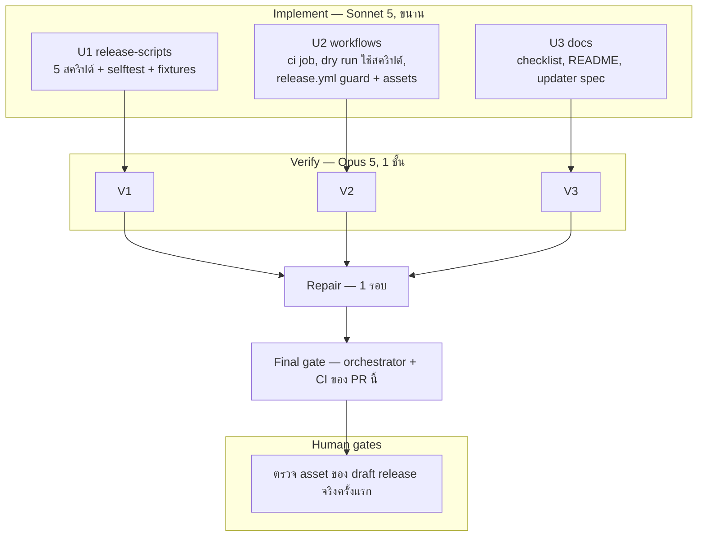

# Lalin Cast — Wave 12 "Release assets": DAG และแผนดำเนินการ

## สถานะและขอบเขต

**CANDIDATE — approved for execution on branch `feat/wave12-release-assets`** (แตกจาก `main` ที่ `802ac54`)

### ทำไมต้องทำแบบนี้

wave 10–11 พิสูจน์แล้วว่า dry run build installer และ zip portable ได้ทั้ง x64 และ ARM64 แต่ **`release.yml` ยังไม่เคยรัน**
และไม่มีขั้นตอนใดของ dry run อยู่ใน `release.yml` เลย ถ้าเราแค่ copy step จาก dry run ไปวาง จะได้โค้ดสองชุดที่ค่อย ๆ
ห่างกัน และ `release.yml` จะไม่มีวันถูกทดสอบจนถึงวัน tag

ทางแก้: **ย้าย logic ไปเป็นสคริปต์ที่ใช้ร่วมกัน** ใน `scripts/release/` ให้ทั้ง dry run และ `release.yml` เรียกสคริปต์เดียวกัน
ด้วยพารามิเตอร์เดียวกัน dry run จึงพิสูจน์โค้ดที่ release จะใช้จริง ต่างกันแค่ขั้น upload ที่ dry run รันแบบ `-WhatIf`

### ช่องโหว่ใน `release.yml` ที่พบตอนวางแผน

`tagName: v__VERSION__` ของ tauri-action ใช้เวอร์ชันจาก `src-tauri/Cargo.toml` (ตอนนี้ `0.1.0`) **ไม่ใช่ tag ที่ push**
ถ้า push `v0.2.0` โดยลืม bump เวอร์ชัน จะได้ draft release ชื่อ `v0.1.0` ที่มี binary ซึ่งบอกตัวเองว่า 0.1.0 และ `latest.json`
ที่ผิด — wave นี้เพิ่ม guard ที่ล้ม **ก่อน build** ถ้า tag ไม่ตรงกับเวอร์ชันของแอป หรือ CHANGELOG ไม่มีหัวข้อของเวอร์ชันนั้น

### สิ่งที่ได้หลัง wave นี้

| ข้อ | ก่อน | หลัง wave 12 |
|---|---|---|
| tag ≠ เวอร์ชันแอป | build ต่อและสร้าง release ผิดชื่อ | ล้มก่อน build พร้อมข้อความบอกวิธีแก้ |
| ไม่มี `## [x.y.z]` ใน CHANGELOG | ใช้ข้อความ fallback เงียบ ๆ | ล้มก่อน build |
| ตรวจ scheme ใน installer | มีแค่ใน dry run | ทั้ง dry run และ release ใช้สคริปต์เดียวกัน |
| zip portable | artifact ของ dry run 7 วัน | แนบกับ draft release ทั้ง x64 และ ARM64 |
| checksum | ไม่มี | `SHA256SUMS` ต่อสถาปัตยกรรม แนบกับ release |
| logic ใน workflow | inline สองชุดที่ต่างกัน | สคริปต์เดียวพร้อม self-test ที่รันบน CI ทุก PR |

**ห้ามเพิ่ม crate และห้ามแตะ `src-tauri/**` ทั้งหมด** (wave นี้ไม่มีโค้ด Rust หรือหน้า UI), **ห้ามเพิ่ม secret ใหม่**,
**ห้ามเปลี่ยนเวอร์ชันของแอป** (การ bump เป็นขั้นตอนตอน release ตาม checklist ไม่ใช่ของ wave นี้),
**ห้ามลบหรือผ่อน step ที่มีอยู่ใน `release.yml`** (updater secret check, Rust checks, clippy, H4 placeholder,
การดึง CHANGELOG, `max-parallel: 1`, `fail-fast: false`, `continue-on-error` ของ ARM64, `uploadUpdaterJson`)

Complexity: **C-2**. Risk: **MEDIUM** — `release.yml` ยังรันไม่ได้จนกว่าจะ tag ขั้น upload จริงจึงพิสูจน์ได้แบบ static
เท่านั้น ที่เหลือพิสูจน์ผ่าน dry run และ self-test

## ค่าคงที่และ contract (ทุกสายต้องใช้ตรงกัน)

ทุกสคริปต์: PowerShell 7 (`pwsh`), `Set-StrictMode -Version Latest`, `$ErrorActionPreference = 'Stop'`, ไม่มี module
ภายนอก, ไม่ต่อเน็ต (ยกเว้น `Publish-ReleaseAssets.ps1` ตอนไม่ใช่ `-WhatIf`), ล้มด้วย `throw` ข้อความที่บอกวิธีแก้,
พิมพ์ผล `OK: ...` เมื่อผ่าน, ไม่รับ path จาก environment โดยปริยาย (ทุกอย่างเป็นพารามิเตอร์)

### 1. `scripts/release/Test-ReleaseVersion.ps1`

```
-Tag <string>            # เช่น "v0.2.0" (ใน release.yml คือ $env:GITHUB_REF_NAME)
-CargoToml <path>        # src-tauri/Cargo.toml
-TauriConf <path>        # src-tauri/tauri.conf.json
-Changelog <path>        # CHANGELOG.md
```

- เวอร์ชันของแอป = `version` ใน tauri.conf.json ถ้ามี ไม่งั้น `[package].version` ของ Cargo.toml (ลำดับเดียวกับที่
  tauri ใช้ — ผู้ทำต้องยืนยันจาก source/เอกสารของ tauri 2.11.5 และบันทึกหลักฐาน)
- ล้มถ้า `Tag` ไม่ใช่ `v<เวอร์ชัน>` ตรงตัว
- ล้มถ้า CHANGELOG ไม่มีบรรทัดที่ขึ้นต้นด้วย `## [<เวอร์ชัน>]` หรือหัวข้อนั้นไม่มีเนื้อหา
- เขียน `version=<เวอร์ชัน>` ลง `$env:GITHUB_OUTPUT` ถ้าตัวแปรนี้มีค่า

### 2. `scripts/release/Test-InstallerScheme.ps1`

```
-SearchRoot <path>       # src-tauri/target
```

- ย้ายตรรกะจาก dry run ของ wave 10 มาทั้งหมดโดยไม่ผ่อน: หา `installer.nsi` ใต้ `SearchRoot` แบบ recursive,
  **ล้มถ้าไม่เจอเลย** (fail closed), ล้มถ้าไฟล์ใดมี `Classes\lalin-cast` แบบไม่สนตัวพิมพ์

### 3. `scripts/release/New-PortableZip.ps1`

```
-ExePath <path>          # target/<triple>/release/lalin-cast.exe
-ReadmePath <path>       # packaging/portable/README-PORTABLE.txt
-OutputDir <path>
-Version <string>        # เช่น "0.2.0"
-Arch <x64|arm64>
```

- ล้มถ้า exe หรือ readme ไม่มี; zip ชื่อ **`Lalin-Cast_<Version>_<Arch>_portable.zip`** ที่มีเพียงสามไฟล์ที่ root:
  `lalin-cast.exe`, `lalin-cast.portable` (ว่าง), `README-PORTABLE.txt`
- เปิด zip ที่สร้างแล้วตรวจกลับว่ามีครบสามไฟล์และไม่มีอื่น (ล้มถ้าไม่ตรง)
- คืน path ของ zip (และเขียน `path=` ลง `GITHUB_OUTPUT` ถ้ามี)

### 4. `scripts/release/Write-Checksums.ps1`

```
-Files <path[]>
-OutputPath <path>       # เช่น Lalin-Cast_<Version>_<Arch>_SHA256SUMS.txt
```

- รูปแบบบรรทัดละไฟล์ `<sha256 hex ตัวเล็ก><สองช่องว่าง><ชื่อไฟล์ไม่มีโฟลเดอร์>` (รูปแบบของ `sha256sum`)
  เรียงตามชื่อไฟล์, จบด้วย LF, ล้มถ้าไฟล์ใดไม่มีหรือชื่อซ้ำ
- `-GitHubAssetNames` (เพิ่มใน final gate): บันทึกชื่อตามที่ GitHub ตั้งให้ asset — ช่องว่างกลายเป็นจุด
  (`Lalin Cast_...-setup.exe` → `Lalin.Cast_...-setup.exe`) และล้มถ้ามีอักขระอื่นที่เดาชื่อไม่ได้ ทั้ง release และ dry run ใช้

### 5. `scripts/release/Publish-ReleaseAssets.ps1`

```
-Tag <string>
-Files <path[]>
-WhatIf                  # SupportsShouldProcess
```

- ล้มถ้าไฟล์ใดไม่มี (ทั้งตอน `-WhatIf` และตอนจริง)
- ตอนจริง: `gh release upload <Tag> <files...> --clobber` (ใช้ `GH_TOKEN` จาก workflow) — ผู้ทำต้องยืนยันจาก
  เอกสาร/source ของ `gh` ว่า `gh release upload` หา **draft release** จาก tag ได้ และบันทึกหลักฐาน ถ้าหาไม่ได้
  ให้ใช้ `releaseId` จาก output ของ tauri-action แทน (พารามิเตอร์ `-ReleaseId` แทน `-Tag`) และบันทึกเหตุผล
- ตอน `-WhatIf`: พิมพ์รายการที่จะอัปโหลดพร้อมขนาด ไม่เรียก `gh`
- workflow ส่งแค่ zip และ SHA256SUMS (final gate): installer ถูก tauri-action แนบไว้แล้ว การ `--clobber` ซ้ำจะลบ
  asset ที่ `latest.json` ชี้อยู่ชั่วคราว
- `Test-ReleaseVersion.ps1 -ResolveOnly` (final gate): คืนเวอร์ชันอย่างเดียว ให้ dry run สร้าง tag จำลองโดยไม่ต้องมีสำเนา
  ของกฎลำดับเวอร์ชันแบบ inline

### 6. Self-test (`scripts/release/selftest.ps1` + `scripts/release/fixtures/**`)

- รันทุกสคริปต์กับ fixture ในโฟลเดอร์ temp และตรวจทั้งกรณีผ่านและกรณีต้องล้ม (**ต้องล้มจริง** ไม่ใช่แค่ไม่ throw):
  version ตรง / tag ผิด / tauri.conf มีเวอร์ชันของตัวเอง / CHANGELOG ไม่มีหัวข้อ / หัวข้อว่าง;
  nsi สะอาด / มี `Classes\LALIN-CAST` / ไม่มี nsi เลย; zip ครบสามไฟล์ / exe หาย;
  checksum ตรงกับค่าที่คำนวณเอง / ไฟล์หาย / ชื่อซ้ำ; publish `-WhatIf` ไม่เรียก `gh` / ไฟล์หาย
- exe ใน fixture เป็นไฟล์ข้อความเล็ก ๆ (ไม่ใช่ binary จริง) — ห้าม commit binary
- exit 0 เมื่อทุกข้อผ่าน, exit 1 พร้อมสรุปข้อที่ล้ม
- `scripts/README.md` บรรยายทุกสคริปต์

### 7. Workflows (U2)

**ci.yml** — job ใหม่ `release-scripts` (`ubuntu-latest`, `pwsh`) รัน `pwsh scripts/release/selftest.ps1`
และ blocking; SHA-pinned checkout เท่านั้น; `permissions` ไม่เกินที่ workflow มี

**release-dryrun.yml** — แทน step inline ด้วยสคริปต์ (x64 และ ARM64 เหมือนกัน):
1. `Test-ReleaseVersion.ps1 -Tag "v<เวอร์ชันที่อ่านได้>"` — dry run ไม่มี tag จริง จึงจำลอง tag ที่ถูกต้อง
   เพื่อพิสูจน์ว่าสคริปต์อ่านเวอร์ชันได้ **แต่ข้ามการตรวจหัวข้อ CHANGELOG** ด้วย switch `-SkipChangelog`
   (เพิ่มใน contract 1 เฉพาะสำหรับ dry run; `release.yml` ห้ามใช้)
2. build (เหมือนเดิม)
3. `Test-InstallerScheme.ps1`
4. `New-PortableZip.ps1` — **ทั้ง x64 และ ARM64** (wave 11 ทำแค่ x64)
5. `Write-Checksums.ps1` กับ installer + zip
6. `Publish-ReleaseAssets.ps1 -WhatIf`
7. upload artifact (ชื่อเดิมของ wave 11 + `lalin-cast-dryrun-portable-arm64` + checksum) และ job summary
- `paths:` เพิ่ม `scripts/release/**`

**release.yml** — เพิ่ม **โดยไม่ลบหรือผ่อน step เดิม**:
1. step แรกหลัง checkout: `Test-ReleaseVersion.ps1 -Tag $env:GITHUB_REF_NAME` (ไม่มี `-SkipChangelog`) ก่อน Rust checks
2. หลัง tauri-action: `Test-InstallerScheme.ps1` → `New-PortableZip.ps1` → `Write-Checksums.ps1` (installer
   `*-setup.exe` ของ leg นั้น + zip) → `Publish-ReleaseAssets.ps1` พร้อม `GH_TOKEN: ${{ secrets.GITHUB_TOKEN }}`
3. tauri-action ได้ `id:` เพื่ออ้าง output ได้ (ถ้า contract 5 ต้องใช้ `releaseId`)
4. job summary บอก asset ที่แนบ
- ไม่มี secret ใหม่, `permissions: contents: write` เดิม, ทุก `uses:` pin SHA

### 8. เอกสาร (U3)

- `docs/runbooks/RELEASE_CHECKLIST.md`: ขั้นตอน bump เวอร์ชันและเขียน `## [x.y.z]` ก่อน tag (อธิบายว่า guard จะล้มถ้าลืม),
  การตรวจ asset ใน draft (installer, `.sig`, `latest.json`, zip portable, SHA256SUMS ทั้งสองสถาปัตยกรรม),
  วิธียืนยัน checksum ด้วย `Get-FileHash`, และ **H30**: ดาวน์โหลด asset ทุกตัวจาก draft release จริงครั้งแรก
  ตรวจ checksum และรัน zip portable ก่อนกด publish
- README ส่วนดาวน์โหลด: เลือกระหว่าง installer / portable / ARM64, ARM64 ยังเป็น experimental, portable ไม่อัปเดตอัตโนมัติ,
  วิธีตรวจ checksum, และว่า binary ยังไม่เซ็น Authenticode จนกว่า H4 จะปิด (SmartScreen อาจเตือน)
- `docs/architecture/LALIN_CAST_UPDATER_SPEC.md`: ระบุว่า zip portable **ไม่อยู่ใน** `latest.json` และไม่รับอัปเดตอัตโนมัติ
- CHANGELOG `[Unreleased]` สองภาษา, ADR-001 feature row + CHANGELOG row, DOCS_INDEX

## DAG



**Dependency scan:** U2 เรียกสคริปต์ของ U1 ตาม interface ใน contract 1–5 จึงเขียนขนานได้ ผลจริงของการเชื่อมกัน
พิสูจน์ใน final gate (รัน selftest) และบน CI ของ PR (dry run รันสคริปต์จริงทั้งสองสถาปัตยกรรม)
ไม่มีสาย Rust/pages/injected และไม่มี notices sync — `src-tauri/**`, `fallback/**`, `Cargo.lock`, `THIRD_PARTY_NOTICES.md`
ต้องไม่มี diff

## File ownership matrix (บังคับ)

| Stream | เขียนได้เฉพาะ | ห้ามแตะ |
|---|---|---|
| U1 release-scripts | `scripts/release/**` (ใหม่), `scripts/README.md` | `.github/**`, `src-tauri/**`, `fallback/**`, เอกสาร |
| U2 workflows | `.github/workflows/ci.yml`, `.github/workflows/release-dryrun.yml`, `.github/workflows/release.yml` | `scripts/**`, dependabot, ISSUE_TEMPLATE, โค้ด, เอกสาร |
| U3 docs | `README.md`, `CHANGELOG.md`, `docs/**` (ยกเว้น `docs/plans/**`), `packaging/portable/README-PORTABLE.txt` | `.github/**`, `scripts/**`, `src-tauri/**`, `PRIVACY.md`, `TERMS.md`, `THIRD_PARTY_NOTICES.md` |

## Stream specs และ acceptance criteria

### U1 release-scripts

1. สคริปต์ห้าตัวตาม contract 1–5 (รวม `-SkipChangelog`) และ self-test ตาม contract 6
2. **Acceptance:** `pwsh scripts/release/selftest.ps1` exit 0 บนเครื่องนี้, ทุกสคริปต์ parse ได้ด้วย
   `[System.Management.Automation.Language.Parser]::ParseFile`, ไม่มี binary ใน fixtures, รันสคริปต์จริงกับ repo:
   `Test-ReleaseVersion.ps1 -Tag v0.1.0 -SkipChangelog` ผ่าน และ `-Tag v9.9.9` ล้ม

### U2 workflows

1. contract 7 ครบ ทั้งสามไฟล์
2. **Acceptance:** YAML parse ทั้งสามไฟล์, ทุก `uses:` pin SHA 40 หลัก, tauri-action SHA เดียวกันทุกที่,
   `release-dryrun.yml` ไม่มี `secrets.`, `release.yml` อ้าง secret แค่ชุดเดิม + `GITHUB_TOKEN`,
   **ทุก step เดิมของ `release.yml` ยังอยู่ครบและไม่ถูกผ่อน** (แสดง diff), guard รันก่อน Rust checks และก่อน build

### U3 docs

1. contract 8 ครบ
2. **Acceptance:** ลิงก์ resolve, forbidden-word grep ว่าง, ไม่มีคำสัญญาว่า binary ถูกเซ็นหรือว่า ARM64 เสถียร

## Verify gate rubric (Opus 5)

- guard ของเวอร์ชันล้มจริงเมื่อ tag ไม่ตรงหรือ CHANGELOG ไม่มีหัวข้อ และรัน **ก่อน** build ใน `release.yml`
- `-SkipChangelog` ใช้ได้เฉพาะใน dry run
- ตรวจ scheme ยัง fail closed เท่าเดิม ไม่มีทางผ่านโดยไม่ได้ตรวจไฟล์ใดเลย
- zip มีสามไฟล์เท่านั้น ตรวจกลับหลังสร้าง
- self-test ครอบกรณีล้มทุกข้อ และกรณีล้มล้มจริง
- `release.yml`: step เดิมครบ, ลำดับถูก, ไม่มี secret ใหม่, `GH_TOKEN` จำกัดอยู่ใน step upload, upload ไม่ทำให้ขา
  ARM64 ที่ล้มกลายเป็นล้มทั้ง release (continue-on-error ยังครอบ)
- `src-tauri/**`, `fallback/**`, `Cargo.lock`, `THIRD_PARTY_NOTICES.md` ไม่มี diff
- Regression wave 1–11

## Final gate (orchestrator)

1. `pwsh scripts/release/selftest.ps1`, parse ทุกสคริปต์และทุก `run:` ใหม่, YAML parse, `check-notices`,
   `cargo test` (ยืนยันว่าไม่มีอะไรพัง แม้ไม่ได้แตะ Rust), `node` ทุก suite
2. รันสคริปต์จริงกับ exe ที่ build บนเครื่อง: `New-PortableZip.ps1` + `Write-Checksums.ps1` แล้วตรวจ checksum ด้วย
   `Get-FileHash` เอง
3. diff ว่างของ `src-tauri/**`, `fallback/**`, `THIRD_PARTY_NOTICES.md`
4. **CI ของ PR นี้** รวม job `release-scripts` และ dry run ทั้งสองสถาปัตยกรรมที่ตอนนี้รันผ่านสคริปต์ — ต้องเขียวก่อน merge
5. รายงาน + H30; ไม่ commit จนกว่าผู้ใช้จะสั่ง

## Out of scope

การ bump เวอร์ชันและ tag `v0.2.0` จริง (ขั้นตอน release ของผู้ก่อตั้ง), LICENSE (H1), Authenticode (H4), ADR userstyle,
Lalin Remote, macOS/Linux

## Rollback

`git checkout -- . && git clean -fd` บน `feat/wave12-release-assets` (ยกเว้นไฟล์นี้) คืนสภาพ `802ac54`

## CHANGELOG

| Version | Date | Status | Summary | Commit Hash | Agent |
|---|---|---|---|---|---|
| 0.1.0b | 2026-09-21 | candidate | Wave 12 DAG and contracts: five shared, self-tested release scripts (tag/version/CHANGELOG guard, fail-closed installer scheme check, portable zip, SHA-256 checksums, asset upload with -WhatIf), the dry run switched onto them for both architectures, and release.yml gaining the guard before build plus portable zip and checksum assets per architecture without loosening any existing step; 3 parallel streams, gates | uncommitted | LALIN |
