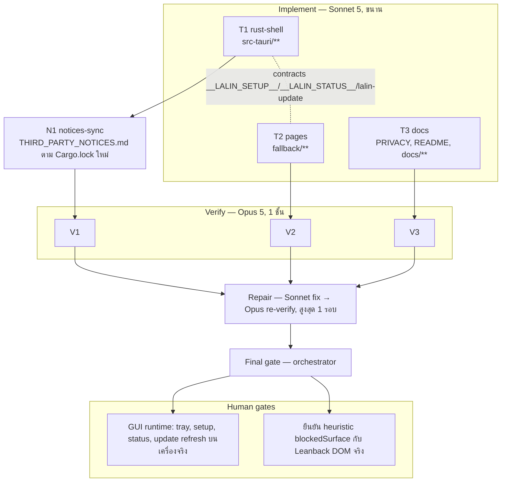

# Lalin Cast — Wave 2 "Living-room readiness": DAG และแผนดำเนินการ

## สถานะและขอบเขต

**CANDIDATE — approved for execution on branch `feat/wave2-living-room`** (แตกจาก `feat/h0-release-readiness`
ที่ `c825358`; PR #1 ยังไม่ merge จึงเป็น stacked branch)

Wave 2 ปิดช่องว่างที่ผู้ใช้จริงเจอใน RCA (มือถือหาทีวีไม่เจอเพราะ network profile เป็น Public, DIAL ตายเงียบ, YouTube
โหลดไม่ขึ้นแล้วเห็นแต่จอ error ของ WebView2) และเก็บ nonBlocking ที่ Opus verifier ของ wave 1 ฝากไว้

Complexity: **C-3**. Risk: **MEDIUM-HIGH** (tray/หน้าต่างใหม่ 2 บาน, event จาก remote origin, การอ่าน network
profile ผ่าน PowerShell) ทุกอย่างอยู่บน branch; พฤติกรรม GUI จริงเป็น human gate

| งาน | สาย | ที่มา |
|---|---|---|
| Tray icon + DIAL status (starting/ready/degraded/disabled) | T1 | review item #10 |
| First-run setup wizard: network profile + DIAL status + วิธีแก้ | T1 + T2 | RCA 2026-09-20 (Public profile) |
| Status window: offline ตอนเปิดแอป / YouTube redirect หรือบล็อก surface | T1 + T2 | review item #10 |
| Updater: กันกดซ้ำ, refresh state ของหน้าต่างที่เปิดอยู่ | T1 + T2 | S4 verifier |
| `dialFriendlyName` อ่านใหม่เมื่อ rebind | T1 | S4 verifier |
| update page: a11y, Escape ระหว่างติดตั้ง, แยก self-test ออกจาก production script | T2 | S5 verifier |
| PRIVACY / README / ADR-001 / DOCS_INDEX ให้ตรงพฤติกรรมใหม่ | T3 | — |
| THIRD_PARTY_NOTICES sync หลัง Cargo.lock เปลี่ยน (feature `tray-icon`) | N1 (หลัง T1) | S1 verifier |
| ไม่ทำ: ลบ `dial_get_info`, settings window, controller, deep link | — | wave 3 |

## ค่าคงที่และ contract (ทุกสายต้องใช้ตรงกัน)

### Store keys (ไฟล์ `media-settings.json`)

| key | type | ความหมาย |
|---|---|---|
| `setupCompleted` | bool | ผู้ใช้กด "ไม่ต้องแสดงอีก" ใน setup wizard; ถ้าไม่ใช่ `true` wizard เปิดทุกครั้งที่เริ่มแอป |
| (เดิม) `fullscreen`, `keepOnTop`, `language`, `dialDeviceId`, `dialFriendlyName` | | ไม่เปลี่ยน |

### DIAL status

```json
{ "state": "starting" | "ready" | "degraded" | "disabled",
  "host": "192.168.1.100" | null, "port": 51234 | null, "message": "human-readable, no PII" | null }
```

- `dial.rs` เก็บสถานะปัจจุบันใน `DialState` และ **emit app-wide event `lalin-cast-dial-status`** (payload ข้างบน)
  ทุกครั้งที่เปลี่ยน รวมครั้งแรกตอน `start()`; `starting` = กำลัง bind/rebind, `ready` = ทั้ง UDP 1900 และ HTTP พร้อม,
  `degraded` = listener ล้มและ supervisor กำลัง retry (message บอกสาเหตุสั้น ๆ), `disabled` = `start()` ล้มเหลวถาวร
- ฟังก์ชัน `dial::current_status(&DialState) -> DialStatus` (struct `Serialize`, `Clone`) สำหรับ command
- `dialFriendlyName` ถูกอ่านจาก store ใหม่ทุกครั้งที่ `start_generation` (rebind) — ไม่ต้องรีสตาร์ทแอป

### Tray (feature `tray-icon` ของ crate `tauri`; ใช้ `app.default_window_icon()` ไม่เพิ่ม asset)

- id `main-tray`; tooltip: `Lalin Cast · DIAL: <state>` ต่อด้วย ` (<host>:<port>)` เมื่อ ready; อัปเดตจาก event
  `lalin-cast-dial-status`
- เมนู (i18n ตาม `language`, rebuild เมื่อ toggle ภาษา): `tray-show` (แสดง Lalin Cast / Show Lalin Cast),
  `tray-setup` (เครือข่ายและ DIAL / Network & DIAL), `check-updates` (ใช้ handler เดิม), `quit`
- คลิกซ้ายที่ไอคอน → focus หน้าต่าง `media`
- ปิดหน้าต่าง `media` ยังคงหมายถึงออกจากแอป (ไม่เปลี่ยนพฤติกรรม; tray ไม่ทำ minimize-to-tray ใน wave นี้)

### Network profile (Windows เท่านั้น; อ่านอย่างเดียว ไม่แก้ firewall/profile)

- รัน `powershell.exe -NoProfile -NonInteractive -Command "Get-NetConnectionProfile | Select-Object InterfaceAlias,NetworkCategory,IPv4Connectivity | ConvertTo-Json -Compress"`
  ใน thread แยก timeout 5 วินาที; parse JSON (object หรือ array); เลือก profile ที่ `IPv4Connectivity == "Internet"`
  ตัวแรก ไม่งั้นตัวแรกที่มี; แปลงเป็น `{ "category": "Private"|"Public"|"DomainAuthenticated"|"Unknown", "interface": string|null }`
- **parser ต้องเป็น pure function** (`parse_network_profiles(json: &str) -> NetworkProfile`) พร้อม unit tests; ผลลัพธ์
  ไม่ persist ลง store และไม่ log ชื่อ interface

### Setup window (first-run wizard)

- label `setup`, `WebviewUrl::App("setup.html")`, 560×560, ไม่ resizable, เปิด 2 วินาทีหลังหน้าต่าง `media` แสดง เมื่อ
  `setupCompleted != true`; เปิดได้ทุกเมื่อจาก tray `tray-setup` และเมนู `network-setup` ของหน้าต่าง media (label i18n)
- `initialization_script` ตั้ง `window.__LALIN_SETUP__ = { lang, firstRun: boolean, network: NetworkProfile, dial: DialStatus }`
- capability `setup` (`capabilities/setup.json`, windows `["setup"]`): `core:default`, `core:window:allow-close`,
  `allow-setup-refresh`, `allow-setup-open-network-settings`, `allow-setup-complete`
- commands (ทุกตัวรับ `window: tauri::Window` และปฏิเสธถ้า label ≠ `setup`):
  - `setup_refresh() -> { network, dial }` อ่านใหม่ทั้งสอง
  - `setup_open_network_settings()` เปิด `ms-settings:network-status` ด้วย `cmd /c start ""` (ไม่รับ argument จาก page)
  - `setup_complete(dontShowAgain: bool)` ถ้า true ตั้ง `setupCompleted=true`; ปิดหน้าต่าง
- หน้า setup แสดง: หัวข้อ, สถานะ network (Private = เขียว "พร้อม", Public = เหลือง + ขั้นตอนเปลี่ยนเป็น Private
  + ปุ่มเปิด Settings, Domain = ข้อความว่านโยบายองค์กรอาจบล็อก, Unknown = ตรวจไม่ได้), สถานะ DIAL (state/host/port/message),
  ปุ่ม "ตรวจอีกครั้ง / Check again", checkbox "ไม่ต้องแสดงอีก / Don't show again", ปุ่ม "ปิด / Continue"; `Escape` = ปิด

### Status window (offline / surface blocked)

- label `status`, `WebviewUrl::App("status.html")`, 520×380, ไม่ resizable
- `window.__LALIN_STATUS__ = { lang, state: "offline" | "blockedSurface", message?: string, url?: string }`
- เปิดเมื่อ (ก) **startup probe** ล้มเหลว: TCP connect `www.youtube.com:443` timeout 4 วินาที รันใน thread ก่อน/ขนาน
  กับการสร้างหน้าต่าง media (media ยังถูกสร้างเสมอ); (ข) injected.js emit event `lalin-cast-surface` (ดูด้านล่าง)
- capability `status` (`capabilities/status.json`): `core:default`, `core:window:allow-close`, `allow-status-retry`,
  `allow-status-quit`
- commands (ตรวจ label = `status`): `status_retry() -> { ok: boolean, message?: string }` = probe ใหม่; ถ้า ok →
  reload หน้าต่าง media แล้วปิด status; `status_quit()` = `app.exit(0)`
- **ไม่มี** auto-retry loop; ผู้ใช้กดเอง

### Surface event จาก remote page (injected.js → Rust)

- `capabilities/default.json` (remote `https://www.youtube.com/*`) เพิ่ม **เฉพาะ** `core:event:allow-emit`
- injected.js: ที่ `load` และอีกครั้งที่ 12 วินาที: ถ้า `location.hostname` ลงท้าย `youtube.com` และ `location.pathname`
  ไม่ขึ้นต้นด้วย `/tv` → emit `{ kind: "redirected", url: location.href, title: document.title }`; มิฉะนั้นถ้าไม่พบ
  element `ytlr-app, [class*="ytlr-"], #app` → emit `{ kind: "blockedSurface", url, title }`; emit ไม่เกิน 1 ครั้งต่อ
  page load; ห้ามใส่ cookie/token/query ที่ไม่ใช่ path ใน url (ตัด `search`/`hash` ออกก่อนส่ง)
- Rust: validate (`kind` ใน whitelist, `url` ≤ 512 chars และขึ้นต้น `https://`, `title` ≤ 200 chars), rate-limit 30 วินาที,
  แล้วเปิดหน้าต่าง `status` state `blockedSurface` พร้อม message i18n ("YouTube ไม่ได้แสดงหน้าทีวี — ลองโหลดใหม่
  หรืออัปเดต Lalin Cast"); ไม่ทำอะไรอัตโนมัติมากกว่านั้น

### Updater follow-ups

- `run_check` มี re-entrancy guard (`AtomicBool`); manual check ระหว่างที่อีกอันกำลังรัน → แค่ focus หน้าต่าง `update` ถ้ามี
- ถ้าหน้าต่าง `update` เปิดอยู่และ state ใหม่ต่างจากเดิม → `window.eval("window.__LALIN_UPDATE__ = <json>; window.dispatchEvent(new CustomEvent('lalin-update'));")`
  และ `update.js` ฟัง `lalin-update` เพื่อ render ใหม่; ระหว่าง install `Escape` และปุ่ม Later ถูกปิด

### Pages ทั่วไป (T2)

- ทุกหน้า: ไม่มี inline script/handler, ไม่โหลด resource ภายนอก, dark theme `#171717`/`#3ea6ff`, TH/EN ตาม `lang`,
  heading เป็น `h1`/`h2`, ข้อความสถานะมี `role="status" aria-live="polite"`, ปุ่มมี `type="button"`
- Self-test แยกเป็นไฟล์ `fallback/<page>.test.js` (Node-only, stub DOM ของตัวเอง, `require('./<page>.js')`), production
  script ไม่มี harness; `<page>.js` ต้อง export ผ่าน `module.exports` เมื่อรันใน CommonJS และไม่พังใน browser
- meta CSP ของทุกหน้า local: `default-src 'self'; script-src 'self'; style-src 'self'; img-src 'self' data:; connect-src ipc: http://ipc.localhost`

### i18n

- `src/i18n.rs` เพิ่ม key สำหรับ tray, เมนู `network-setup`, title หน้าต่าง `setup`/`status`, message ของ status window
  ทุก key ต้องมีทั้ง Th และ En (unit test ตรวจครบ)

## DAG



**Dependency scan:** งาน Rust ทั้งหมด (tray, setup, status, updater, dial status) แตะ `lib.rs`/`dial.rs`/`updater.rs`
ร่วมกัน จึงรวมเป็น T1 เดียวเหมือน wave 1; หน้า local ตัดขาดด้วย contract → T2; เอกสาร → T3; notices ต้องรอ
`Cargo.lock` สุดท้ายของ T1 → N1 ต่อท้าย T1 ใน pipeline เดียวกัน

## File ownership matrix (บังคับ)

| Stream | เขียนได้เฉพาะ | ห้ามแตะ |
|---|---|---|
| T1 rust-shell | `src-tauri/**` (รวม `Cargo.toml`, `Cargo.lock`, `tauri.conf.json`, `capabilities/**`, `permissions/**`, `injected.js`, `src/**`) | `fallback/**`, เอกสารทุกไฟล์ |
| T2 pages | `fallback/**` | `src-tauri/**`, เอกสาร |
| T3 docs | `PRIVACY.md`, `README.md`, `docs/**` (ยกเว้น `docs/plans/**`), `.brain/**` | `THIRD_PARTY_NOTICES.md`, `TERMS.md`, โค้ด |
| N1 notices-sync | `THIRD_PARTY_NOTICES.md` | อื่น ๆ ทั้งหมด |

กฎร่วมเหมือน wave 1: ห้าม commit/push/เปลี่ยน branch, ห้ามติดตั้งซอฟต์แวร์, ห้ามลบไฟล์นอกสิทธิ์, คำขอแก้ไฟล์นอกสิทธิ์ →
`openQuestions`; ห้าม log/เก็บ TV code, cookie, token, ชื่อ interface, URL ที่มี query

## Stream specs และ acceptance criteria

### T1 rust-shell

1. `Cargo.toml`: `tauri = { version = "2", features = ["tray-icon"] }` (crate `tray-icon`/`muda` อยู่ใน registry cache แล้ว);
   ห้ามเพิ่ม crate อื่น
2. `dial.rs`: `DialStatus` + `current_status()` + emit `lalin-cast-dial-status` ทุก transition (รวม `disabled_state()`);
   อ่าน `dialFriendlyName` ใหม่ทุก generation; unit tests ของ transition (ผ่าน channel/mocked emitter หรือ pure state
   function) และของ friendly-name reload
3. `src/tray.rs`: build tray ตาม contract, listen event เพื่ออัปเดต tooltip, rebuild menu เมื่อภาษาเปลี่ยน; `lib.rs`
   เรียกใน `setup` ก่อน `dial::start` เพื่อรับ event แรก
4. `src/network.rs`: `parse_network_profiles` (pure) + `detect_network_profile()` (PowerShell + timeout, cfg(windows),
   non-Windows คืน Unknown) + tests ของ parser (object, array, ว่าง, JSON เสีย, ไม่มี Internet)
5. `src/surface.rs`: `probe_connectivity(timeout) -> Result<(), String>` (TCP connect) + tests กับ `TcpListener` local
   และพอร์ตปิด; `validate_surface_event(payload) -> Option<SurfaceEvent>` + tests (kind นอก whitelist, url ยาว, ไม่ใช่ https,
   title ยาว); rate limiter 30 วินาที
6. `src/setup.rs`: หน้าต่าง `setup` + 3 commands + `setupCompleted`; เปิดอัตโนมัติ 2 วินาทีหลัง media แสดงเมื่อยังไม่ complete
7. `src/status.rs` (หรือรวมใน surface.rs): หน้าต่าง `status` + `status_retry`/`status_quit`; startup probe ใน thread;
   listener ของ `lalin-cast-surface` จาก remote page
8. `updater.rs`: re-entrancy guard + refresh state ด้วย `eval` ตาม contract; unit test ของ guard
9. `injected.js`: เพิ่ม surface detection ตาม contract (emit ≤ 1 ครั้งต่อ load, ตัด query/hash); ห้ามแตะ DIAL bridge เดิม
10. `capabilities/`: `default.json` เพิ่มเฉพาะ `core:event:allow-emit`; เพิ่ม `setup.json`, `status.json`; `update.json`
    ไม่เปลี่ยน; ทุก command ใหม่ตรวจ `window.label()`
11. `i18n.rs`: key ใหม่ครบสองภาษา + test; เมนู media เพิ่ม `network-setup`
12. **Quality gate:** `cargo fmt`, `cargo clippy --all-targets -- -D warnings`, `cargo test`, `cargo check`,
    `node --check src-tauri/injected.js`; `grep -rn VacuumTube src-tauri/src src-tauri/injected.js` ว่าง (ยกเว้น comment
    provenance); ไม่มี `unwrap()` บน I/O ใน code ใหม่; ไม่มี `println!/eprintln!` ที่พิมพ์ URL/interface/ชื่อเครื่อง

**Acceptance:** ข้อ 12 ผ่านทั้งหมด; commands ใหม่ทุกตัวปฏิเสธ label ผิด (มี test หรืออย่างน้อยโค้ดตรวจชัดเจน); event
payload ถูก validate; `setupCompleted` เป็น key เดียวที่เพิ่มใน store

### T2 pages

1. `fallback/setup.html/js/css` ตาม contract `__LALIN_SETUP__` + commands `setup_refresh`, `setup_open_network_settings`,
   `setup_complete`; ปุ่ม "ตรวจอีกครั้ง" เรียก `setup_refresh` แล้ว render ใหม่; ขั้นตอนเปลี่ยน Public → Private สำหรับ
   Windows 11 และ 10 (Settings → Network & internet → คุณสมบัติของเครือข่าย → Private) เป็นข้อความ ไม่ใช่ภาพ
2. `fallback/status.html/js/css` ตาม contract `__LALIN_STATUS__` + `status_retry` (แสดง message เมื่อ `ok=false`) +
   `status_quit`; state `blockedSurface` แสดงคำอธิบาย + ปุ่ม "โหลดใหม่ / Reload" (= `status_retry`) + "ออก / Quit"
3. `fallback/update.js/html`: ฟัง `lalin-update` เพื่อ render ใหม่; ปิด `Escape`/Later ระหว่าง install; a11y ตามข้อ "Pages
   ทั่วไป"; **ย้าย self-test ออกไป `fallback/update.test.js`**; CSP meta ตามค่าคงที่
4. `fallback/setup.test.js`, `fallback/status.test.js`, `fallback/update.test.js` รันด้วย `node <file>` และ exit 0 เมื่อผ่าน;
   ครอบคลุมทุก state/ปุ่ม/ข้อผิดพลาดของแต่ละหน้า
5. `fallback/index.html` ไม่เปลี่ยน

**Acceptance:** `node --check` ทุก `.js`; `node fallback/*.test.js` ผ่านทั้งหมด; `grep -n "<script>" fallback/*.html` ว่าง
(มีแต่ `<script src=`); ไม่มี `on[a-z]+=` ใน html; production `.js` ไม่มี `__LALIN_TEST__`

### T3 docs

1. `PRIVACY.md`: เพิ่ม `setupCompleted`; อธิบายว่า setup wizard อ่าน network category ผ่าน PowerShell ในเครื่อง ไม่เก็บ
   ไม่ส่ง; อธิบาย event `lalin-cast-surface` (URL แบบตัด query + title ส่งจากหน้า YouTube มาที่ shell ในเครื่องเดียวกัน
   เพื่อแสดงหน้า status เท่านั้น); tray tooltip แสดง IP ภายใน LAN ของเครื่องเอง
2. `README.md`: "Current scope" เพิ่ม tray, setup wizard, status window, surface detection; ส่วน evidence คงเดิม
3. `docs/architecture/ADR-001-CAST-TAURI-PORT.md`: security rules อัปเดตเป็น 4 หน้าต่าง (`media`, `update`, `setup`, `status`)
   และเหตุผลของ `core:event:allow-emit`; CHANGELOG row; feature matrix แถว "network/surface status"
4. `docs/DOCS_INDEX.md`: เพิ่มแผนนี้
5. `.brain/rca/2026-09-20-lalin-media-tauri-pairing-missing-dial.md`: เพิ่มบรรทัด "Follow-up (wave 2)" ท้ายไฟล์ว่า first-run
   wizard ตรวจ network profile และแสดง DIAL status แล้ว — ไม่แก้ evidence เดิม

**Acceptance:** ลิงก์ relative ทั้ง repo resolve; ไม่มีคำต้องห้าม (ad-free, ปลอดโฆษณา, official YouTube, Chromecast,
Google Cast); ข้อความตรงกับ contract ในแผนนี้

### N1 notices-sync (รันหลัง T1 เท่านั้น)

- อ่าน `src-tauri/Cargo.lock` ใหม่ → เพิ่ม/ลบ/แก้แถวในตาราง section 1 ของ `THIRD_PARTY_NOTICES.md` ให้ (name, version) ตรง
  lock 100% (ยกเว้น `lalin-cast`), อัปเดตตัวเลขรวม (entries/distinct) ทุกจุดที่กล่าวถึง, เพิ่ม license ใหม่ใน summary ถ้ามี,
  และเพิ่ม license ใหม่ที่ไม่อยู่ใน `deny.toml` allow list ลง `openQuestions` (ห้ามแก้ `deny.toml`)
- ตรวจด้วยสคริปต์เทียบเซ็ต (name, version) สองทาง และรายงานผล

## Verify gate rubric (Opus 5)

เหมือน wave 1 (scope, acceptance ทุกข้อด้วยคำสั่งจริง, constants/contract, security, claims, regression) เพิ่ม:

- **Regression ที่ต้องคง:** DIAL supervisor/rebind, device-id sync, single-instance, settings best-effort, update flow ของ
  wave 1 (label guard, capability ของ `media` ยังไม่มี `cast_update_*`), UA/identity ของ wave 1
- **Security เพิ่ม:** remote capability เพิ่มได้เฉพาะ `core:event:allow-emit`; ทุก command ใหม่ตรวจ label; ไม่มี command ที่รับ
  path/URL/argument จาก page ไปเปิดโปรแกรม; PowerShell ถูกเรียกด้วย argument คงที่เท่านั้น
- ไฟล์ของสายอื่นที่ยังไม่เสร็จ (เช่น `setup.html` ตอน verify T1) → nonBlocking

## Final gate (orchestrator)

1. integrated: fmt --check, clippy -D warnings, test, check, `node --check` ทุก `.js`, `node fallback/*.test.js`
2. link check, forbidden-word grep, `grep VacuumTube src-tauri/` ว่าง
3. diff review: `capabilities/*.json`, `injected.js` (surface block), `setup.rs`/`status.rs` command guards, PowerShell
   invocation, `tray.rs`, `updater.rs` guard
4. THIRD_PARTY_NOTICES เทียบ Cargo.lock สองทาง
5. รายงาน + human gates H5/H6; ไม่ commit จนกว่าผู้ใช้จะสั่ง

## Out of scope / wave 3

- settings window (แก้ `dialFriendlyName`, ภาษา, ฯลฯ ใน UI), ลบ `dial_get_info`, controller/keyboard extras, deep link,
  Studio launcher IPC, minimize-to-tray, auto-retry ของ offline, macOS/Linux tray

## Rollback

`git checkout -- . && git clean -fd` บน `feat/wave2-living-room` (ยกเว้นไฟล์นี้) คืนสภาพ `c825358`

## CHANGELOG

| Version | Date | Status | Summary | Commit Hash | Agent |
|---|---|---|---|---|---|
| 0.1.0b | 2026-09-20 | candidate | Wave 2 DAG, contracts for tray/setup/status/surface, 3 parallel streams + notices sync, gates | uncommitted | LALIN |
