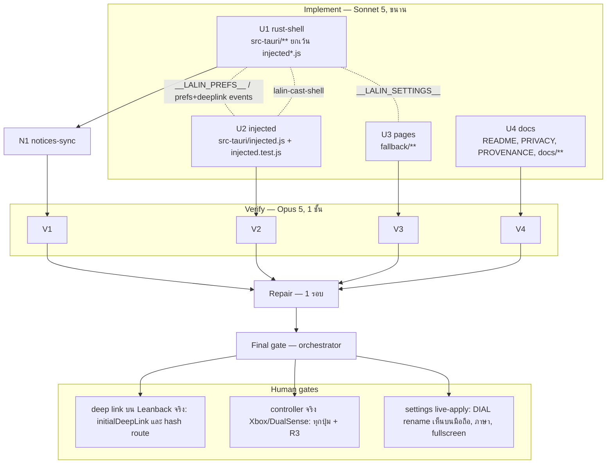

# Lalin Cast — Wave 3 "Controls": DAG และแผนดำเนินการ

## สถานะและขอบเขต

**CANDIDATE — approved for execution on branch `feat/wave3-controls`** (แตกจาก `feat/wave2-living-room` ที่ `8d59812`;
PR #1 และ #2 ยังไม่ merge จึงเป็น stacked branch ชั้นที่ 3)

Wave 3 ปิดช่องว่าง P0/P1 ที่ launch review ระบุว่าเป็นเหตุผลหลักที่คนใช้ TV UI บน PC: **controller**, keyboard
extras, settings ที่แก้ได้จริง, และเปิดวิดีโอจาก command line (Steam shortcut / Studio launcher) ทั้งหมดเป็นงานฝั่ง
client ที่ไม่แตะ DOM/ads ของ YouTube เกินกว่าการส่ง key event จึงอยู่ในโซน ToS-safe ตาม roadmap H1

Complexity: **C-3**. Risk: **MEDIUM** (injected.js ใหญ่ขึ้นมาก, deep link ต้องพิสูจน์บน Leanback จริง, settings มี side
effect หลายทาง) ทุกอย่างอยู่บน branch; พฤติกรรมจริงเป็น human gate

| งาน | สาย | ที่มา |
|---|---|---|
| Controller (Gamepad API → Leanback key events) port จาก VacuumTube พร้อม provenance | U2 | review P0 |
| Keyboard extras: Ctrl+O, F11, Shift+Enter, right-click back, +/−/M volume+OSD, C captions, Ctrl+Shift+C copy URL | U2 | review P0 |
| Pause on blur | U2 | review P2 (เล็ก) |
| Native settings window (ภาษา, DIAL name, fullscreen, keep-on-top, pause-on-blur, controller, เปิด wizard, check update, About) | U1 + U3 | review P1 |
| CLI: `lalin-cast.exe [--fullscreen] [--version] [<youtube-url>]` + single-instance forwarding + deep link | U1 (+U2 รับ event) | review P1 |
| ลบ `dial_get_info` (command ไม่มี permission/ผู้เรียก) | U1 | S4 verifier |
| `dialFriendlyName` apply ทันทีจาก settings (rebind) | U1 | S4 verifier |
| README/PRIVACY/ADR-001/PROVENANCE/DOCS_INDEX + คู่มือ Steam/handheld | U4 | — |
| THIRD_PARTY_NOTICES sync หลัง U1 | N1 | — |
| ไม่ทำ: `lalin-cast://` URL scheme (ต้องเพิ่ม plugin), touch overlay, codec filter, hide shorts, userstyles, sleep timer, mini-player, ARM64 | — | wave 4 |

## ค่าคงที่และ contract (ทุกสายต้องใช้ตรงกัน)

### Store keys ใหม่

| key | type | default | ความหมาย |
|---|---|---|---|
| `controllerEnabled` | bool | `true` | เปิด/ปิด gamepad polling ในหน้า YouTube |
| `pauseOnBlur` | bool | `false` | หยุดวิดีโอเมื่อหน้าต่าง media เสียโฟกัส |

(เดิม: `fullscreen`, `keepOnTop`, `language`, `dialDeviceId`, `dialFriendlyName`, `setupCompleted` ไม่เปลี่ยน)

### Prefs ที่ Rust ส่งให้หน้า YouTube (U1 → U2)

- `initialization_script` ตัวแรกของหน้าต่าง `media` (ลงทะเบียน **ก่อน** `INJECTED_SCRIPT`) ตั้ง
  `window.__LALIN_PREFS__ = { lang: "th"|"en", controllerEnabled: bool, pauseOnBlur: bool, deepLink: string|null }`
  (JSON-escape ทุกค่า; `deepLink` เป็น canonical URL จาก `parse_launch_url` หรือ `null`)
- event Rust → page `lalin-cast-prefs` payload `{ lang, controllerEnabled, pauseOnBlur }` ทุกครั้งที่ค่าเปลี่ยนจาก settings
- event Rust → page `lalin-cast-deeplink` payload `{ url }` (canonical, validate แล้ว) เมื่อ instance ที่รันอยู่ได้รับ URL
  จาก single-instance callback
- `capabilities/default.json` (remote) **ห้ามเปลี่ยน** — `allow-listen`/`allow-emit` ที่มีอยู่พอแล้ว

### Event หน้า YouTube → Rust (U2 → U1)

- `lalin-cast-shell` payload `{ action: "toggle-fullscreen" | "open-settings" }` — Rust validate whitelist, rate-limit 500 ms,
  `toggle-fullscreen` = toggle จริง + persist `fullscreen`; `open-settings` = เปิดหน้าต่าง settings; action อื่นทิ้ง

### Deep link

- `parse_launch_url(&str) -> Option<DeepLink>` (pure, tests): รับเฉพาะ `https://www.youtube.com/watch?v=<id>`,
  `https://youtube.com/watch?v=<id>`, `https://m.youtube.com/watch?v=<id>`, `https://youtu.be/<id>`,
  `https://www.youtube.com/playlist?list=<list>`; `id` = `[A-Za-z0-9_-]{11}`, `list` = `[A-Za-z0-9_-]{1,64}`; scheme ต้องเป็น
  `https`; host ต้องอยู่ใน whitelist ตรงตัว (ไม่ใช่ suffix match); ทิ้ง query อื่นทั้งหมด
- canonical: video → `https://www.youtube.com/watch?v=<id>`; playlist → `https://www.youtube.com/playlist?list=<list>`
- **ครั้งแรก (process ใหม่):** `__LALIN_PREFS__.deepLink` = canonical; injected.js ตั้ง `window.h5vcc.runtime.initialDeepLink`
  เป็นค่านี้ (กลไกเดียวกับ upstream `preload/modules/h5vcc/index.js` บรรทัด 50–56 — บันทึก provenance)
- **instance ที่รันอยู่:** single-instance callback parse args → ถ้ามี URL → focus media + emit `lalin-cast-deeplink`;
  injected.js รับแล้ว `location.assign("https://www.youtube.com/tv#/watch?v=<id>")` หรือ `#/playlist?list=<list>` (hash route
  ของ Leanback — ต้องพิสูจน์ใน human gate H7; ถ้าไม่ทำงานให้ fallback เป็นการ reload ด้วย `initialDeepLink` ใน wave ถัดไป)
- CLI flags: `--fullscreen` (บังคับเต็มจอสำหรับ run นี้ ไม่ persist), `--version` (พิมพ์ `lalin-cast <version>` แล้วออกโดยไม่สร้าง
  window), positional สุดท้ายที่ parse ได้ = URL; arg ที่ไม่รู้จัก → ignore (ไม่ crash); parser เป็น pure fn
  `parse_cli(args) -> LaunchOptions` + tests

### Settings window (U1 + U3)

- label `settings`, `WebviewUrl::App("settings.html")`, 560×640, ไม่ resizable, single instance (focus ถ้ามี); เปิดจาก: เมนู media
  `settings` (label i18n), tray `tray-settings`, `Ctrl+O`/R3 ผ่าน `lalin-cast-shell`
- `window.__LALIN_SETTINGS__ = { lang, version, settings: { language, dialFriendlyName, fullscreen, keepOnTop, pauseOnBlur, controllerEnabled, setupCompleted }, dial: DialStatus }`
- capability `settings` (`capabilities/settings.json`, windows `["settings"]`): `core:default`, `core:window:allow-close`,
  `allow-settings-get`, `allow-settings-set`, `allow-settings-open-setup`, `allow-settings-check-updates`
- commands (ทุกตัวรับ `window: tauri::Window`, ปฏิเสธ label ≠ `settings`):
  - `settings_get() -> SettingsSnapshot` (= object `settings` + `dial` ข้างบน)
  - `settings_set(key: String, value: serde_json::Value) -> SettingsSnapshot` — whitelist key + type: `language` (`"th"|"en"`),
    `dialFriendlyName` (string → sanitizer เดิม), `fullscreen`/`keepOnTop`/`pauseOnBlur`/`controllerEnabled`/`setupCompleted`
    (bool); key/type อื่น → `Err`; side effects: `language` → save + rebuild เมนู media และ tray + emit `lalin-cast-prefs`;
    `dialFriendlyName` → save + `dial::request_reload()` (supervisor rebind generation ใหม่ → descriptor ใหม่ทันที);
    `fullscreen`/`keepOnTop` → apply กับหน้าต่าง media ทันที + save; `pauseOnBlur`/`controllerEnabled` → save + emit prefs;
    `setupCompleted` → save เท่านั้น
  - `settings_open_setup()` → เปิดหน้าต่าง `setup` (firstRun=false)
  - `settings_check_updates()` → `updater::run_check(manual=true)`
- หน้า settings (U3): กลุ่ม "ทั่วไป" (ภาษา radio, fullscreen, keep on top), "ทีวีและมือถือ" (DIAL name input + สถานะ DIAL + ปุ่ม
  เปิด wizard), "การควบคุม" (controller toggle, pause on blur, ตารางปุ่ม controller/คีย์ลัดแบบย่อ), "อัปเดตและเกี่ยวกับ" (ปุ่มตรวจ
  อัปเดต, version, ข้อความ unofficial/not affiliated, ชื่อไฟล์ PRIVACY/TERMS/THIRD_PARTY_NOTICES เป็นข้อความ ไม่ใช่ลิงก์ออกนอก);
  ทุก toggle เรียก `settings_set` ทันทีและ render จาก snapshot ที่คืนมา; error แสดง inline; `Escape` ปิด

### Controller และ keyboard (U2 — port จาก `reference/vacuumtube`, MIT, ต้องมี provenance comment ต่อ module)

- แหล่ง: `src/preload/modules/controller-support.js`, `src/preload/util/controller.js`, `modules/keybinds.js`,
  `modules/mouse.js`, `modules/no-f11.js`, `modules/pause-on-blur.js`, `modules/volume-control/index.js` (+ `style.css`)
- **ต้อง port ตาราง keyCode ของ upstream ตรงตัว** (รวม keyCode เฉพาะของ Cobalt: 1011–1014 สำหรับ left stick และ 1015–1018 สำหรับ right stick ที่ upstream ประกาศไว้แต่ไม่เคย emit เพราะสลับตัวแปร `keyCode`/`code` — Lalin Cast แก้ให้ emit ได้) เพราะพิสูจน์แล้ว
  กับ UA เดียวกัน; วิธี dispatch (`document.dispatchEvent` + `keyCode` override) ให้เหมือน upstream
- Gamepad: poll ด้วย `requestAnimationFrame` เฉพาะเมื่อ `controllerEnabled`; deadzone/repeat ตาม upstream; ปุ่มที่ upstream map
  เป็น "เปิด settings" (R3) → emit `lalin-cast-shell` `open-settings` แทน
- Keyboard: `Ctrl+O` → `open-settings`; `F11` → `toggle-fullscreen` (แทน no-f11); `Shift+Enter` → long-press Enter;
  right-click → back; `+`/`-` → volume ± พร้อม OSD (port volume-control; CSS inject ใน page ได้ — เป็น overlay ของเรา ไม่แก้ DOM ของ
  YouTube); `M` → mute; `C` → captions ตาม upstream; `Ctrl+Shift+C` → `navigator.clipboard.writeText(location.href ตัด query
  ที่ไม่ใช่ v/list)` เฉพาะจาก keypress ของผู้ใช้
- Pause on blur: เมื่อ `pauseOnBlur` และ `document.hidden`/`blur` → `video.pause()` ตาม upstream
- โครงไฟล์: `src-tauri/injected.js` ยังเป็นไฟล์เดียว (ถูก `include_str!`) แต่แบ่งเป็นส่วน: bridge (เดิม ห้ามแตะ logic DIAL),
  prefs, deeplink, controller, keybinds, volume, pauseOnBlur; **pure functions** (`mapGamepadState(prev, gamepad) -> keyEvents[]`,
  `keybindFor(event, prefs) -> action|null`, `deepLinkToHash(url) -> string|null`, `clampVolume`) export ผ่าน
  `module.exports` เมื่อ `typeof module !== "undefined"` และ IIFE ไม่รันเมื่อ `typeof window === "undefined"`
- `src-tauri/injected.test.js` (Node-only stub) ทดสอบ pure functions ทุกตัว + prefs update + deeplink event handling

### i18n

- key ใหม่: เมนู `settings`, tray `tray-settings`, title หน้าต่าง settings; ทุก key ครบ Th/En (test เดิมครอบ)

### หน้า local ทั่วไป (U3)

- กฎเดียวกับ wave 2: ไม่มี inline script/handler, ไม่โหลด resource ภายนอก, dark theme, TH/EN ตาม `lang`, live region, meta CSP
  `default-src 'self'; script-src 'self'; style-src 'self'; img-src 'self' data:; connect-src ipc: http://ipc.localhost`,
  self-test แยกไฟล์ `fallback/settings.test.js`

## DAG

**Dependency scan:** `injected.js` แยกจาก Rust ได้ด้วย contract 3 ตัว (prefs script, 2 events ขาเข้า, 1 event ขาออก) และไม่
compile ร่วมกับ Rust (แค่ `include_str!` — การเปลี่ยน JS ไม่ทำให้ `cargo check` ของ U1 พัง) จึงแยก U2 ออกจาก U1 ได้โดยไม่ต้อง
worktree; งาน Rust ที่เหลือ (settings, CLI, single-instance, dial reload, ลบ dial_get_info) แตะ `lib.rs`/`dial.rs`/`updater.rs`
ร่วมกันจึงรวมใน U1; หน้า settings → U3; เอกสาร → U4

## File ownership matrix (บังคับ)

| Stream | เขียนได้เฉพาะ | ห้ามแตะ |
|---|---|---|
| U1 rust-shell | `src-tauri/**` **ยกเว้น** `src-tauri/injected.js`, `src-tauri/injected.test.js` | `injected*.js`, `fallback/**`, เอกสาร |
| U2 injected | `src-tauri/injected.js`, `src-tauri/injected.test.js` | ไฟล์อื่นทั้งหมดใน `src-tauri/**` |
| U3 pages | `fallback/**` | โค้ด, เอกสาร |
| U4 docs | `README.md`, `PRIVACY.md`, `LALIN_PROVENANCE.md`, `docs/**` (ยกเว้น `docs/plans/**`), `.brain/**` | `THIRD_PARTY_NOTICES.md`, `TERMS.md`, โค้ด |
| N1 notices-sync | `THIRD_PARTY_NOTICES.md` | อื่น ๆ |

กฎร่วมเหมือน wave 1–2 (ห้าม commit/push/branch, ห้ามติดตั้ง, ห้ามลบไฟล์นอกสิทธิ์, คำขอข้ามสาย → `openQuestions`, ห้าม log/เก็บ
TV code, cookie, token, URL ที่มี query)

## Stream specs และ acceptance criteria

### U1 rust-shell

1. `src/launch.rs`: `parse_cli(args: &[String]) -> LaunchOptions { fullscreen: bool, version: bool, deep_link: Option<DeepLink> }`
   และ `parse_launch_url` ตาม contract + tests (host whitelist ตรงตัว, ปฏิเสธ `http://`, `javascript:`, `evil.youtube.com.example`,
   id ผิดความยาว, query อื่นถูกทิ้ง); `main.rs`/`lib.rs`: `--version` พิมพ์แล้ว `return` ก่อน `tauri::Builder`
2. `lib.rs`: prefs init script ก่อน `INJECTED_SCRIPT`; single-instance callback → `parse_cli` → focus + `lalin-cast-deeplink` +
   fullscreen ถ้าขอ; listener `lalin-cast-shell` (validate + rate-limit 500 ms); เมนู media เพิ่ม `settings`; ลบ `dial::dial_get_info`
   ออกจาก invoke handler
3. `dial.rs`: ลบ `dial_get_info` และ `DialInfo` ถ้าไม่มีผู้ใช้อื่น; เพิ่ม `request_reload(&DialState)` ที่สั่ง supervisor ปิด
   generation ปัจจุบันและ bind ใหม่ (อ่าน friendly name ใหม่ตามพฤติกรรม wave 2) + test ผ่าน state/flag
4. `src/settings.rs`: หน้าต่าง `settings`, 4 commands ตาม contract, whitelist/type check เป็น pure fn `apply_setting(key, value,
   current) -> Result<Settings, String>` + tests (key ผิด, type ผิด, language นอก th/en, friendly name sanitize); side effects
   ตามตาราง; `capabilities/settings.json`; `tray.rs` เพิ่ม `tray-settings`
5. `updater.rs` ไม่เปลี่ยนนอกจากที่จำเป็น; `i18n.rs` key ใหม่ครบสองภาษา
6. **ห้ามเพิ่ม crate**; `capabilities/default.json` ต้อง diff ว่าง
7. **Quality gate:** `cargo fmt`, `cargo clippy --all-targets -- -D warnings`, `cargo test`, `cargo check`, `node --check
   src-tauri/injected.js` (ไฟล์ของ U2 อาจกำลังเปลี่ยน — รายงานผลตามที่เห็น), `grep -rn VacuumTube src-tauri/src` ว่าง

### U2 injected

1. Port module ตามรายการใน contract พร้อม comment provenance บรรทัดแรกของแต่ละส่วน (path upstream + "adapted for Lalin Cast")
2. DIAL bridge และ surface detection ของ wave 1–2 **ต้องคงพฤติกรรมเดิมทุกบรรทัด** (diff ของส่วนนั้นควรว่างหรือเป็นการย้ายที่เท่านั้น)
3. อ่าน `window.__LALIN_PREFS__` ตอน start (default: controllerEnabled=true, pauseOnBlur=false, deepLink=null ถ้าไม่มี object);
   ฟัง `lalin-cast-prefs` และ `lalin-cast-deeplink`; ตั้ง `h5vcc.runtime.initialDeepLink` ก่อนสร้าง `window.h5vcc` object
   ที่ page ใช้ (ลำดับสำคัญ: `initialDeepLink` ต้องพร้อมก่อน Leanback boot)
4. Volume OSD: element ของเราเอง id `lalin-cast-volume-osd`, CSS inject ผ่าน `<style id="lalin-cast-volume-style">`, ไม่แตะ element ของ YouTube
5. `src-tauri/injected.test.js` ครอบ: mapGamepadState (กดค้าง/ปล่อย/deadzone/สองปุ่มพร้อมกัน/R3 → open-settings),
   keybindFor ทุก binding + modifier, deepLinkToHash (video/playlist/ปฏิเสธ URL อื่น), prefs update เปิด/ปิด polling, pause-on-blur
   เรียก pause เฉพาะเมื่อเปิด, clipboard เรียกเฉพาะเมื่อมี keypress
6. **Quality gate:** `node --check src-tauri/injected.js`, `node src-tauri/injected.test.js` exit 0; `grep -n "VacuumTube"
   src-tauri/injected.js` มีเฉพาะ comment provenance; ไม่มี `eval`/`Function(`/`innerHTML` กับข้อมูลจากภายนอก

### U3 pages

1. `fallback/settings.html/js/css` ตาม contract; ตารางปุ่ม controller/คีย์ลัดแบบย่อเป็นข้อความ TH/EN; `fallback/settings.test.js`
   ครอบทุก control, error path ของ `settings_set`, การ render จาก snapshot, no-Tauri fallback, Escape
2. `fallback/setup.js`: ไม่เปลี่ยน (ถ้าจำเป็นต้องเปลี่ยน ให้ใส่ openQuestions)
3. **Quality gate:** `node --check` ทุกไฟล์, `node fallback/*.test.js` ผ่านทั้งหมด, grep inline script/handler ว่าง

### U4 docs

1. `README.md`: ส่วน "Controller and keyboard" (ตาราง mapping ตาม contract), "Command line" (`--fullscreen`, `--version`, URL,
   ตัวอย่าง Steam launch options), "Settings" (รายการที่ตั้งได้), อัปเดต "Current scope"
2. `PRIVACY.md`: key `controllerEnabled`/`pauseOnBlur`; gamepad อ่านในเครื่องผ่าน Gamepad API ไม่ส่งออก; clipboard เขียนเฉพาะเมื่อผู้ใช้กด
   `Ctrl+Shift+C` และไม่มี query นอกจาก v/list; deep link จาก command line ถูก validate และไม่ log
3. `LALIN_PROVENANCE.md`: ตารางโมดูลที่ port ใน wave 3 (path upstream → ส่วนใน injected.js, การดัดแปลง)
4. `docs/architecture/ADR-001-CAST-TAURI-PORT.md`: feature matrix แถว controller/keybinds/settings/deep link → "ported/implemented";
   security rules เพิ่มหน้าต่าง `settings` และ event `lalin-cast-shell`; CHANGELOG row
5. `docs/guides/STEAM_AND_HANDHELD.md` (ใหม่): เพิ่ม Lalin Cast เป็น non-Steam game, launch options `--fullscreen`, Big Picture,
   controller ที่รองรับ, handheld (ROG Ally/Legion Go) tips, ข้อจำกัดที่ยังไม่รองรับ (touch overlay, `lalin-cast://`)
6. `docs/DOCS_INDEX.md`: เพิ่มแผนนี้และคู่มือ
7. **Acceptance:** ลิงก์ resolve, ไม่มีคำต้องห้าม (ad-free, ปลอดโฆษณา, Chromecast, Google Cast, การอ้างว่า Lalin เป็น official),
   ตาราง mapping ตรง contract (ไม่ต้องตรงโค้ด U2 ที่อาจยังไม่เสร็จ)

### N1 notices-sync (หลัง U1)

- เหมือน wave 2: เทียบ (name, version) สองทางกับ `Cargo.lock`; คาดว่าไม่มีการเปลี่ยนแปลงเพราะห้ามเพิ่ม crate — รายงานผล

## Verify gate rubric (Opus 5)

เหมือน wave 1–2 เพิ่ม:

- **Remote capability ไม่เปลี่ยน:** `git diff src-tauri/capabilities/default.json` ต้องว่าง
- **settings_set:** key/type whitelist บังคับใน Rust (ไม่ใช่แค่หน้า); friendly name ผ่าน sanitizer; ไม่มี key ที่เขียนค่าใด ๆ ลง store
  โดยตรงจาก page
- **Deep link:** parser ปฏิเสธ scheme/host/id ที่ไม่ตรง; ค่าใน init script ถูก JSON-escape; ไม่มีการ `navigate` ไป URL ที่มาจาก
  page หรือ args โดยไม่ผ่าน parser
- **injected.js:** DIAL bridge/surface ของเดิมไม่เปลี่ยนพฤติกรรม; keyCode map ตรง upstream (verifier เปิดไฟล์ upstream เทียบ);
  controller ไม่ poll เมื่อปิด; ไม่มี network call ใหม่; provenance ครบ
- **Regression:** ทุกอย่างของ wave 1–2 (update/setup/status windows, tray, DIAL supervisor, identity, i18n)

## Final gate (orchestrator)

1. integrated: fmt --check, clippy -D warnings, test, check, `node --check` ทุก `.js`, `node src-tauri/injected.test.js`,
   `node fallback/*.test.js`
2. `git diff src-tauri/capabilities/default.json` ว่าง; link check; forbidden-word grep; `grep VacuumTube src-tauri/src` ว่าง
3. diff review: `launch.rs` parser + tests, `settings.rs` whitelist, single-instance handler, `lalin-cast-shell` listener, injected.js
   ส่วน bridge เทียบ wave 2, keyCode map เทียบ upstream
4. THIRD_PARTY_NOTICES เทียบ lock
5. รายงาน + human gates H7–H9; ไม่ commit จนกว่าผู้ใช้จะสั่ง

## Out of scope / wave 4

`lalin-cast://` scheme, touch overlay, codec filter / HW decode / resolution unlock / low-memory, hide shorts / guide tabs,
userstyles, sleep timer, mini-player, Studio launcher IPC contract แบบเต็ม, ARM64, winget manifest

## Rollback

`git checkout -- . && git clean -fd` บน `feat/wave3-controls` (ยกเว้นไฟล์นี้) คืนสภาพ `8d59812`

## CHANGELOG

| Version | Date | Status | Summary | Commit Hash | Agent |
|---|---|---|---|---|---|
| 0.1.0b | 2026-09-20 | candidate | Wave 3 DAG, contracts for prefs/shell/deep link/settings, 4 parallel streams + notices sync, gates | uncommitted | LALIN |
