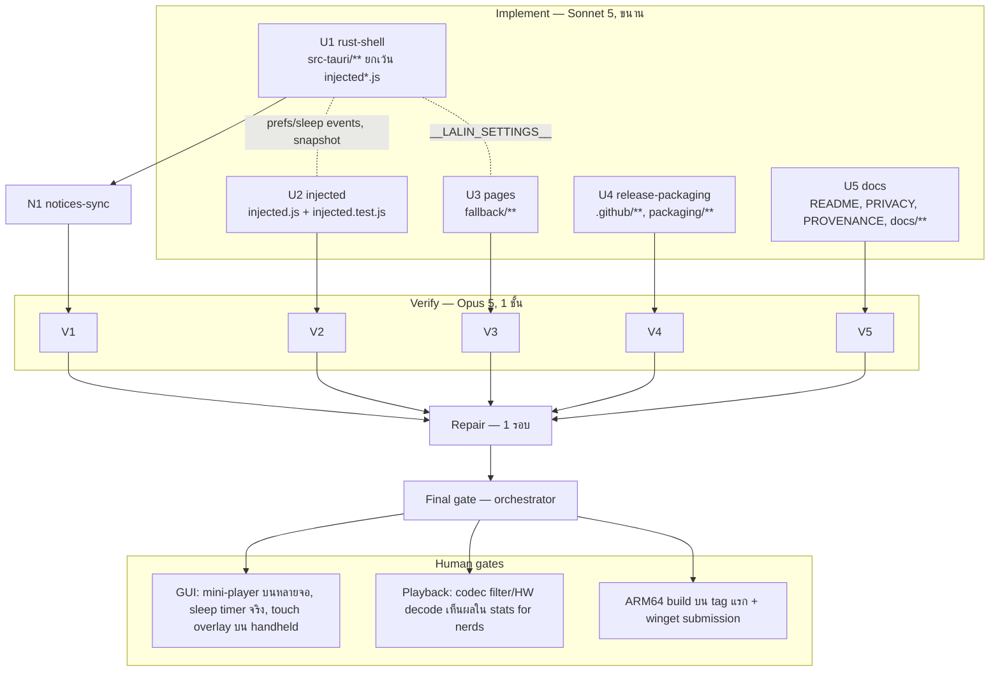

# Lalin Cast — Wave 4 "Playback & handheld": DAG และแผนดำเนินการ

## สถานะและขอบเขต

**CANDIDATE — approved for execution on branch `feat/wave4-playback`** (แตกจาก `main` ที่ `5c50e8f` หลัง merge #1–#3)

Wave 4 เก็บ differentiator ฝั่ง living-room/handheld ที่ยังไม่ต้องรอการตัดสินใจเรื่อง ToS (ทั้งหมดเป็นพฤติกรรมฝั่ง client
ของเราเอง: timer, window mode, overlay ของเรา, การเลือก codec ผ่าน Web API มาตรฐาน, flag ของ WebView2) และเตรียมช่องทาง
แจกจ่าย (ARM64, winget) ส่วน hide shorts / guide tabs / userstyles / ad-filter ยังรอ escalation ก และ `lalin-cast://` รอการ
อนุมัติเพิ่ม crate `tauri-plugin-deep-link` (wave 5)

Complexity: **C-3**. Risk: **MEDIUM** (window geometry บนหลายจอ, override Web API, ARM64 build ที่ยังไม่มี runner
ทดสอบ) ทุกอย่างอยู่บน branch; พฤติกรรม GUI/ARM64 เป็น human gate

| งาน | สาย | ที่มา |
|---|---|---|
| Sleep timer (Rust timer + OSD ในหน้า + settings) | U1 + U2 + U3 | review differentiator (SmartTube parity) |
| Codec filter (port h264ify: ปฏิเสธ VP8/VP9/AV1 เมื่อเลือก H.264) | U2 + U3 | review P1 (HTPC/iGPU เก่า) |
| Hardware-decoding toggle ผ่าน `additional_browser_args` (มีผลหลังเปิดใหม่) | U1 + U3 | review P1 |
| Touch overlay (port touch-support: ปุ่มบนจอเมื่อพบ touch) | U2 + U3 | review P2 (handheld) |
| Mini-player mode (หน้าต่างเล็กมุมจอ อยู่บนสุด ไม่มีขอบ) | U1 + U2 + U3 | review differentiator (VTPiP demand) |
| Settings page: control ใหม่ + refresh ทุก 5 s ด้วย `settings_get` (DIAL status + countdown) | U3 | U3 verifier |
| Release matrix ARM64 (`continue-on-error`) + `cargo check --target aarch64` ใน CI | U4 | roadmap H1 |
| winget manifest templates + คู่มือส่ง | U4 | roadmap H1 |
| README/PRIVACY/PROVENANCE/ADR-001/DOCS_INDEX/Steam guide | U5 | — |
| THIRD_PARTY_NOTICES sync หลัง U1 | N1 | — |
| ไม่ทำ: `lalin-cast://`, hide shorts/guide tabs, userstyles, ad-filter, low-memory mode (แก้ config JSON ของ YouTube = โซนรอตัดสิน), Studio IPC | — | wave 5 / escalation |

## ค่าคงที่และ contract (ทุกสายต้องใช้ตรงกัน)

### Store keys ใหม่

| key | type | default | ความหมาย |
|---|---|---|---|
| `sleepTimerMinutes` | int ∈ {0, 15, 30, 60, 90, 120} | 0 | ตั้งค่า ≠ 0 = เริ่ม/รีสตาร์ท timer ทันที; 0 = ยกเลิก; เมื่อหมดเวลา Rust เขียนกลับเป็น 0 |
| `codecFilter` | `"off"` \| `"h264"` | `"off"` | มีผลตอนโหลดหน้าครั้งถัดไป |
| `hardwareDecoding` | bool | `true` | `false` → เพิ่ม `--disable-accelerated-video-decode` ตอนสร้างหน้าต่าง media; มีผลหลังเปิดแอปใหม่ |
| `touchOverlay` | bool | `true` | แสดงปุ่มบนจอหลังตรวจพบ `touchstart` ครั้งแรก |

`miniPlayer` เป็น state ต่อ session (ไม่ persist) ปรากฏใน snapshot ของ settings เป็น bool

### Prefs → หน้า YouTube (ขยาย contract wave 3)

- `window.__LALIN_PREFS__` เพิ่ม `codecFilter: "off"|"h264"`, `touchOverlay: bool`
- event `lalin-cast-prefs` payload เพิ่ม `codecFilter`, `touchOverlay` (codec filter ที่เปลี่ยนภายหลังมีผลหลัง reload — หน้าไม่ reload เอง)
- event Rust → page `lalin-cast-sleep` payload `{ minutes }` เมื่อ timer หมด → หน้าเรียก `pause()` ทุก `<video>` และแสดง OSD ของเราเอง
  `#lalin-cast-sleep-osd` ("หมดเวลาตั้งนอน — หยุดเล่นแล้ว / Sleep timer: playback paused") 6 วินาที
- `lalin-cast-shell` เพิ่ม action `toggle-mini` (whitelist เป็น 3 action); keybind `Ctrl+Shift+M` → `toggle-mini`
- `capabilities/default.json` (remote) **ห้ามเปลี่ยน**

### Sleep timer (U1: `src/sleep.rs`)

- `SleepState` managed: `Mutex<Option<Deadline { generation: u64, ends_at: Instant, minutes: u32 }>>`
- `sleep::schedule(app, minutes)`: 0 → ยกเลิก (generation+1) และเขียน `sleepTimerMinutes=0`; ค่าอื่นในเซ็ต → generation+1, เขียน
  store, spawn thread ที่ตื่นทุก 1 s ตรวจว่า generation ยังตรงและถึง deadline หรือยัง; เมื่อถึง: emit `lalin-cast-sleep` ไปหน้าต่าง
  `media`, เขียน `sleepTimerMinutes=0`, ล้าง state
- `sleep::remaining_seconds(state) -> Option<u64>` สำหรับ snapshot (`sleepRemainingSeconds`)
- pure fn `validate_sleep_minutes(v) -> Option<u32>` + tests; test ของ cancel/generation semantics ผ่าน state ไม่ต้องรอเวลาจริง
- tray tooltip **ไม่** เปลี่ยน; เมนู media/tray ไม่ต้องมี item (ตั้งจาก settings เท่านั้น)

### Mini-player (U1)

- `MiniPlayerState` managed: `Mutex<Option<SavedGeometry { position, size, decorations: bool }>>`
- `toggle_mini(app)`: ถ้าไม่ได้อยู่ใน mini → บันทึก geometry ปัจจุบัน แล้วตั้ง `decorations(false)`, `always_on_top(true)`,
  `set_size(400×225 logical)`, `set_position` มุมล่างขวาของ monitor ปัจจุบัน (`window.current_monitor()`; fallback primary) เว้นขอบ
  24 px (คำนวณด้วย pure fn `mini_position(monitor_size, monitor_position, scale, window_size) -> position` + tests); ถ้าอยู่ใน mini →
  คืน geometry, `decorations(true)`, `always_on_top(keepOnTop setting)`
- เข้าถึงจาก: เมนู media `mini-player`, tray `tray-mini`, `lalin-cast-shell` `toggle-mini`, `settings_set("miniPlayer", bool)`
- fullscreen กับ mini ขัดกัน: เข้า mini จะออก fullscreen ก่อน (ไม่แก้ค่า `fullscreen` ใน store)

### Hardware decoding (U1)

- ตอนสร้างหน้าต่าง media: ถ้า `hardwareDecoding == false` → `.additional_browser_args("--disable-accelerated-video-decode")`
  (Windows เท่านั้น; ค่า default ของ Tauri ต้องคงไว้ — อ่าน doc ของ `additional_browser_args` ใน tauri 2.11.5 ว่าค่านี้ **แทนที่**
  ค่า default หรือไม่ ถ้าแทนที่ ให้ต่อท้าย default ของ Tauri เอง) — บันทึกผลการอ่านใน notes
- `settings_set("hardwareDecoding", bool)` → save เท่านั้น; snapshot บอก `hardwareDecodingRestartRequired: bool` (= ค่าใน store ≠
  ค่าที่ใช้ตอนสร้างหน้าต่าง)

### Settings window (ขยาย)

- snapshot `settings` เพิ่ม: `sleepTimerMinutes`, `codecFilter`, `hardwareDecoding`, `touchOverlay`, `miniPlayer`; ระดับบน
  เพิ่ม `sleepRemainingSeconds: int|null`, `hardwareDecodingRestartRequired: bool`
- `settings_set` whitelist เพิ่ม 5 key ตามชนิด: `sleepTimerMinutes` (int ในเซ็ต → `sleep::schedule`), `codecFilter` (enum → save +
  emit prefs), `hardwareDecoding` (bool → save), `touchOverlay` (bool → save + emit prefs), `miniPlayer` (bool → `toggle_mini` ถ้าต่าง
  จาก state ปัจจุบัน, ไม่ save)
- หน้า settings (U3): กลุ่ม "การเล่น / Playback" (sleep timer select + countdown "เหลือ mm:ss", codec filter select พร้อมหมายเหตุ
  "มีผลหลังโหลดใหม่", hardware decoding toggle พร้อมหมายเหตุ "มีผลหลังเปิดแอปใหม่" ที่แสดงเป็นสีเตือนเมื่อ `hardwareDecodingRestartRequired`),
  กลุ่ม "หน้าจอ / Display" ย้าย fullscreen/keep-on-top มาไว้ + mini-player toggle, กลุ่ม "การควบคุม" เพิ่ม touch overlay toggle;
  **refresh**: ขณะหน้าต่างเปิด เรียก `settings_get` ทุก 5 s (และหยุดเมื่อ `document.hidden`) เพื่ออัปเดต DIAL status/countdown/mini state
  โดยไม่ทับค่าที่ผู้ใช้กำลังพิมพ์ใน DIAL name (ข้ามการ render input ที่มี focus)

### Codec filter และ touch overlay (U2 — port จาก upstream พร้อม provenance)

- `modules/h264ify.js` → section `codecFilter`: เมื่อ `codecFilter === "h264"` override `window.MediaSource.isTypeSupported` และ
  `HTMLMediaElement.prototype.canPlayType` ให้คืนค่าไม่รองรับสำหรับ type ที่มี `vp8`, `vp9`, `av01` (คง behavior เดิมสำหรับ type อื่น);
  ทำใน init script ก่อน page script; pure fn `codecAllowed(type, filter) -> bool` + tests
- `modules/touch-support.js` → section `touchOverlay`: สร้าง `#lalin-cast-touch-overlay` (+ `<style id="lalin-cast-touch-style">`)
  หลัง `touchstart` ครั้งแรกและเมื่อ `touchOverlay` เปิด; ปุ่ม back/ok/ทิศทาง/play-pause ส่ง synthetic key ด้วย helper เดียวกับ
  controller section; ซ่อน/ลบเมื่อ pref ปิดผ่าน `lalin-cast-prefs`; ไม่แตะ DOM ของ YouTube; pure fn `touchButtons(lang) -> spec[]` + tests
- section `sleep`: ฟัง `lalin-cast-sleep` → pause ทุก video + OSD; tests
- keybind `Ctrl+Shift+M` → `toggle-mini`; tests ของ `keybindFor`

### Release และ packaging (U4)

- `.github/workflows/release.yml`: job `build` เป็น matrix `{ label: x64, target: x86_64-pc-windows-msvc, experimental: false }`,
  `{ label: arm64, target: aarch64-pc-windows-msvc, experimental: true }` ด้วย `continue-on-error: ${{ matrix.experimental }}`;
  `rustup target add ${{ matrix.target }}`; tauri-action `args: --target ${{ matrix.target }}`; `uploadUpdaterJson: true` ทั้งคู่ —
  **ต้องตรวจจาก source/README ของ tauri-action ที่ SHA ที่ pin** ว่า job ที่สองจะ merge platform เข้า `latest.json` เดิม ไม่ใช่ทับ
  แล้วบันทึกผลใน notes; ถ้าไม่ merge ให้ arm64 ตั้ง `uploadUpdaterJson: false` และบันทึกว่า updater ของ arm64 ยังไม่เปิด
- `.github/workflows/ci.yml`: job `arm64-check` (`continue-on-error: true`): `rustup target add aarch64-pc-windows-msvc` +
  `cargo check --manifest-path src-tauri/Cargo.toml --target aarch64-pc-windows-msvc`
- `packaging/winget/Lalin.LalinCast.yaml`, `Lalin.LalinCast.installer.yaml`, `Lalin.LalinCast.locale.en-US.yaml` ตาม manifest schema
  1.6 ด้วย placeholder `{{VERSION}}`, `{{INSTALLER_URL}}`, `{{INSTALLER_SHA256}}` และ `packaging/winget/README.md` (ขั้นตอน: release
  public → `winget hash` → เติมค่า → `winget validate` → PR ไป `microsoft/winget-pkgs`; PackageIdentifier `Lalin.LalinCast` เป็นข้อเสนอ
  รอ H1/H15 เรื่องชื่อ)

### i18n

- key ใหม่: เมนู `mini-player`, tray `tray-mini`, label/หมายเหตุใน snapshot ที่ Rust สร้าง (ถ้ามี) ครบ Th/En

### หน้า local ทั่วไป (U3)

- กฎเดียวกับ wave 2–3; self-test แยกไฟล์; production script ไม่มี harness

## DAG

**Dependency scan:** เหมือน wave 3 — Rust ทั้งหมดรวมใน U1, `injected.js` แยก U2, หน้า settings U3, workflow/packaging U4
(ไม่ชนกับใคร), เอกสาร U5; N1 หลัง U1

## File ownership matrix (บังคับ)

| Stream | เขียนได้เฉพาะ | ห้ามแตะ |
|---|---|---|
| U1 rust-shell | `src-tauri/**` ยกเว้น `src-tauri/injected.js`, `src-tauri/injected.test.js` | `injected*.js`, `fallback/**`, เอกสาร, `.github/**` |
| U2 injected | `src-tauri/injected.js`, `src-tauri/injected.test.js` | อื่น ๆ ใน `src-tauri/**` |
| U3 pages | `fallback/**` | โค้ดอื่น, เอกสาร |
| U4 release-packaging | `.github/**`, `packaging/**` | โค้ด, เอกสารอื่น |
| U5 docs | `README.md`, `PRIVACY.md`, `LALIN_PROVENANCE.md`, `docs/**` (ยกเว้น `docs/plans/**`), `.brain/**` | `THIRD_PARTY_NOTICES.md`, `TERMS.md`, โค้ด, `packaging/**` |
| N1 notices-sync | `THIRD_PARTY_NOTICES.md` | อื่น ๆ |

กฎร่วมเหมือน wave 1–3 (ห้าม commit/push/branch, ห้ามติดตั้ง, ห้ามลบไฟล์นอกสิทธิ์, คำขอข้ามสาย → `openQuestions`, ห้าม log/เก็บ
TV code, cookie, token, URL ที่มี query); **ห้ามเพิ่ม crate**

## Stream specs และ acceptance criteria

### U1 rust-shell

1. `src/sleep.rs` ตาม contract + tests (`validate_sleep_minutes`, cancel/generation, `remaining_seconds` จาก deadline ที่ inject ได้)
2. mini-player ใน `src/window_mode.rs` (หรือใน lib.rs ถ้าเล็กพอ) + `mini_position` pure fn + tests; wiring เมนู/tray/shell/settings
3. `hardwareDecoding` → `additional_browser_args` เฉพาะเมื่อ false (บันทึกผลการอ่าน doc เรื่อง default args); snapshot
   `hardwareDecodingRestartRequired`
4. `settings.rs`: ขยาย `apply_setting` whitelist/type (5 key) + side effects + snapshot fields ใหม่ + tests ทุก key (ค่านอกเซ็ต, type ผิด)
5. prefs init script/event เพิ่ม `codecFilter`, `touchOverlay`; `lalin-cast-shell` whitelist เพิ่ม `toggle-mini` + test
6. `i18n.rs` key ใหม่ครบสองภาษา
7. `capabilities/default.json` diff ว่าง; ห้ามเพิ่ม crate
8. **Quality gate:** fmt, clippy -D warnings, test, check, `grep -rn VacuumTube src-tauri/src` ว่าง

### U2 injected

1. sections `codecFilter`, `touchOverlay`, `sleep` + keybind `Ctrl+Shift+M` ตาม contract พร้อม provenance comment
2. DIAL bridge / surface / controller / keybinds / volume / pause-on-blur ของ wave 1–3 คงพฤติกรรม (diff เฉพาะจุดที่ต้องต่อ prefs ใหม่)
3. `injected.test.js` ครอบ: `codecAllowed` ทุก codec/filter, override ติดตั้งเฉพาะเมื่อ h264, touch overlay สร้าง/ซ่อนตาม pref และ
   `touchstart`, ปุ่ม overlay dispatch key ที่ถูก, sleep event → pause + OSD, keybind toggle-mini
4. **Quality gate:** `node --check`, `node src-tauri/injected.test.js` exit 0, grep `eval(`/`new Function`/`innerHTML` ว่างหรือมีเหตุผล

### U3 pages

1. `fallback/settings.*` ขยายตาม contract (กลุ่ม Playback/Display/Controls ใหม่, countdown, หมายเหตุ restart/reload, refresh 5 s,
   ไม่ทับ input ที่มี focus) + `settings.test.js` ครอบ control ใหม่ทุกตัว, refresh loop (fake timer), การไม่ทับ input ที่ focus,
   error path
2. หน้าอื่นไม่เปลี่ยน
3. **Quality gate:** `node --check` ทุกไฟล์, `node fallback/*.test.js` ผ่าน, grep inline script/handler ว่าง

### U4 release-packaging

1. `release.yml` matrix ตาม contract (pin SHA เดิม, secrets เดิม, signing placeholder คงไว้) + `ci.yml` job `arm64-check`
2. `packaging/winget/*` + README ตาม contract; validate YAML ด้วย Python `yaml`
3. **Acceptance:** YAML parse ได้; ทุก `uses:` ยัง pin SHA; หลักฐานเรื่อง `latest.json` merge ของ tauri-action บันทึกใน notes;
   ไม่มี secret ใน log

### U5 docs

1. README: ส่วน "Playback" (sleep timer, codec filter, hardware decoding, mini-player `Ctrl+Shift+M`, touch overlay) + "Current
   scope" + หมายเหตุ ARM64 experimental/winget coming
2. PRIVACY: key ใหม่ 4 ตัว (ทั้งหมด local; sleep timer ไม่ส่งอะไร; codec filter เปลี่ยน capability ที่หน้า YouTube เห็นผ่าน Web API มาตรฐาน)
3. PROVENANCE: แถว `h264ify.js`, `touch-support.js` → section + การดัดแปลง
4. ADR-001: feature matrix rows (sleep, codec, HW decode, touch, mini, ARM64), security rule (`toggle-mini` เพิ่มใน whitelist,
   `additional_browser_args` เป็น const เดียว), CHANGELOG row
5. `docs/guides/STEAM_AND_HANDHELD.md`: touch overlay, mini-player ขณะเล่นเกม, HW decode บน handheld
6. DOCS_INDEX: แผนนี้ + `packaging/winget/README.md`
7. **Acceptance:** ลิงก์ resolve, ไม่มีคำต้องห้าม, ตรง contract

### N1 notices-sync (หลัง U1)

- เหมือน wave 3; คาดว่าไม่มีการเปลี่ยนแปลง (ห้ามเพิ่ม crate) — รายงานตัวเลข

## Verify gate rubric (Opus 5)

เหมือน wave 3 เพิ่ม:

- remote capability ไม่เปลี่ยน; `toggle-mini` เป็น action เดียวที่เพิ่มใน whitelist
- `additional_browser_args` ถูกตั้งด้วย const เดียว ไม่รับค่าจาก settings เป็น string
- mini-player คืน geometry เดิมได้ (test) และไม่เขียน store
- sleep timer ยกเลิกได้ทันที (generation) และไม่มี thread รั่วเมื่อรีสตาร์ท timer ซ้ำ ๆ (thread เก่าออกเองเมื่อ generation ไม่ตรง)
- codec override ไม่แตะ type ที่ไม่ใช่ vp8/vp9/av01 และไม่ทำงานเมื่อ `off`
- ARM64 job เป็น `continue-on-error` จริง; x64 job ไม่ถูกกระทบ
- Regression wave 1–3 ทั้งหมด

## Final gate (orchestrator)

1. integrated: fmt --check, clippy -D warnings, test, check, `node --check` ทุก `.js`, `node src-tauri/injected.test.js`,
   `node fallback/*.test.js`, YAML parse ของ workflows/winget
2. `git diff src-tauri/capabilities/default.json` ว่าง; link check; forbidden-word grep; `grep VacuumTube src-tauri/src` ว่าง
3. diff review: `sleep.rs`, mini-player geometry, `settings.rs` whitelist, `additional_browser_args`, injected.js codec override,
   release.yml matrix
4. THIRD_PARTY_NOTICES เทียบ lock
5. รายงาน + human gates H10–H12; ไม่ commit จนกว่าผู้ใช้จะสั่ง

## Out of scope / wave 5

`lalin-cast://` (ต้องอนุมัติ `tauri-plugin-deep-link`), hide shorts / guide tabs / userstyles / ad-filter / low-memory (รอ escalation ก),
Studio launcher IPC, macOS/Linux, auto-retry offline

## Rollback

`git checkout -- . && git clean -fd` บน `feat/wave4-playback` (ยกเว้นไฟล์นี้) คืนสภาพ `5c50e8f`

## CHANGELOG

| Version | Date | Status | Summary | Commit Hash | Agent |
|---|---|---|---|---|---|
| 0.1.0b | 2026-09-20 | candidate | Wave 4 DAG, contracts for sleep/mini/codec/HW-decode/touch, 5 parallel streams + notices sync, gates | uncommitted | LALIN |
