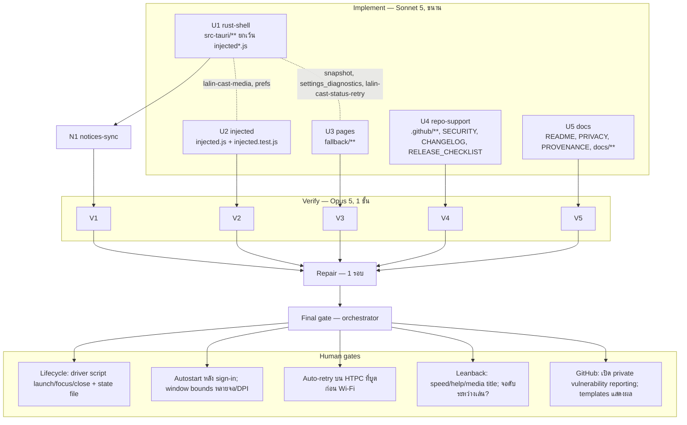

# Lalin Cast — Wave 5 "Desktop integration & launcher": DAG และแผนดำเนินการ

## สถานะและขอบเขต

**CANDIDATE — approved for execution on branch `feat/wave5-desktop`** (แตกจาก `main` ที่ `da7a32c` หลัง merge #7)

Wave 5 เก็บงาน "desktop integration" และ "launcher" ที่ทำได้โดย **ไม่เพิ่ม crate** และ **ไม่ต้องรอ escalation ก** (ทุกอย่างเป็น
พฤติกรรมฝั่ง client/OS ของเราเอง: ไฟล์สถานะของแอป, geometry ของหน้าต่าง, registry Run key ของผู้ใช้เองผ่าน `reg.exe`
พร้อม argument คงที่, การ probe เครือข่ายซ้ำ, ข้อความวินิจฉัยที่ผู้ใช้เป็นคนคัดลอกเอง, `HTMLMediaElement.playbackRate`,
`navigator.mediaSession.metadata` ซึ่งเป็น Web API มาตรฐาน) และเติมไฟล์ support ของ repository ก่อนเปิด public beta

สิ่งที่ **ยังกันไว้เหมือน wave 4:** `lalin-cast://` (ต้องอนุมัติ `tauri-plugin-deep-link` หรือทางเลือก NSIS hook — ผู้ก่อตั้งตัดสิน),
hide Shorts / guide tabs / userstyles / ad-filter / low-memory (escalation ก), keep-display-awake ผ่าน
`SetThreadExecutionState` (ต้องพิสูจน์ก่อนว่า WebView2 ไม่กันจอดับเองระหว่างเล่น — H16), macOS/Linux

Complexity: **C-3**. Risk: **MEDIUM** (process อื่นเขียน registry ผ่าน `reg.exe`, geometry บนหลายจอ/DPI, thread retry,
IPC ผ่านไฟล์) ทุกอย่างอยู่บน branch; พฤติกรรมบนเครื่องจริงเป็น human gate

| งาน | สาย | ที่มา |
|---|---|---|
| Studio launcher lifecycle: `--lifecycle launch\|focus\|close --request-id <id>` + ไฟล์สถานะ `lifecycle.json` ตาม `MediaLifecycleState` | U1 + U5 | `CAST_PLATFORM_PLAN.md` slice P2; review 4.2 |
| จำตำแหน่ง/ขนาดหน้าต่าง media ข้ามการเปิดแอป (`windowBounds`, Rust เขียนเอง) | U1 | review 4.3 (quality) |
| Start with Windows (`startWithWindows` → HKCU Run value ผ่าน `reg.exe` argument คงที่; reconcile ตอนเปิดแอป) | U1 + U3 + U5 | HTPC demand (Steam/handheld guide) |
| Auto-retry เมื่อออฟไลน์ตอนเปิดแอป (backoff 5→30 s, สูงสุด 10 นาที, นับถอยหลังบนหน้า status) | U1 + U3 + U5 | wave 4 out-of-scope; HTPC boot ก่อน Wi-Fi |
| Diagnostics snapshot + ปุ่ม "คัดลอกข้อมูลวินิจฉัย" ในหน้า settings (ไม่มี device id / URL / TV code) | U1 + U3 + U5 | review 4.2 (About/diagnostics) |
| Now-playing: หน้า YouTube ส่ง `lalin-cast-media` (state + title จาก Media Session API) → title หน้าต่าง + tooltip tray | U1 + U2 + U5 | review 4.3 (`Lalin Cast — {title}`) |
| Playback speed keys `Shift+,` / `Shift+.` + OSD ของเรา (session-only, ยอมรับค่าที่ YouTube ตั้งเอง) | U2 + U3 + U5 | differentiator (SmartTube parity) |
| Help overlay `?` / `F1` แสดงผังคีย์บอร์ด+คอนโทรลเลอร์สองภาษา | U2 + U5 | UX |
| Repo support: issue templates, PR template, `SECURITY.md`, `CHANGELOG.md`, release checklist | U4 | review action items |
| README/PRIVACY/DOCS_INDEX/ADR-001/CAST_PLATFORM_PLAN/`CAST_LAUNCHER_IPC.md`/Steam guide/PROVENANCE | U5 | — |
| THIRD_PARTY_NOTICES sync หลัง U1 (คาดว่าไม่เปลี่ยน) | N1 | — |
| ไม่ทำ: `lalin-cast://`, hide shorts/guide/userstyles/ad-filter/low-memory, keep-display-awake, controller mapping สำหรับ speed/help, macOS/Linux | — | wave 6 / escalation / H16 |

## ค่าคงที่และ contract (ทุกสายต้องใช้ตรงกัน)

### Store keys ใหม่ (`media-settings.json`)

| key | type | default | ความหมาย |
|---|---|---|---|
| `startWithWindows` | bool | `false` | `true` → `reg.exe add HKCU\Software\Microsoft\Windows\CurrentVersion\Run /v "Lalin Cast" /t REG_SZ /d "<quoted exe path>" /f`; `false` → `reg.exe query … /v "Lalin Cast"` ก่อน: ไม่พบค่า = สำเร็จโดยไม่ต้องลบ; พบค่า → `reg.exe delete … /v "Lalin Cast" /f` ต้อง exit 0 persist เฉพาะเมื่อคำสั่งสำเร็จ; ตอนเปิดแอป ถ้าค่าใน store เป็น `true` ให้รัน `add` ซ้ำ (idempotent — path ของ exe จะถูกต้องหลังอัปเดต) ถ้าเป็น `false`/ไม่มี ไม่ทำอะไร |
| `windowBounds` | object `{ x: i32, y: i32, width: u32, height: u32 }` (physical px ของหน้าต่าง media: `outer_position` + `inner_size`) | ไม่มี | **Rust เขียนเองเท่านั้น** — `apply_setting` ต้องปฏิเสธ key นี้ (ไม่อยู่ใน whitelist) บันทึกเมื่อ `CloseRequested` และเมื่อ `Moved`/`Resized` แบบ debounce 1 s; **ไม่บันทึก** ขณะ fullscreen, mini-player, maximized, minimized |

ค่า `startWithWindows` ปรากฏใน `settings` ของ snapshot; `windowBounds` **ไม่** ปรากฏใน snapshot

### `reg.exe` (U1: `src/autostart.rs`)

- ค่าที่เขียน: `"<absolute exe path from std::env::current_exe()>"` (ครอบด้วย `"` เสมอ, ไม่มี argument) pure fn `run_value(path) -> Result<String, String>`
  ปฏิเสธ path ที่มี `"` หรือ control character
- pure fn `reg_args(op: RegOp, value: Option<&str>) -> Vec<String>` คืน argument list คงที่ตามตารางด้านบน (`add`/`delete`/`query`; key path และ value name เป็น const)
- รัน `reg.exe` ด้วย `stdin/stdout/stderr = null`, `creation_flags(0x0800_0000 /* CREATE_NO_WINDOW */)` บน Windows, timeout 5 s ผ่าน
  thread + `mpsc::recv_timeout` (รูปแบบเดียวกับ `network::detect_network_profile`); non-Windows → `Err("unsupported")`
- ห้าม PowerShell, ห้าม unsafe, ห้าม crate ใหม่, ห้าม feature ใหม่ของ `windows-sys`

### Window bounds (U1: `src/window_bounds.rs`)

- pure fn `restore_target(saved: Bounds, monitors: &[MonitorRect]) -> Option<Bounds>`: คืน `Some` เฉพาะเมื่อ `width >= 320 && height >= 180`
  และสี่เหลี่ยมที่บันทึกซ้อนทับจอใดจอหนึ่งอย่างน้อย 64×64 px; ไม่เช่นนั้น `None` (ไม่ย้าย/ขยับให้เอง) + tests (นอกจอ, ซ้อนบางส่วน, ขนาดผิดปกติ)
- apply หลัง build หน้าต่าง media และก่อน `show()` ด้วย `set_position(PhysicalPosition)` + `set_size(PhysicalSize)` แล้วค่อย apply
  fullscreen (จาก setting หรือ `--fullscreen`) เพื่อให้ออกจาก fullscreen แล้วกลับมาที่ bounds เดิม
- geometry ของ mini-player (`window_mode.rs`) ไม่เกี่ยวข้องและต้องไม่ถูกบันทึกเป็น `windowBounds`

### Lifecycle — Studio launcher (U1: `src/lifecycle.rs`, `src/launch.rs`)

CLI (token แยก, ลำดับใดก็ได้, ตัวสุดท้ายชนะ):

| flag | ค่า | ความหมาย |
|---|---|---|
| `--lifecycle <cmd>` | `launch` \| `focus` \| `close` | ค่าอื่น → ข้ามทั้ง flag (เหมือน argument ที่ไม่รู้จัก) |
| `--request-id <id>` | `[A-Za-z0-9_.-]{1,64}` | ไม่ระบุ/ไม่ผ่านการตรวจ → ใช้ `"cli"` (คำสั่งที่ส่งต่อไปยัง instance ที่รันอยู่) หรือ `"startup"` (การเปิดโปรเซสครั้งแรก) |

`LaunchOptions` เพิ่ม `lifecycle: Option<LifecycleCommand>`, `request_id: Option<String>` (เฉพาะที่ผ่านการตรวจ)

ไฟล์สถานะ: `<app_local_data_dir>/lifecycle.json` (`app.path().app_local_data_dir()` = `%LOCALAPPDATA%\ai.lalin.cast`) เขียนแบบ
atomic (เขียน `lifecycle.json.tmp` แล้ว `rename`) รูปแบบ (serde camelCase; field ที่ไม่เกี่ยวถูกละ):

```json
{ "type": "starting" | "ready" | "stopped" | "failed",
  "requestId": "cli",
  "pid": 1234,            // ready เท่านั้น
  "exitCode": 0,          // stopped เท่านั้น
  "code": "media-window", // failed เท่านั้น
  "message": "…",         // failed เท่านั้น — ไม่มี URL / path ผู้ใช้
  "version": "0.1.0",
  "updatedAt": 1758380400 } // unix seconds
```

Transitions (ตรงกับ `MediaLifecycleState` ใน `docs/architecture/CAST_PLATFORM_PLAN.md`):

| เหตุการณ์ | เขียน |
|---|---|
| process เริ่ม (ใน `setup` hook หลัง single-instance plugin ตัดอินสแตนซ์ที่สองออกแล้ว, ก่อนสร้างหน้าต่าง/tray/DIAL; ยกเว้น `--version`) | `starting` (requestId = จาก CLI หรือ `"startup"`) |
| `build_media_window` สำเร็จ | `ready` + `pid` |
| `build_media_window` ล้มเหลว | `failed` code `media-window` แล้ว exit ตามเดิม |
| instance แรกได้รับ `--lifecycle close` และยังไม่มี instance อื่นรัน | `stopped` exitCode 0 แล้ว return ก่อนสร้างหน้าต่าง/tray/DIAL |
| instance ที่สองส่ง `launch`/`focus` (single-instance callback) | focus media (+ deep link/fullscreen ตามเดิม) แล้ว `ready` ด้วย requestId ที่ส่งมา |
| instance ที่สองส่ง `close` | `stopped` exitCode 0 แล้ว `app.exit(0)` |
| แอปออกทุกทาง (`RunEvent::Exit` ของ `tauri::App::run`) | `stopped` exitCode 0 (ถ้าสถานะล่าสุดยังไม่ใช่ `stopped`) |

- `lib.rs::run()` เปลี่ยนจาก `.run(ctx)` เป็น `.build(ctx)?.run(|app, event| …)` เพื่อจับ `RunEvent::Exit`
- pure fns + tests: `validate_request_id`, `parse_cli` ทุกรูปแบบ (flag ไม่มีค่า, ค่าไม่รู้จัก, ซ้ำ), `LifecycleState` serialize ตรง schema
  (field ที่ไม่เกี่ยวหายไป), `write_state_atomic` ลง temp dir แล้วอ่านกลับ, `next_state_for(cmd)`
- ไม่ log requestId, ไม่ใส่ URL/deep link ในไฟล์; requestId เป็น token ทึบจาก Studio
- Studio ฝั่งเรียก: poll ไฟล์จนกว่า `type` เป็น `ready`/`stopped`/`failed` ที่มี `requestId` ตรงกัน (แนะนำ timeout 10 s) — เอกสาร U5

### Auto-retry offline (U1: `src/status.rs`, U3: `fallback/status.*`)

- เริ่มเฉพาะเมื่อเปิดหน้าต่าง status ด้วย `STATE_OFFLINE` (ไม่ใช่ `blockedSurface`)
- delay: `retry_delay(attempt) -> Option<u32>` = `[5, 10, 20, 30, 30, …]` วินาที; หยุดเมื่อ elapsed ≥ 600 s หรือ attempt > 22
  (pure `should_stop(attempt, elapsed_secs)`) + tests
- managed `AutoRetryState { generation }`: ปิดหน้าต่าง status (`Destroyed`), เปิดใหม่, หรือ probe สำเร็จ → generation++ ทำให้ thread เก่าออกเอง
- event Rust → หน้าต่าง `status`: `lalin-cast-status-retry` payload
  `{ attempt: u32, nextInSeconds: u32|null, phase: "waiting"|"probing"|"stopped" }` — ส่ง `waiting` หนึ่งครั้งตอนเริ่มรอ (หน้านับถอยหลังเอง
  ทีละ 1 s), `probing` ตอนเริ่ม probe, `stopped` เมื่อครบเพดาน
- probe สำเร็จ → reload media + close status (เหมือน `status_retry` ok path)
- ปุ่ม Retry/Quit ทำงานเหมือนเดิม; `status_retry` สำเร็จ = หน้าต่างปิด = generation++
- `capabilities/status.json` เพิ่ม `core:event:allow-listen`, `core:event:allow-unlisten` (เท่านั้น)

### Diagnostics (U1: `src/diagnostics.rs`, command `settings_diagnostics`)

- command `settings_diagnostics(window) -> Result<String, String>` (label guard `settings` เหมือน command อื่น) permission ใหม่
  `allow-settings-diagnostics` ใน `capabilities/settings.json` (เท่านั้น)
- pure fn `format_diagnostics(input: &DiagnosticsInput) -> String` ผลลัพธ์ข้อความ key: value บรรทัดละค่า (ภาษาอังกฤษ, ไม่ต้อง i18n):

```
Lalin Cast diagnostics
version: 0.1.0
tauri: 2.11.5
webview2: <tauri::webview_version() หรือ unknown>
os: windows / arch: x86_64
language: th
dial: ready (192.168.1.10:8008) | starting | degraded (<reason>) | disabled (<reason>)
network: private | public | unknown (<interface หรือ ->)
settings: fullscreen=false keepOnTop=false pauseOnBlur=false controllerEnabled=true sleepTimerMinutes=0 codecFilter=off hardwareDecoding=true hardwareDecodingRestartRequired=false touchOverlay=true startWithWindows=false miniPlayer=false
dialFriendlyName: <name>
lifecycle: ready (pid 1234)
generatedAt: 1758380400
```

- **ห้าม** มี `dialDeviceId`, URL ใด ๆ, deep link, TV code, cookie, token, ชื่อผู้ใช้/hostname; test ยืนยันว่า output ไม่มี device id
  ที่ใส่เข้าไปใน input
- หน้า settings: ปุ่ม `#copy-diagnostics-btn` → invoke → ใส่ข้อความใน `<textarea id="diagnostics-output" readonly>` (แสดงเมื่อมีข้อความ) →
  `navigator.clipboard.writeText` → สำเร็จ: "คัดลอกแล้ว / Copied"; ล้มเหลว: "เลือกข้อความแล้วคัดลอกเอง / Select the text and copy it"
  ข้อความกำกับ: มีเวอร์ชัน, OS/WebView2, สถานะ DIAL และ IP ใน LAN, ค่าตั้ง — ไม่มีข้อมูลบัญชีหรือรหัสทีวี

### Now-playing (U1 + U2)

- event หน้า → Rust `lalin-cast-media` payload `{ state: "playing"|"paused"|"idle", title: string }`
  หน้า: title จาก `navigator.mediaSession?.metadata?.title` (ไม่อ่าน DOM ของ YouTube), trim, ≤ 200 ตัวอักษร, `""` ถ้าไม่มี;
  ส่งเมื่อ `<video>` ใด ๆ เกิด `play`/`pause`/`ended`/`emptied` (listener แบบ capture ที่ document) + อ่านซ้ำครั้งเดียว 2 s หลัง `play`
- Rust: validate (`state` ∈ set, ตัด control char, ≤ 120 ตัวอักษร) + rate limit 250 ms (ใช้ `surface::rate_limit_allows`) ผ่าน
  `app.listen` แบบเดียวกับ `lalin-cast-shell`; managed `MediaTitleState { media: Option<String>, document: Option<String> }`
- title หน้าต่าง = `window_title(media)` ถ้า `state != idle` และ title ไม่ว่าง; ไม่เช่นนั้น `window_title(document_title ล่าสุด)`
  (`on_document_title_changed` เก็บ `document` ไว้ใน state แล้วคำนวณด้วยกฎเดียวกัน)
- tray tooltip: `tooltip_text(status, now_playing: Option<&str>)` ต่อบรรทัด `▶ <title>` เฉพาะ `playing` + tests
- **ไม่** เพิ่ม permission ใด ๆ ใน `capabilities/default.json` (`core:event:allow-emit` มีอยู่แล้ว)

### Playback speed (U2)

- keybinds ใหม่ใน `keybindFor`: `speed-up` = Shift + `Period` (code) หรือ key `>`; `speed-down` = Shift + `Comma` หรือ key `<`;
  ไม่มี Ctrl/Meta; `toggle-help` = Shift + `Slash` หรือ key `?` หรือ `F1` (ไม่มี modifier อื่น) — `keybindFor` รับ `input.code`
  เพิ่ม (optional) และทดสอบทั้งทาง `code` และ `key`
- rates `[0.5, 0.75, 1, 1.25, 1.5, 1.75, 2]`; pure `nextRate(current, direction)` (clamp ปลาย, ค่านอกตาราง → snap ไปตัวใกล้สุด)
- `desiredRate` เป็น state ของ session (ไม่ persist, ไม่มี pref) apply กับทุก `<video>` ในเอกสาร; re-apply เมื่อ `loadedmetadata`
  (capture) ของวิดีโอใหม่ เฉพาะเมื่อ `desiredRate !== 1`; เมื่อเกิด `ratechange` ที่ไม่ได้มาจากเรา (flag ภายใน) ให้ **ยอมรับ** ค่าใหม่เป็น
  `desiredRate` (ไม่สู้กับ UI ของ YouTube — รูปแบบเดียวกับ volume OSD ที่ adopt ค่าภายนอก)
- OSD `#lalin-cast-speed-osd` + `<style id="lalin-cast-speed-style">` ข้อความ `1.5×` / `1×` แสดง 1.5 s

### Help overlay (U2)

- `#lalin-cast-help` (`role="dialog"`, `aria-modal="true"`) + `<style id="lalin-cast-help-style">` สร้างครั้งแรกเมื่อเรียก; toggle ด้วย
  `toggle-help`; ปิดด้วย `Escape` (capture + `stopImmediatePropagation` เพื่อไม่ให้ YouTube ถอยหน้า; ปุ่ม B ของคอนโทรลเลอร์ที่ dispatch
  synthetic Escape จึงปิดได้เอง), `?`/`F1`, คลิก backdrop
- ขณะเปิด: `ArrowUp/Down/Left/Right`, `Enter` ถูก stop ใน capture phase (ไม่ให้หน้าใต้ overlay เลื่อน focus); key อื่นผ่านตามปกติ
- pure `helpRows(lang) -> [{ action, keyboard, controller }]` สองภาษา (`th`/`en` จาก `prefs.language`) ครอบ: Ctrl+O, F11, Ctrl+Shift+M,
  Shift+Enter, right-click, +/-, M, C, Ctrl+Shift+C, Shift+, / Shift+., ? / F1 และปุ่มคอนโทรลเลอร์ตามผังใน README + tests (สองภาษา
  จำนวนแถวเท่ากัน ไม่มีช่องว่าง)
- ไม่มี `innerHTML`; สร้าง element ด้วย `createElement`/`textContent`

### Settings window (ขยาย — U3)

- กลุ่ม General: toggle `#start-with-windows-toggle` (`startWithWindows`) + หมายเหตุ `#start-with-windows-note`
  ("เพิ่ม Lalin Cast ในรายการเริ่มต้นของ Windows (registry Run key ของบัญชีนี้) มีผลตั้งแต่การเข้าสู่ระบบครั้งถัดไป / Adds Lalin Cast to this
  account's Windows startup (registry Run key); takes effect at the next sign-in") error inline เมื่อ `settings_set` คืน Err
- ตารางคีย์: แถว "ความเร็วเล่น ช้าลง/เร็วขึ้น — Shift+, / Shift+." และ "ผังคีย์ — ? / F1" (ช่องคอนโทรลเลอร์ "—")
- กลุ่ม Updates/About: ปุ่ม `#copy-diagnostics-btn`, `#diagnostics-output` (textarea readonly, hidden จนมีข้อความ),
  `#diagnostics-result` (`role="status"`), `#diagnostics-note`
- refresh 5 s เดิม; ไม่ทับ input ที่ focus (รวม textarea)
- `settings.test.js`: toggle ใหม่ (สำเร็จ/Err), diagnostics (clipboard สำเร็จ / clipboard ล้มเหลว → textarea แสดง / invoke Err),
  ตารางคีย์มีแถวใหม่ (ทั้งสองภาษา)

### Status window (ขยาย — U3)

- `#auto-retry-line` (`role="timer"`, `aria-live="off"`) ใต้ข้อความสถานะ; แสดงเฉพาะ state `offline`
- ฟัง `lalin-cast-status-retry` ผ่าน `win.__TAURI__.event.listen` (guard ถ้าไม่มี `event`): `waiting` → "จะลองใหม่อัตโนมัติใน N วินาที
  (ครั้งที่ K) / Retrying automatically in N s (attempt K)" นับถอยหลังทีละ 1 s ด้วย `win.setInterval`; `probing` → "กำลังลองใหม่… /
  Retrying…"; `stopped` → "หยุดลองใหม่อัตโนมัติแล้ว — กดโหลดใหม่ / Auto-retry stopped — press Retry"
- ปุ่ม Retry/Quit เหมือนเดิม; `status.test.js`: ทุก phase, countdown ด้วย fake timer, `blockedSurface` ไม่แสดงบรรทัดนี้, ไม่มี `event` API ไม่พัง

### i18n

`i18n.rs` เพิ่ม key เฉพาะที่ Rust ต้องใช้ (ถ้ามี) ครบสองภาษา; ข้อความหน้า local อยู่ใน `STRINGS` ของแต่ละหน้า; injected.js ใช้
`prefs.language`

### Repo support (U4)

- `.github/ISSUE_TEMPLATE/bug_report.yml` (fields: เวอร์ชัน Lalin Cast, เวอร์ชัน Windows, ขั้นตอน, ผลที่คาด/ผลจริง, ช่องวางข้อความ
  diagnostics พร้อมคำเตือน **ห้าม** วางรหัสทีวี/ข้อมูลบัญชี, checkbox "ค้นหา issue ซ้ำแล้ว"), `feature_request.yml`,
  `config.yml` (`blank_issues_enabled: false`, contact link ไป `SECURITY.md`)
- `.github/PULL_REQUEST_TEMPLATE.md` (checklist: fmt/clippy/test/check, `node` suites, `capabilities/default.json` ไม่เปลี่ยน, ไม่เพิ่ม crate
  โดยไม่อนุมัติ, เอกสาร/NOTICES อัปเดต, ไม่มี secret/TV code)
- `SECURITY.md` (root): supported versions, รายงานผ่าน GitHub private vulnerability reporting ของ repo (ระบุว่าต้องเปิดใน settings —
  human gate H17), สิ่งที่อยู่ในขอบเขต (updater, DIAL listener, capabilities) และไม่อยู่ (YouTube เอง), ไม่มี bug bounty
- `CHANGELOG.md` (root, Keep a Changelog): `[Unreleased]` รวม H0–W5 แยก Added/Changed/Security อ้าง `docs/plans/*`; ยังไม่มี tag
- `docs/runbooks/RELEASE_CHECKLIST.md`: ก่อน tag (H1–H4 ปิด, bump `src-tauri/Cargo.toml`, CHANGELOG ย้าย Unreleased → เวอร์ชัน, NOTICES ตรง
  lock), tag `vX.Y.Z`, ตรวจ `latest.json` + signature, winget manifest, post-release
- ทุก YAML parse ได้ด้วย Python `yaml`; ห้ามแตะ workflows

## DAG



**Dependency scan:** เหมือน wave 3–4 — Rust ทั้งหมดรวมใน U1 (lib.rs เป็นจุดต่อกลาง), `injected.js` แยก U2, หน้า local U3, ไฟล์ support
U4 (ไม่ชนโค้ด; `docs/runbooks/RELEASE_CHECKLIST.md` ยกให้ U4 อย่างชัดเจน), เอกสาร U5; N1 หลัง U1

## File ownership matrix (บังคับ)

| Stream | เขียนได้เฉพาะ | ห้ามแตะ |
|---|---|---|
| U1 rust-shell | `src-tauri/**` ยกเว้น `src-tauri/injected.js`, `src-tauri/injected.test.js` (รวม `capabilities/settings.json`, `capabilities/status.json`) | `injected*.js`, `fallback/**`, เอกสาร, `.github/**`, **`capabilities/default.json` (diff ต้องว่าง)** |
| U2 injected | `src-tauri/injected.js`, `src-tauri/injected.test.js` | อื่น ๆ ใน `src-tauri/**` |
| U3 pages | `fallback/**` | โค้ดอื่น, เอกสาร, capabilities |
| U4 repo-support | `.github/ISSUE_TEMPLATE/**`, `.github/PULL_REQUEST_TEMPLATE.md`, `SECURITY.md`, `CHANGELOG.md`, `docs/runbooks/RELEASE_CHECKLIST.md` | `.github/workflows/**`, `.github/dependabot.yml`, โค้ด, เอกสารอื่น |
| U5 docs | `README.md`, `PRIVACY.md`, `LALIN_PROVENANCE.md`, `docs/**` (ยกเว้น `docs/plans/**` และ `docs/runbooks/RELEASE_CHECKLIST.md`), `.brain/**` | `THIRD_PARTY_NOTICES.md`, `TERMS.md`, `SECURITY.md`, `CHANGELOG.md`, โค้ด, `.github/**` |
| N1 notices-sync | `THIRD_PARTY_NOTICES.md` | อื่น ๆ |

กฎร่วมเหมือน wave 1–4 (ห้าม commit/push/branch, ห้ามติดตั้ง, ห้ามลบไฟล์นอกสิทธิ์, คำขอข้ามสาย → `openQuestions`, ห้าม log/เก็บ TV code,
cookie, token, URL ที่มี query); **ห้ามเพิ่ม crate และห้ามเพิ่ม feature ของ `windows-sys`**; **ห้ามใช้ `unsafe` ใหม่**

## Stream specs และ acceptance criteria

### U1 rust-shell

1. `src/lifecycle.rs` + `launch.rs` ตาม contract (CLI, state file atomic, transitions, `RunEvent::Exit`) + tests ที่ระบุ
2. `src/window_bounds.rs` (`restore_target` pure + tests; save debounce; apply ก่อน show; ข้าม fullscreen/mini/maximized/minimized)
3. `src/autostart.rs` (`run_value`, `reg_args` pure + tests; runner มี timeout; reconcile ตอน setup เมื่อ store = true)
4. `src/status.rs` auto-retry (`retry_delay`, `should_stop` pure + tests; generation; event `lalin-cast-status-retry`) +
   `capabilities/status.json` เพิ่ม listen/unlisten
5. `src/diagnostics.rs` (`format_diagnostics` pure + test ว่าไม่มี device id/URL) + command `settings_diagnostics` +
   `capabilities/settings.json` เพิ่ม `allow-settings-diagnostics`
6. `lalin-cast-media` listener (validate + rate limit + tests) → `MediaTitleState` → title หน้าต่าง/tray tooltip (`tooltip_text` ขยาย + tests)
7. `settings.rs`: `startWithWindows` ใน `apply_setting` + side effect + snapshot; `windowBounds` ถูกปฏิเสธ (test); `settings_diagnostics`
   ลงทะเบียนใน `generate_handler!`
8. `i18n.rs` key ใหม่ (ถ้าจำเป็น) ครบสองภาษา; `capabilities/default.json` diff ว่าง; ห้ามเพิ่ม crate/feature/unsafe
9. **Quality gate:** fmt, clippy -D warnings, test, check, `grep -rn VacuumTube src-tauri/src` ว่าง, `grep -rn "unsafe" src-tauri/src`
   ไม่เพิ่มจาก `main`

### U2 injected

1. sections `speed`, `help`, `media` + keybinds ใหม่ตาม contract (`keybindFor` รับ `code`)
2. ทุก section ของ wave 1–4 คงพฤติกรรม (diff เฉพาะจุดต่อ)
3. `injected.test.js` ครอบ: `nextRate` ทุกขอบ, apply/re-apply/adopt external `ratechange`, OSD, `helpRows` สองภาษา, overlay เปิด/ปิด
   ด้วยทุกทาง + key ที่ถูก stop ขณะเปิด, `keybindFor` ทาง `code` และ `key`, payload `lalin-cast-media` (title ว่าง/ยาว/ไม่มี mediaSession)
4. **Quality gate:** `node --check`, `node src-tauri/injected.test.js` exit 0, grep `eval(`/`new Function`/`innerHTML` ว่างหรือมีเหตุผล

### U3 pages

1. `fallback/settings.*` และ `fallback/status.*` ตาม contract + tests ตามที่ระบุ
2. `setup.*`, `update.*`, `index.html` ไม่เปลี่ยน
3. **Quality gate:** `node --check` ทุกไฟล์, `node fallback/*.test.js` ผ่าน, grep inline script/handler ว่าง

### U4 repo-support

1. ไฟล์ทั้งหมดในตาราง "Repo support" ตาม contract; Thai นำ English ตาม
2. **Acceptance:** YAML ทุกไฟล์ parse ได้; ไม่แตะ workflows/dependabot; ไม่มีคำต้องห้าม; CHANGELOG อ้างอิงแผนที่มีอยู่จริง

### U5 docs

1. README: ส่วน "Command line" (lifecycle flags + ตัวอย่าง), "Settings" (startWithWindows, diagnostics), ส่วนใหม่ "Desktop integration"
   (window bounds, start with Windows, auto-retry, now-playing title), ตารางคีย์ (speed, help), ส่วน "Support" (SECURITY/CHANGELOG/issue
   templates — path ที่ U4 สร้าง)
2. PRIVACY (ไทย+อังกฤษ): key ใหม่ 2 ตัว, ไฟล์ `lifecycle.json` (ที่อยู่/เนื้อหา), registry Run value, เนื้อหา diagnostics และการคัดลอกที่ผู้ใช้
   เป็นผู้กด, การอ่าน Media Session title ภายในเครื่องเท่านั้น, ไม่มี telemetry
3. ใหม่ `docs/architecture/CAST_LAUNCHER_IPC.md`: contract mapping, CLI grammar, schema/ที่อยู่ไฟล์, sequence launch/focus/close/timeout,
   exit code, ขอบเขตที่ยังไม่ครอบ (queue/media item), แนวทาง polling ฝั่ง Studio, ตัวอย่าง PowerShell driver สำหรับ H13
4. `CAST_PLATFORM_PLAN.md`: แถว P2 → สถานะ "CLI + state file slice (wave 5); Studio driver + H13 pending" ตาม convention ของไฟล์
5. ADR-001: feature matrix rows, security rules (`lalin-cast-media` validated/rate-limited; `reg.exe` argument คงที่; state file ไม่มี URL;
   `windowBounds` Rust-only), CHANGELOG row
6. `docs/guides/STEAM_AND_HANDHELD.md`: start with Windows สำหรับ HTPC, auto-retry ตอนบูต, speed keys
7. DOCS_INDEX: แผนนี้, `CAST_LAUNCHER_IPC.md`, `runbooks/RELEASE_CHECKLIST.md`, `../SECURITY.md`, `../CHANGELOG.md`
8. PROVENANCE: หมายเหตุว่า speed/help/media/lifecycle/autostart/bounds เป็นของ Lalin เอง ไม่ได้ port
9. **Acceptance:** ลิงก์ resolve (path ของ U4 ถือว่ามีแม้ยังไม่ปรากฏ), ไม่มีคำต้องห้าม, ตรง contract

### N1 notices-sync (หลัง U1)

- เหมือน wave 3–4; คาดว่าไม่มีการเปลี่ยนแปลง (ห้ามเพิ่ม crate) — รายงานตัวเลข

## Verify gate rubric (Opus 5)

เหมือน wave 4 เพิ่ม:

- remote capability (`capabilities/default.json`) ไม่เปลี่ยน; `status.json`/`settings.json` เพิ่มเฉพาะ permission ที่ contract ระบุ
- `lalin-cast-media` ถูก validate (state whitelist, ตัด control char, ความยาว) และ rate-limit; ไม่มี action/side effect อื่นนอกจาก title/tooltip
- `windowBounds` ถูกปฏิเสธจาก `settings_set`; ไม่บันทึกขณะ fullscreen/mini/maximized/minimized; `restore_target` ไม่คืนค่านอกจอ
- `reg.exe` ถูกเรียกด้วย argument คงที่จาก pure fn เท่านั้น; exe path ครอบ quote และปฏิเสธ `"`; ไม่มี PowerShell/unsafe/feature ใหม่;
  persist เฉพาะเมื่อสำเร็จ
- ไฟล์ lifecycle เขียน atomic, ไม่มี URL/deep link/requestId ที่ไม่ผ่านการตรวจ; ทุก exit path เขียน `stopped`
- auto-retry thread ออกเองเมื่อ generation ไม่ตรง; ไม่มี retry ใน `blockedSurface`; หยุดตามเพดาน
- diagnostics ไม่มี `dialDeviceId`/URL/TV code (test)
- speed override ยอมรับ `ratechange` ภายนอก (ไม่ loop) และไม่ persist; help overlay stop เฉพาะ key ที่ระบุ
- U4 ไม่แตะ workflows; templates เตือนเรื่อง TV code
- Regression wave 1–4 ทั้งหมด

## Final gate (orchestrator)

1. integrated: fmt --check, clippy -D warnings, test, check, `node --check` ทุก `.js`, `node src-tauri/injected.test.js`,
   `node fallback/*.test.js`, YAML parse ของ workflows/winget/issue templates
2. `git diff src-tauri/capabilities/default.json` ว่าง; link check; forbidden-word grep; `grep VacuumTube src-tauri/src` ว่าง;
   จำนวน `unsafe` ใน `src-tauri/src` ไม่เพิ่มจาก `main`; Cargo.lock ไม่เปลี่ยน
3. diff review: `lifecycle.rs` transitions + `RunEvent::Exit`, `autostart.rs` args, `window_bounds.rs` skip conditions, `status.rs`
   generation, `diagnostics.rs` exclusions, `lalin-cast-media` listener, injected.js speed adopt + help key stops
4. THIRD_PARTY_NOTICES เทียบ lock
5. รายงาน + human gates H13–H17; ไม่ commit จนกว่าผู้ใช้จะสั่ง

## Out of scope / wave 6

`lalin-cast://` (ต้องอนุมัติ `tauri-plugin-deep-link` หรือ NSIS `installerHooks`), hide shorts / guide tabs / userstyles / ad-filter /
low-memory (รอ escalation ก), keep-display-awake (หลัง H16), controller binding สำหรับ speed/help, Lalin Remote, macOS/Linux

## Rollback

`git checkout -- . && git clean -fd` บน `feat/wave5-desktop` (ยกเว้นไฟล์นี้) คืนสภาพ `da7a32c`

## CHANGELOG

| Version | Date | Status | Summary | Commit Hash | Agent |
|---|---|---|---|---|---|
| 0.1.0b | 2026-09-20 | candidate | Wave 5 DAG, contracts for lifecycle/window bounds/autostart/auto-retry/diagnostics/media title/speed/help, 5 parallel streams + notices sync, gates | uncommitted | LALIN |
