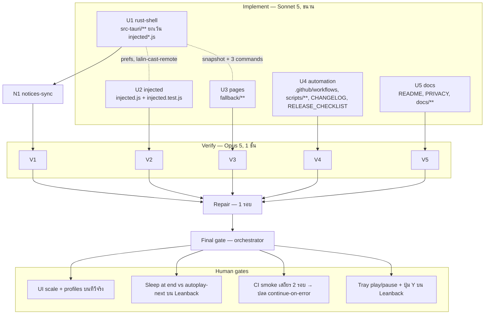

# Lalin Cast — Wave 6 "Living-room polish & QA": DAG และแผนดำเนินการ

## สถานะและขอบเขต

**CANDIDATE — approved for execution on branch `feat/wave6-polish`** (แตกจาก `main` ที่ `78bd897` หลัง merge #8)

Wave 6 เก็บงาน polish ฝั่ง living-room และงาน QA/automation ที่ทำได้โดย **ไม่เพิ่ม crate**, ไม่เพิ่ม feature ของ `windows-sys`,
ไม่มี `unsafe` ใหม่ และไม่ต้องรอการตัดสินใจเรื่อง ToS (ทั้งหมดเป็น API ของ Tauri/WebView2 เอง: `set_zoom`, store, event; Web API
มาตรฐาน `HTMLMediaElement.play/pause`; และงาน CI/สคริปต์ของ repo เอง)

สิ่งที่ **ยังกันไว้เหมือน wave 4–5:** `lalin-cast://` (ต้องอนุมัติ crate หรือ NSIS hook), hide Shorts / guide tabs / userstyles /
ad-filter / low-memory (escalation ก), keep-display-awake (รอ H16), macOS/Linux, Lalin Remote

Complexity: **C-2**. Risk: **LOW–MEDIUM** (zoom กับ layout ของ Leanback, autoplay-next ของ YouTube เมื่อตั้ง "หยุดเมื่อจบวิดีโอ", CI job
ที่รัน exe จริงบน runner) ทุกอย่างอยู่บน branch; พฤติกรรมบนเครื่องจริงเป็น human gate

| งาน | สาย | ที่มา |
|---|---|---|
| UI scale (`uiScale` 100–200 % ผ่าน `WebviewWindow::set_zoom`) สำหรับทีวี 4K ที่นั่งไกล | U1 + U3 + U5 | review (living-room UX) |
| Settings profiles: ปุ่ม "ห้องนั่งเล่น / อุปกรณ์พกพา / เดสก์ท็อป" ตั้งค่าหลายค่าพร้อมกันผ่าน whitelist เดิม | U1 + U3 + U5 | review 4.2 "Handheld profile" |
| Reset to defaults (ยกเว้น language, DIAL name/id, setupCompleted, startWithWindows) | U1 + U3 + U5 | review 4.3 |
| Sleep at end of video (`sleepAtEndOfVideo`): หยุดหลังจบวิดีโอปัจจุบันและกัน autoplay-next หนึ่งครั้ง | U1 + U2 + U3 + U5 | SmartTube parity |
| Play/Pause จาก tray และเมนูหน้าต่าง → event `lalin-cast-remote` ไปหน้า YouTube | U1 + U2 + U5 | living-room UX |
| ปุ่ม "คัดลอกคำสั่งเปิดสำหรับ Steam" (`"<exe>" --fullscreen`) ในหน้า settings | U1 + U3 + U5 | review differentiator (Steam shortcut) |
| ปุ่ม Y ของคอนโทรลเลอร์ (index 3, ว่างอยู่) → toggle-help | U2 + U5 | ค้างจาก wave 5 |
| Test hardening: `read_http_request`, SSDP M-SEARCH ที่ผิดรูป, updater info mapping, settings defaults | U1 | review 4.3 |
| CI smoke job (windows-latest): build debug → `--version` และ `--lifecycle close --request-id ci-smoke` → ตรวจ `lifecycle.json` | U4 | H13 automation |
| `scripts/lifecycle-driver.ps1` (อ่านไฟล์อย่างเดียว + เรียก exe ด้วย argument คงที่) + `scripts/README.md` | U4 | H13 |
| Release notes ของ GitHub Release จากส่วนของเวอร์ชันใน `CHANGELOG.md` | U4 | review 4.3 (release checklist) |
| README/PRIVACY/DOCS_INDEX/ADR-001/CAST_LAUNCHER_IPC/Steam guide | U5 | — |
| THIRD_PARTY_NOTICES sync หลัง U1 (คาดว่าไม่เปลี่ยน) | N1 | — |
| ไม่ทำ: `lalin-cast://`, ad-filter/hide UI, keep-display-awake, controller binding สำหรับ speed, Lalin Remote, macOS/Linux | — | wave 7 / escalation |

## ค่าคงที่และ contract (ทุกสายต้องใช้ตรงกัน)

### Store keys ใหม่ (`media-settings.json`)

| key | type | default | ความหมาย |
|---|---|---|---|
| `uiScale` | int ∈ {100, 125, 150, 175, 200} | 100 | `media.set_zoom(uiScale / 100.0)` ทันทีที่ตั้งค่า และหลัง `show()` ตอนสร้างหน้าต่าง (หลัง restore bounds); ค่านอกเซ็ต → Err |
| `sleepAtEndOfVideo` | bool | `false` | ส่งไปหน้า YouTube ผ่าน prefs/`lalin-cast-prefs`; **Rust ไม่รีเซ็ตเอง** (คงค่าจนผู้ใช้ปิด) |

### Profiles (U1: pure fn ใน `settings.rs`)

`profile_settings(profile) -> Vec<(&'static str, serde_json::Value)>` — apply ทีละ key ผ่าน `apply_setting` + side effect เดียวกับ
`settings_set` (ห้ามเขียน store ตรง ๆ) ลำดับตามตาราง; key ที่ไม่อยู่ในตารางไม่ถูกแตะ (โดยเฉพาะ `language`, `dialFriendlyName`,
`startWithWindows`, `hardwareDecoding`, `sleepTimerMinutes`)

| profile | fullscreen | keepOnTop | controllerEnabled | touchOverlay | pauseOnBlur | codecFilter | uiScale |
|---|---|---|---|---|---|---|---|
| `livingRoom` | true | false | true | false | false | off | 150 |
| `handheld` | true | false | true | true | false | h264 | 125 |
| `desktop` | false | false | true | false | true | off | 100 |

command `settings_apply_profile(profile: String, window) -> Result<SettingsSnapshot, String>` (label guard `settings`; profile นอกเซ็ต → Err)
permission `allow-settings-apply-profile`

### Reset to defaults (U1)

command `settings_reset_defaults(window) -> Result<SettingsSnapshot, String>` permission `allow-settings-reset-defaults`
รีเซ็ตผ่าน path เดียวกับ `settings_set` ทีละ key: `fullscreen=false, keepOnTop=false, pauseOnBlur=false, controllerEnabled=true,
sleepTimerMinutes=0 (ยกเลิก timer), codecFilter=off, hardwareDecoding=true, touchOverlay=true, uiScale=100, sleepAtEndOfVideo=false,
miniPlayer=false` และลบ key `windowBounds` ออกจาก store (`store.delete`); **ไม่แตะ** `language`, `dialFriendlyName`, `dialDeviceId`,
`setupCompleted`, `startWithWindows` pure fn `reset_plan() -> Vec<(&'static str, Value)>` + test ว่า key ต้องห้ามไม่อยู่ในรายการ

### Launch command (U1)

command `settings_launch_command(window) -> Result<String, String>` permission `allow-settings-launch-command` คืน
`"<absolute exe path>" --fullscreen` โดยใช้ `autostart::run_value` (quote/ตรวจ path เดิม) — ไม่มี URL, ไม่มี argument อื่น; หน้า settings เป็นคน
คัดลอกลงคลิปบอร์ด (รูปแบบเดียวกับ diagnostics: textarea fallback)

### Remote (Rust → หน้า YouTube)

event `lalin-cast-remote` payload `{ action: "toggle-play" }` (whitelist 1 action) ส่งด้วย `emit_to(MEDIA_LABEL, …)` จาก tray item
`tray-play-pause` และเมนูหน้าต่าง `play-pause` (i18n key `PlayPause` สองภาษา: "เล่น/หยุดชั่วคราว" / "Play/Pause") **ไม่แก้
`capabilities/default.json`** (หน้า listen ได้อยู่แล้ว)
หน้า: ถ้ามี `<video>` ที่กำลังเล่น (`!paused && !ended`) → `pause()` ทุกตัว; ไม่เช่นนั้น → `play()` ตัวแรกที่ `paused` (จับ promise reject
เงียบ ๆ); action นอก whitelist → ไม่ทำอะไร; rate limit 250 ms ฝั่งหน้า

### Sleep at end of video (U2)

- อ่าน `prefs.sleepAtEndOfVideo` (default false) + อัปเดตจาก `lalin-cast-prefs`
- เมื่อ `<video>` เกิด `ended` (capture) และ pref เป็น true: ตั้ง "armed" 8 s; ภายในช่วงนี้ event `play`/`playing` ครั้งแรกจากวิดีโอใด ๆ
  (autoplay-next ของ YouTube) → `pause()` ทันที + แสดง OSD `#lalin-cast-sleep-osd` (element เดิมของ wave 4) ข้อความ
  "จบวิดีโอแล้ว — หยุดเล่นตามที่ตั้งไว้ / End of video: playback paused as requested" 6 s แล้ว disarm; ถ้าไม่มี play ภายใน 8 s → disarm เฉย ๆ
- ไม่แตะ DOM ของ YouTube นอกจาก `<video>` และ OSD ของเรา; pure `sleepAtEndDecision(state, eventType, now)` + tests

### Controller (U2)

ปุ่ม index 3 (Y) → action `toggle-help` (เดิม unmapped → fallback keycode) เฉพาะเมื่อ `controllerEnabled`; เอกสารผัง + `helpRows` แถว help
เพิ่มคอลัมน์คอนโทรลเลอร์ "Y"

### Settings window (ขยาย — U3)

- General: select `#ui-scale-select` (100/125/150/175/200 %) + หมายเหตุ "มีผลทันที"; กลุ่ม profile `#profile-living-room-btn`,
  `#profile-handheld-btn`, `#profile-desktop-btn` + `#profile-note` (บอกว่าจะเปลี่ยนค่าใดบ้าง) → `settings_apply_profile` → render snapshot
- Playback: toggle `#sleep-at-end-toggle` (`sleepAtEndOfVideo`)
- Updates/About: ปุ่ม `#copy-launch-command-btn` + `#launch-command-output` (textarea readonly) + `#launch-command-result` (รูปแบบ diagnostics);
  ปุ่ม `#reset-defaults-btn` แบบสองจังหวะ (กดครั้งแรก → ข้อความ "กดอีกครั้งภายใน 5 วินาทีเพื่อยืนยัน / Press again within 5 s to confirm";
  ครั้งที่สองภายใน 5 s → `settings_reset_defaults`; เกินเวลา → กลับสภาพเดิม) ไม่มี native dialog
- ตารางคีย์: แถว help เพิ่ม "Y"
- `settings.test.js`: ทุก control ใหม่, profile Err, reset สองจังหวะ (fake timer: ยืนยัน/หมดเวลา), launch command clipboard ok/fail

### Repo automation (U4)

- `ci.yml` job `smoke` (windows-latest, `needs: checks`, **`continue-on-error: true` จนกว่า H20 จะยืนยันเสถียร 2 รอบ**):
  `cargo build --manifest-path src-tauri/Cargo.toml` → รัน `src-tauri/target/debug/lalin-cast.exe --version` ต้องพิมพ์ `lalin-cast <version
  จาก Cargo.toml>` → รัน `lalin-cast.exe --lifecycle close --request-id ci-smoke` ด้วย timeout 60 s → อ่าน
  `$env:LOCALAPPDATA\ai.lalin.cast\lifecycle.json` ต้องมี `type == stopped`, `requestId == ci-smoke`, `exitCode == 0`; ทุก step เป็น pwsh
  ที่มี argument คงที่; ทุก `uses:` pin SHA เดิม
- `scripts/lifecycle-driver.ps1`: พารามิเตอร์ `-Command launch|focus|close`, `-RequestId`, `-ExePath`, `-TimeoutSeconds` (default 10);
  เรียก exe ด้วย argument คงที่, poll ไฟล์จนกว่า `requestId` ตรงและ `type ∈ {ready, stopped, failed}`, พิมพ์ผล, exit code 0/1/2 (สำเร็จ/ล้มเหลว/หมดเวลา);
  ไม่แก้ไฟล์ใด ๆ; `scripts/README.md` อธิบาย + ใช้ใน H13
- `release.yml`: step pwsh ดึงส่วน `## [<version>]` จาก `CHANGELOG.md` (version จาก tag โดยตัด `v`) ลงตัวแปร env แล้วใช้เป็น
  `releaseBody` (fallback เป็นข้อความเดิมถ้าไม่พบส่วนนั้น); `releaseDraft: true` คงเดิม; `docs/runbooks/RELEASE_CHECKLIST.md` เพิ่มขั้น
  "ส่วน CHANGELOG ของเวอร์ชันต้องมีก่อน tag"; `CHANGELOG.md` เพิ่มรายการ wave 6

### i18n

`i18n.rs` เพิ่ม `PlayPause` (+ key อื่นที่ Rust ต้องใช้) ครบสองภาษา

## DAG

## File ownership matrix (บังคับ)

| Stream | เขียนได้เฉพาะ | ห้ามแตะ |
|---|---|---|
| U1 rust-shell | `src-tauri/**` ยกเว้น `src-tauri/injected.js`, `src-tauri/injected.test.js` (รวม `capabilities/settings.json`) | `injected*.js`, `fallback/**`, เอกสาร, `.github/**`, **`capabilities/default.json` (diff ต้องว่าง)** |
| U2 injected | `src-tauri/injected.js`, `src-tauri/injected.test.js` | อื่น ๆ ใน `src-tauri/**` |
| U3 pages | `fallback/**` | โค้ดอื่น, เอกสาร, capabilities |
| U4 automation | `.github/workflows/**`, `scripts/**`, `CHANGELOG.md`, `docs/runbooks/RELEASE_CHECKLIST.md` | `.github/ISSUE_TEMPLATE/**`, dependabot, โค้ด, เอกสารอื่น |
| U5 docs | `README.md`, `PRIVACY.md`, `LALIN_PROVENANCE.md`, `docs/**` (ยกเว้น `docs/plans/**`, `docs/runbooks/RELEASE_CHECKLIST.md`), `.brain/**` | `THIRD_PARTY_NOTICES.md`, `TERMS.md`, `SECURITY.md`, `CHANGELOG.md`, โค้ด, `.github/**`, `scripts/**` |
| N1 notices-sync | `THIRD_PARTY_NOTICES.md` | อื่น ๆ |

กฎร่วมเหมือน wave 1–5 (ห้าม commit/push/branch, ห้ามติดตั้ง, ห้ามลบไฟล์นอกสิทธิ์, คำขอข้ามสาย → `openQuestions`, ห้าม log/เก็บ TV code,
cookie, token, URL ที่มี query); **ห้ามเพิ่ม crate/feature ของ `windows-sys`/`unsafe` ใหม่**

## Stream specs และ acceptance criteria

### U1 rust-shell

1. `uiScale` + `sleepAtEndOfVideo` ใน `apply_setting` (type/set check) + side effects + snapshot + prefs init script/`lalin-cast-prefs`
   (`sleepAtEndOfVideo`) + tests ทุก key (ค่านอกเซ็ต, type ผิด)
2. `profile_settings` pure + test (ทุก profile มี 7 key ตามตาราง, ไม่มี key ต้องห้าม) + command `settings_apply_profile`
3. `reset_plan` pure + test + command `settings_reset_defaults` (ลบ `windowBounds`, ยกเลิก sleep timer, ออกจาก mini)
4. command `settings_launch_command` (ผ่าน `autostart::run_value`) + test ของ pure formatter
5. `lalin-cast-remote`: tray item + เมนู + i18n `PlayPause`; `tray::rebuild_menu`/`build_menu` เพิ่ม item
6. Test hardening ≥ 12 tests ใหม่: `dial.rs` `read_http_request` (header เกินขนาด, ไม่มี CRLF คู่, ไม่ใช่ UTF-8, method ตัวพิมพ์เล็ก, path
   ยาว), SSDP M-SEARCH ผิดรูป (ไม่มี `ST`, `MAN` ผิด, packet ว่าง/ใหญ่), `updater::to_update_info` (body ว่าง/None), settings defaults
   (`load_settings` เมื่อ store ว่าง = defaults ทุก key) — ห้าม sleep จริงใน test
7. `capabilities/settings.json` เพิ่มเฉพาะ 3 permission; `capabilities/default.json` diff ว่าง; `Cargo.lock` ไม่เปลี่ยน
8. **Quality gate:** fmt, clippy -D warnings, test, check, `grep -rn VacuumTube src-tauri/src` ว่าง, `unsafe` เท่าเดิม

### U2 injected

1. section `remote` (listener `lalin-cast-remote`, whitelist, rate limit) + section `sleepAtEnd` ตาม contract + ปุ่ม Y → `toggle-help`
   + prefs `sleepAtEndOfVideo` + `helpRows` แถว help มี "Y"
2. wave 1–5 sections คงพฤติกรรม
3. `injected.test.js`: toggle-play ทั้งสองทิศ, action นอก whitelist, rate limit, `sleepAtEndDecision` ทุกกรณี (armed/หมดเวลา/pref off),
   autoplay-next ถูก pause + OSD, ปุ่ม Y → help เฉพาะเมื่อ controllerEnabled
4. **Quality gate:** `node --check`, `node src-tauri/injected.test.js` exit 0, grep `eval(`/`new Function`/`innerHTML` ว่าง

### U3 pages

1. `fallback/settings.*` ตาม contract + tests ตามที่ระบุ; หน้าอื่นไม่เปลี่ยน
2. **Quality gate:** `node --check` ทุกไฟล์, `node fallback/*.test.js` ผ่าน, grep inline script/handler ว่าง

### U4 automation

1. `ci.yml` job `smoke` ตาม contract (pin SHA เดิม, pwsh argument คงที่, `continue-on-error: true` + comment อ้าง H20)
2. `scripts/lifecycle-driver.ps1` + `scripts/README.md`; script ต้องผ่าน `pwsh -NoProfile -Command "Get-Command -Syntax"` หรืออย่างน้อย
   parse ได้ (`[System.Management.Automation.Language.Parser]::ParseFile` ไม่มี error)
3. `release.yml` releaseBody จาก CHANGELOG + fallback; `RELEASE_CHECKLIST.md` ขั้นใหม่; `CHANGELOG.md` รายการ wave 6
4. **Acceptance:** YAML parse ได้; ทุก `uses:` ยัง pin SHA; ไม่มี secret ใน log; ไม่แตะ ISSUE_TEMPLATE/dependabot

### U5 docs

1. README: Settings (UI scale, profiles, reset, sleep at end, launch command), Controller (Y = help), tray play/pause, ส่วน "Development"
   กล่าวถึง CI smoke + `scripts/lifecycle-driver.ps1`
2. PRIVACY (ไทย+อังกฤษ): key ใหม่ 2 ตัว (local), launch command มี path ของ exe และคัดลอกเมื่อผู้ใช้กดเท่านั้น, reset ไม่ลบ DIAL id/ชื่อ
3. `docs/guides/STEAM_AND_HANDHELD.md`: ปุ่มคัดลอกคำสั่ง + profile "อุปกรณ์พกพา"
4. ADR-001: feature rows + security rule (`lalin-cast-remote` whitelist 1 action, profiles/reset ผ่าน whitelist เดิมเท่านั้น)
5. `CAST_LAUNCHER_IPC.md`: ชี้ไป `scripts/lifecycle-driver.ps1` และ CI smoke; DOCS_INDEX: แผนนี้ + `scripts/README.md`; PROVENANCE: หมายเหตุ
   ของ Lalin เอง
6. **Acceptance:** ลิงก์ resolve (path ของ U4 ถือว่ามี), ไม่มีคำต้องห้าม, ตรง contract

### N1 notices-sync (หลัง U1)

- เหมือน wave 5; คาดว่าไม่มีการเปลี่ยนแปลง — รายงานตัวเลข

## Verify gate rubric (Opus 5)

เหมือน wave 5 เพิ่ม:

- `capabilities/default.json` ไม่เปลี่ยน; `settings.json` เพิ่มเฉพาะ 3 permission
- profiles/reset เขียน store ผ่าน `apply_setting` + side effect เดิมเท่านั้น (ไม่มี write ตรง) และไม่แตะ key ต้องห้าม (test)
- `uiScale` ค่านอกเซ็ตถูกปฏิเสธ; `set_zoom` เรียกหลัง `show()`
- `lalin-cast-remote` whitelist 1 action; หน้าไม่แตะ DOM ของ YouTube นอกจาก `<video>`/OSD ของเรา
- sleep-at-end: disarm เสมอ (ไม่ค้าง), ไม่ loop กับ autoplay
- CI smoke: `continue-on-error: true`, argument คงที่, ไม่มี secret; driver script อ่านไฟล์อย่างเดียว
- Regression wave 1–5 ทั้งหมด

## Final gate (orchestrator)

1. integrated: fmt --check, clippy -D warnings, test, check, `node --check` ทุก `.js`, `node` ทุก suite, YAML parse, PowerShell parse ของ
   `scripts/*.ps1`
2. `git diff src-tauri/capabilities/default.json` ว่าง; `Cargo.lock` ไม่เปลี่ยน; link check; forbidden-word grep; `grep VacuumTube src-tauri/src`
   ว่าง; `unsafe` เท่าเดิม
3. diff review: `profile_settings`/`reset_plan`, `set_zoom` call site, `lalin-cast-remote`, sleep-at-end decision, ci smoke job, driver script
4. THIRD_PARTY_NOTICES เทียบ lock
5. รายงาน + human gates H18–H21; ไม่ commit จนกว่าผู้ใช้จะสั่ง

## Out of scope / wave 7

`lalin-cast://`, hide Shorts / guide tabs / userstyles / ad-filter / low-memory (escalation ก), keep-display-awake (หลัง H16), controller
binding สำหรับ speed, Lalin Remote, macOS/Linux

## Rollback

`git checkout -- . && git clean -fd` บน `feat/wave6-polish` (ยกเว้นไฟล์นี้) คืนสภาพ `78bd897`

## CHANGELOG

| Version | Date | Status | Summary | Commit Hash | Agent |
|---|---|---|---|---|---|
| 0.1.0b | 2026-09-21 | candidate | Wave 6 DAG, contracts for uiScale/profiles/reset/sleep-at-end/remote/launch command/CI smoke/driver script, 5 parallel streams + notices sync, gates | uncommitted | LALIN |
