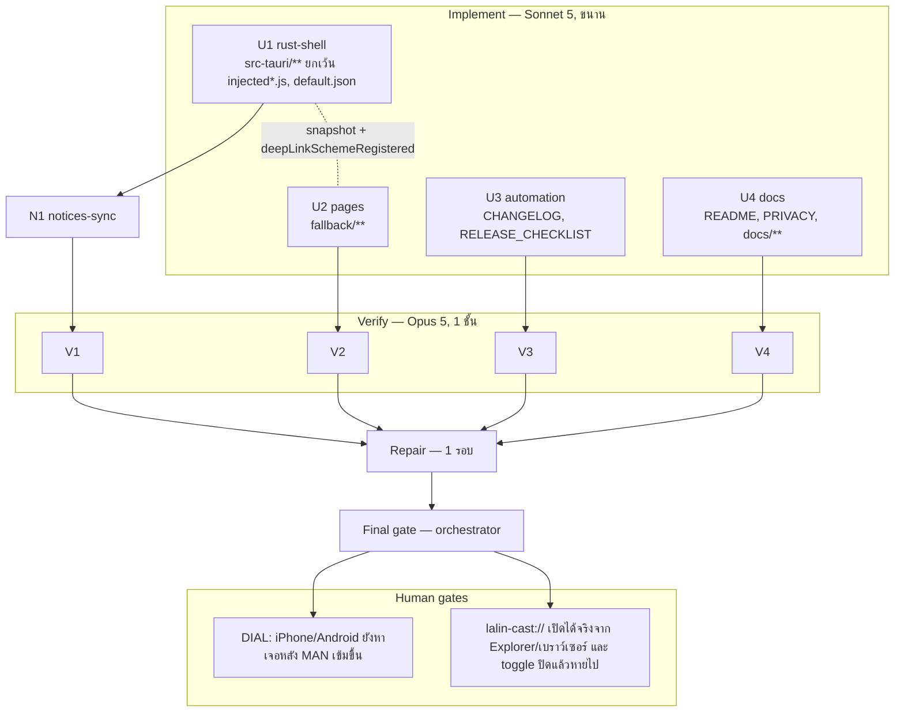

# Lalin Cast — Wave 7 "Deep link & DIAL hardening": DAG และแผนดำเนินการ

## สถานะและขอบเขต

**CANDIDATE — approved for execution on branch `feat/wave7-deeplink`** (แตกจาก `main` ที่ `b56a52a` หลัง merge #9)

Wave 7 ทำสามเรื่องที่ผู้ก่อตั้งเพิ่งอนุมัติ ไม่มีเรื่องอื่นปนเข้ามา:

1. **ตรวจ header `MAN` ของ SSDP M-SEARCH เข้มขึ้น** (ปิดช่องที่ wave 6 บันทึกไว้เป็น characterization test)
2. **`lalin-cast://` URL scheme** ผ่าน crate `tauri-plugin-deep-link` ที่ **ได้รับอนุมัติแล้ว**
3. **sync `THIRD_PARTY_NOTICES.md`** ตาม `Cargo.lock` ที่เปลี่ยนเพราะ crate ใหม่

**ข้อยกเว้นกฎ "ห้ามเพิ่ม crate" เฉพาะ wave นี้:** เพิ่มได้ **crate เดียวเท่านั้น** คือ `tauri-plugin-deep-link` (resolve เป็น 2.4.10,
license `MIT OR Apache-2.0` ซึ่งอยู่ใน allow list ของ `deny.toml` แล้ว) ห้าม crate อื่น ห้ามเปิด feature ใหม่ของ `windows-sys`
ห้าม `unsafe` ใหม่ dependency ของ plugin (`url`, `thiserror` 2, `tracing`, `dunce`, `windows-registry`, `windows-result`,
`tauri-utils`, `serde`, `serde_json`) มีอยู่ใน `Cargo.lock` แล้วทั้งหมด ดังนั้นคาดว่า lock โตขึ้นน้อยมาก — N1 เป็นผู้รายงานตัวเลขจริง

สิ่งที่ **ยังกันไว้:** hide Shorts / guide tabs / userstyles / ad-filter / low-memory (escalation ก ยังไม่ตัดสิน),
keep-display-awake (รอ H16), Lalin Remote, macOS/Linux

Complexity: **C-2**. Risk: **MEDIUM** (MAN ที่เข้มขึ้นอาจทำให้ client จริงบางตัวหาอุปกรณ์ไม่เจอ → human gate บังคับ;
การจดทะเบียน URL scheme เป็นการเขียน registry ของผู้ใช้)

| งาน | สาย | ที่มา |
|---|---|---|
| `is_dial_search` บังคับให้มี `MAN` ที่ถูกต้อง (`ssdp:discover`) นอกเหนือจาก `ST` | U1 | ผู้ก่อตั้งอนุมัติ; wave 6 NB |
| `lalin-cast://watch?v=…` / `lalin-cast://playlist?list=…` → `DeepLink` เดิม (canonical เป็น https เหมือนเดิม) | U1 | roadmap H1; wave 5–6 out-of-scope |
| จดทะเบียน/ยกเลิก scheme แบบ opt-in (`deepLinkScheme`) ผ่าน plugin (HKCU เท่านั้น) | U1 + U2 + U4 | ความสอดคล้องกับ `startWithWindows` |
| หน้า settings: toggle + สถานะการจดทะเบียนจริง | U2 | — |
| CHANGELOG + release checklist (ขั้นตอนตรวจ scheme ก่อน tag) | U3 | — |
| README/PRIVACY/ADR-001/CAST_LAUNCHER_IPC/DOCS_INDEX/PROVENANCE | U4 | — |
| THIRD_PARTY_NOTICES sync หลัง U1 (**คราวนี้เปลี่ยนจริง**) | N1 | ผู้ก่อตั้งสั่ง |
| ไม่ทำ: ad-filter/hide UI, keep-display-awake, mobile deep link (Android/iOS), single-instance feature `deep-link` | — | wave 8 / escalation |

## ค่าคงที่และ contract (ทุกสายต้องใช้ตรงกัน)

### 1. SSDP `MAN` (U1: `src/dial.rs`)

`is_dial_search` ต้องคืน `true` ก็ต่อเมื่อครบ **ทั้งสาม** ข้อ:

1. บรรทัดแรกคือ `M-SEARCH * …` (เหมือนเดิม)
2. มี header `ST` ที่ค่า (trim แล้ว) เท่ากับ `ssdp:all` หรือ `urn:dial-multiscreen-org:service:dial:1` (เหมือนเดิม, case-insensitive)
3. **ใหม่:** มี header `MAN` ที่ค่า (trim แล้ว, **ตัดเครื่องหมาย `"` คู่หน้า-หลังออกถ้ามี**) เท่ากับ `ssdp:discover` แบบ case-insensitive

pure fn `man_header_is_discover(value: &str) -> bool` แยกออกมา + tests

**เหตุผลที่ยอมรับทั้งแบบมีและไม่มี quote:** UPnP กำหนดให้ส่ง `MAN: "ssdp:discover"` (มี quote) แต่ client จริงจำนวนหนึ่งส่งแบบไม่มี
quote การบังคับ quote จะทำให้ discovery พังโดยที่เราไม่ได้ประโยชน์ด้านความปลอดภัยเพิ่ม — เป้าหมายของการเข้มขึ้นคือทิ้ง datagram ที่ไม่ใช่
M-SEARCH จริง ไม่ใช่การบังคับ spec เป๊ะ

ต้องแก้ test `accepts_m_search_even_with_an_incorrect_man_header` ของ wave 6 ให้กลายเป็น `rejects_…` (นี่คือการเปลี่ยนพฤติกรรมโดยเจตนา)
และเพิ่ม tests: ไม่มี `MAN` เลย → reject; `MAN: "ssdp:discover"` (มี quote) → accept; `MAN: ssdp:discover` (ไม่มี quote) → accept;
`MAN: "SSDP:DISCOVER"` → accept; `MAN: "ssdp:discover" extra` → reject; quote ข้างเดียว → reject

**Human gate H22 (บังคับ):** ยืนยันว่า iPhone/Android YouTube app ยังหา Lalin Cast เจอหลังเปลี่ยน ถ้าไม่เจอให้ย้อนข้อนี้ทันที

### 2. `lalin-cast://` scheme (U1: `src/launch.rs`)

รูปแบบที่ยอมรับ (นอกเหนือจาก https ที่มีอยู่เดิม ซึ่งต้องไม่เปลี่ยนพฤติกรรม):

| URL | ผล |
|---|---|
| `lalin-cast://watch?v=<11-char id>` | `DeepLink::Video(id)` |
| `lalin-cast://playlist?list=<id>` | `DeepLink::Playlist(id)` |

- host (`watch` / `playlist`) เทียบแบบ case-insensitive; scheme เทียบแบบ case-insensitive
- id/list ใช้ตัวตรวจเดิม (`is_valid_video_id`, `is_valid_playlist_id`) ไม่ผ่อนปรน
- รูปแบบอื่นทั้งหมด (`lalin-cast://settings`, `lalin-cast://watch` ที่ไม่มี `v`, path เพิ่ม, `lalin-cast:watch?v=…` แบบไม่มี `//`) → `None`
- `canonical()` **ไม่เปลี่ยน** — ยังคืน `https://www.youtube.com/...` เสมอ; สตริง `lalin-cast://` ดิบ **ห้าม** ไปถึง webview หรือถูก log
- `parse_cli` ไม่เปลี่ยนโครงสร้าง: URL ตัวสุดท้ายที่ parse ได้ยังชนะเหมือนเดิม

### 3. การจดทะเบียน scheme (U1)

- `tauri.conf.json` **ห้ามมี** block `plugins."deep-link"` (แก้จากร่างแรกของแผนนี้ที่ final gate — ดูหมายเหตุด้านล่าง)
- `tauri::Builder` เพิ่ม `.plugin(tauri_plugin_deep_link::init())`
- **หมายเหตุการแก้แผนที่ final gate:** ร่างแรกกำหนดให้ใส่ `plugins."deep-link".desktop.schemes` ใน `tauri.conf.json` ผู้ตรวจ Opus
  ของ U1 ตั้งข้อสังเกตว่า bundler ของ Tauri อ่านคีย์นี้เพื่อผูก scheme ตอน **ติดตั้ง** ซึ่งจะทำให้ผู้ติดตั้งทุกคนได้ `lalin-cast://`
  ไปโดยไม่สนใจ toggle และทำให้คำว่า opt-in ใน README/PRIVACY ไม่จริง เครื่องนี้ไม่มี tauri-cli จึงพิสูจน์ฝั่ง bundler ไม่ได้ แต่
  `register`/`unregister`/`is_registered` รับ protocol เป็น argument อยู่แล้ว คีย์นี้จึงไม่จำเป็นต่อการทำงานเลย — ตัดออกทั้งหมด
  และเพิ่ม unit test `tauri_conf_declares_no_deep_link_plugin_config` กันการใส่กลับโดยไม่ตั้งใจ
- **ไม่เปิด** feature `deep-link` ของ `tauri-plugin-single-instance` และ **ไม่ใช้** `handle_cli_arguments`/`on_open_url`:
  Windows ส่ง URL มาเป็น argument ของโปรเซสใหม่อยู่แล้ว และ `parse_cli` + single-instance callback ของเรารองรับเส้นทางนั้นครบและมี test
  อยู่แล้ว การเปิดทั้งสองทางพร้อมกันจะทำให้มี code path ซ้อนกันสองทางโดยไม่จำเป็น plugin จึงถูกใช้ **เพื่อจด/ยกเลิก/ตรวจ registry เท่านั้น**
  (บันทึกเหตุผลนี้ใน doc comment และ ADR)
- store key ใหม่:

| key | type | default | ความหมาย |
|---|---|---|---|
| `deepLinkScheme` | bool | `false` | `true` → `DeepLinkExt::deep_link().register("lalin-cast")`; `false` → `unregister("lalin-cast")` (ถ้า `is_registered` เป็น false อยู่แล้ว ถือว่าสำเร็จโดยไม่ต้องเรียก) เขียน `HKCU\Software\Classes\lalin-cast` เท่านั้น ไม่ต้องสิทธิ์ผู้ดูแล; persist เฉพาะเมื่อสำเร็จ; ตอนเปิดแอป ถ้า store เป็น `true` ให้ `register` ซ้ำ (idempotent, path exe ถูกต้องหลังอัปเดต) ถ้าเป็น `false`/ไม่มี ไม่ทำอะไร |

- snapshot เพิ่ม `deepLinkScheme` (จาก store) ที่ระดับ `settings` และ `deepLinkSchemeRegistered: bool` ที่ระดับบนสุด (จาก
  `is_registered("lalin-cast")`, error → `false`) — คู่นี้ทำให้หน้า settings บอกได้ว่า "เปิดไว้แต่ registry ไม่ตรง"
- `apply_setting` เพิ่ม `deepLinkScheme` (bool) พร้อม test; key อื่นไม่เปลี่ยน
- `reset_plan()` **ไม่** รวม `deepLinkScheme` (เหมือน `startWithWindows` — การรีเซ็ตต้องไม่ถอนการจดทะเบียนที่ผู้ใช้ตั้งใจเปิด) + test
- `profile_settings` ไม่แตะ key นี้
- `diagnostics.rs` เพิ่ม `deepLinkScheme=<bool> deepLinkSchemeRegistered=<bool>` ต่อท้ายบรรทัด `settings:`
  (ชื่อฟิลด์ที่สองยาวกว่าที่ร่างแรกเขียนไว้ว่า `registered=` — ยอมรับตามที่ implement เพราะอ่านแล้วไม่กำกวม และไม่มีโค้ด/test ใดอ่านสตริงนี้) (ยังห้ามมี device id/URL/TV code)

### 4. Capabilities (U1) — ข้อบังคับด้านความปลอดภัย

- `capabilities/default.json` (หน้า remote youtube.com) **ต้อง byte-identical** — diff ว่าง
- **ห้าม** เพิ่ม permission ของ plugin (`deep-link:default`, `deep-link:allow-is-registered`, ฯลฯ) ลงใน capability ใด ๆ ทั้งสิ้น:
  หน้า local เรียกผ่าน `settings_get`/`settings_set` ที่มีอยู่แล้วเท่านั้น ไม่มีหน้าไหนเรียก command ของ plugin โดยตรง
- `capabilities/settings.json` ไม่เปลี่ยน (ไม่มี command ใหม่ใน wave นี้)

### 5. หน้า settings (U2: `fallback/**`)

- กลุ่ม General เพิ่ม `#deep-link-toggle` (`deepLinkScheme`) + `#deep-link-note` สองภาษา:
  "ให้ลิงก์ `lalin-cast://` เปิดด้วย Lalin Cast (เขียนในรีจิสทรีของบัญชีนี้เท่านั้น) / Let `lalin-cast://` links open in Lalin Cast
  (written to this account's registry only)"
- `#deep-link-status` (`role="status"`) แสดงเมื่อ `deepLinkScheme === true` แต่ `deepLinkSchemeRegistered === false`:
  "เปิดไว้แต่ยังไม่ได้จดทะเบียน — ลองปิดแล้วเปิดใหม่ / Enabled but not registered — try turning it off and on again" (สีเตือน
  เหมือน `hardwareDecodingRestartRequired`)
- error ของ `settings_set` แสดง inline เหมือน toggle อื่น; refresh 5 s เดิมอัปเดตสถานะนี้ด้วย
- `settings.test.js`: toggle สำเร็จ/Err, สถานะไม่ตรงแสดง/ไม่แสดง, ไม่ทับ input ที่ focus
- หน้าอื่น (`setup.*`, `status.*`, `update.*`, `index.html`) ไม่เปลี่ยน

### 6. Automation (U3)

- `CHANGELOG.md` เพิ่มรายการ wave 7 ใน `[Unreleased]` (Added: `lalin-cast://`; Changed: MAN validation — ระบุว่าเป็น
  **behavior change** ของ DIAL discovery; Security: scheme จด HKCU แบบ opt-in)
- `docs/runbooks/RELEASE_CHECKLIST.md` เพิ่มขั้นก่อน tag: ยืนยัน H22 (DIAL discovery หลัง MAN เข้มขึ้น) และ H23 (`lalin-cast://`
  เปิดจริงจาก Explorer/เบราว์เซอร์) ผ่านแล้ว
- ไม่ต้องแก้ workflow ใด ๆ (smoke job เดิมยังใช้ได้) — ถ้าจะแตะ `.github/workflows/**` ต้องมีเหตุผลและห้ามลด `continue-on-error`
  ของ smoke (H20 ยังนับรอบไม่ครบ)

### 7. เอกสาร (U4)

- README: ส่วน "Command line" เพิ่ม `lalin-cast://` (รูปแบบที่รองรับ + ตัวอย่าง), Settings เพิ่ม toggle, หมายเหตุว่า scheme เป็น opt-in
  และเขียน registry ของบัญชีผู้ใช้เท่านั้น
- PRIVACY (ไทย+อังกฤษ): key `deepLinkScheme`, สิ่งที่เขียนใน registry (`HKCU\Software\Classes\lalin-cast`), URL ที่มาจาก scheme
  ถูกตรวจและแปลงเป็น URL ของ YouTube ก่อนใช้ **และไม่ถูก log** เหมือนลิงก์จากบรรทัดคำสั่ง
- ADR-001: feature rows + security rules (plugin ใช้เพื่อ registry เท่านั้น, ไม่เปิด feature `deep-link` ของ single-instance,
  ไม่มี capability ของ plugin, MAN เข้มขึ้นเป็น behavior change ที่มี human gate) + CHANGELOG row
- `CAST_LAUNCHER_IPC.md`: ระบุว่า Studio ยังควรใช้ `--lifecycle` + argument URL (เส้นทางที่มี test) และ `lalin-cast://` มีไว้สำหรับ
  ผู้ใช้/ระบบปฏิบัติการ ไม่ใช่ช่องทาง IPC ของ Studio
- `LALIN_PROVENANCE.md`: เพิ่ม `tauri-plugin-deep-link` เป็น dependency ใหม่พร้อมเหตุผลและขอบเขตการใช้งาน
- DOCS_INDEX: แผนนี้

### 8. N1 notices-sync (หลัง U1)

- คราวนี้ **คาดว่าเปลี่ยนจริง** — ต้อง sync ตาราง section 1 ให้ตรง `Cargo.lock` ใหม่ ทุกแถวและทุกตัวเลขรวม พร้อมพิสูจน์ด้วยการเทียบ
  เซ็ตสองทาง และรายงานจำนวนก่อน/หลัง ถ้ามี license ที่ไม่อยู่ใน allow list ของ `deny.toml` ให้รายงานเป็น `openQuestions` โดย**ไม่แก้**
  `deny.toml`

## DAG

**Dependency scan:** `injected.js` **ไม่ต้องแก้เลยใน wave นี้** (deep link ยังมาทาง prefs/event เดิม) จึงไม่มีสาย injected —
ผู้ตรวจต้องยืนยันว่า `src-tauri/injected.js` และ `injected.test.js` ไม่มี diff

## File ownership matrix (บังคับ)

| Stream | เขียนได้เฉพาะ | ห้ามแตะ |
|---|---|---|
| U1 rust-shell | `src-tauri/**` ยกเว้น `injected.js`, `injected.test.js`, `capabilities/default.json` (รวม `Cargo.toml`, `Cargo.lock`, `tauri.conf.json`) | `injected*.js`, **`capabilities/default.json`**, `fallback/**`, เอกสาร, `.github/**` |
| U2 pages | `fallback/**` | โค้ดอื่น, เอกสาร, capabilities |
| U3 automation | `CHANGELOG.md`, `docs/runbooks/RELEASE_CHECKLIST.md` | `.github/**` (เว้นมีเหตุผลและห้ามแตะ smoke `continue-on-error`), โค้ด, เอกสารอื่น |
| U4 docs | `README.md`, `PRIVACY.md`, `LALIN_PROVENANCE.md`, `docs/**` (ยกเว้น `docs/plans/**`, `docs/runbooks/RELEASE_CHECKLIST.md`), `.brain/**` | `THIRD_PARTY_NOTICES.md`, `TERMS.md`, `SECURITY.md`, `CHANGELOG.md`, โค้ด, `scripts/**` |
| N1 notices-sync | `THIRD_PARTY_NOTICES.md` | อื่น ๆ |

กฎร่วมเหมือน wave 1–6 (ห้าม commit/push/branch, ห้ามติดตั้งซอฟต์แวร์, ห้ามลบไฟล์นอกสิทธิ์, คำขอข้ามสาย → `openQuestions`,
ห้าม log/เก็บ TV code, cookie, token, URL ที่มี query) **ยกเว้นข้อเดียว:** U1 เพิ่ม crate `tauri-plugin-deep-link` ได้ (crate อื่นยังห้าม)

## Stream specs และ acceptance criteria

### U1 rust-shell

1. `is_dial_search` + `man_header_is_discover` ตาม contract 1 พร้อม tests ทั้งหมดที่ระบุ และแก้ test wave 6 ให้เป็น reject
2. `parse_launch_url` รองรับ `lalin-cast://` ตาม contract 2 พร้อม tests (ยอมรับ/ปฏิเสธครบทุกเคส, https เดิมไม่เปลี่ยน,
   `canonical()` ยังเป็น https)
3. `Cargo.toml` เพิ่ม `tauri-plugin-deep-link` (crate เดียว), builder เพิ่ม plugin, `tauri.conf.json` ต้องไม่มี block ของ plugin
4. `deepLinkScheme` ใน `apply_setting`/`settings_set` + side effect (register/unregister, persist เมื่อสำเร็จ) + startup reconcile
   + snapshot 2 field + `reset_plan` ไม่รวม (test) + diagnostics บรรทัด settings
5. `capabilities/default.json` diff ว่าง; ไม่มี permission ของ plugin ใน capability ใด ๆ (grep พิสูจน์)
6. ไม่เปิด feature `deep-link` ของ single-instance; ไม่มี `unsafe` ใหม่; ไม่มี crate อื่น
7. **Quality gate:** fmt, clippy -D warnings, test, check, `grep -rn VacuumTube src-tauri/src` ว่าง, `cargo deny check licenses`
   (ถ้ารันได้) หรืออย่างน้อยยืนยันว่า license ของ crate ใหม่อยู่ใน allow list, `git diff --stat src-tauri/injected.js` ว่าง

### U2 pages

1. `fallback/settings.*` ตาม contract 5 + tests; หน้าอื่นไม่เปลี่ยน
2. **Quality gate:** `node --check` ทุกไฟล์, `node fallback/*.test.js` ผ่าน, grep inline script/handler ว่าง

### U3 automation

1. CHANGELOG + RELEASE_CHECKLIST ตาม contract 6
2. **Acceptance:** ไม่มีการแก้ workflow ที่ลด `continue-on-error` ของ smoke; ลิงก์ในไฟล์ resolve; ไม่มีคำต้องห้าม

### U4 docs

1. ทุกข้อใน contract 7
2. **Acceptance:** ลิงก์ resolve, ไม่มีคำต้องห้าม, ตรง contract (โดยเฉพาะ: scheme เป็น opt-in, registry ของบัญชีผู้ใช้เท่านั้น,
   URL ถูกแปลงเป็น https ก่อนใช้, ไม่ถูก log)

### N1 notices-sync (หลัง U1)

- ตาม contract 8 — รายงานจำนวนแถวก่อน/หลังและรายชื่อแถวที่เพิ่ม

## Verify gate rubric (Opus 5)

เหมือน wave 6 เพิ่ม:

- มี crate ใหม่ **ตัวเดียว** ใน `Cargo.toml` diff คือ `tauri-plugin-deep-link`; `Cargo.lock` เปลี่ยนสอดคล้องกันและ N1 sync ครบ
- `capabilities/default.json` diff ว่าง; ไม่มี permission ของ plugin ปรากฏในไฟล์ capability ใด ๆ
- `src-tauri/injected.js` / `injected.test.js` diff ว่าง
- `lalin-cast://` ดิบไม่เคยถูกส่งเข้า webview หรือ log; `canonical()` ยังเป็น https เท่านั้น
- `MAN` เข้มขึ้นจริง (test เดิมของ wave 6 กลายเป็น reject) และยอมรับทั้งแบบมี/ไม่มี quote
- `deepLinkScheme` persist เฉพาะเมื่อ register/unregister สำเร็จ; `reset_plan` ไม่แตะ
- ไม่เปิด feature `deep-link` ของ single-instance; ไม่มี `unsafe`/crate อื่นเพิ่ม
- Regression wave 1–6 ทั้งหมด

## Final gate (orchestrator)

1. integrated: fmt --check, clippy -D warnings, test, check, `node --check` ทุก `.js`, `node` ทุก suite, YAML parse, PowerShell parse
2. `git diff src-tauri/capabilities/default.json` ว่าง; `git diff src-tauri/injected.js src-tauri/injected.test.js` ว่าง;
   `Cargo.toml` มี crate ใหม่ตัวเดียว; link check; forbidden-word grep; `unsafe` เท่าเดิม
3. `cargo deny check licenses` (ถ้ามี cargo-deny ในเครื่อง) หรือยืนยัน license ของ crate ใหม่ด้วยมือ
4. diff review: `man_header_is_discover`, `parse_launch_url` เส้นทาง scheme, การ register/unregister, capability
5. THIRD_PARTY_NOTICES เทียบ lock สองทาง
6. รายงาน + human gates H22–H23; ไม่ commit จนกว่าผู้ใช้จะสั่ง

## Out of scope / wave 8

hide Shorts / guide tabs / userstyles / ad-filter / low-memory (escalation ก), keep-display-awake (หลัง H16), deep link ฝั่ง
Android/iOS, การจดทะเบียน scheme ตอนติดตั้งผ่าน NSIS (ตอนนี้เป็น opt-in ตอนรันเท่านั้น), Lalin Remote, macOS/Linux

## Rollback

`git checkout -- . && git clean -fd` บน `feat/wave7-deeplink` (ยกเว้นไฟล์นี้) คืนสภาพ `b56a52a`

## CHANGELOG

| Version | Date | Status | Summary | Commit Hash | Agent |
|---|---|---|---|---|---|
| 0.1.0b | 2026-09-21 | candidate | Wave 7 DAG, contracts for strict SSDP MAN validation, the lalin-cast:// scheme via the approved tauri-plugin-deep-link crate with opt-in HKCU registration, and the notices sync; 4 parallel streams + notices sync, gates | uncommitted | LALIN |
