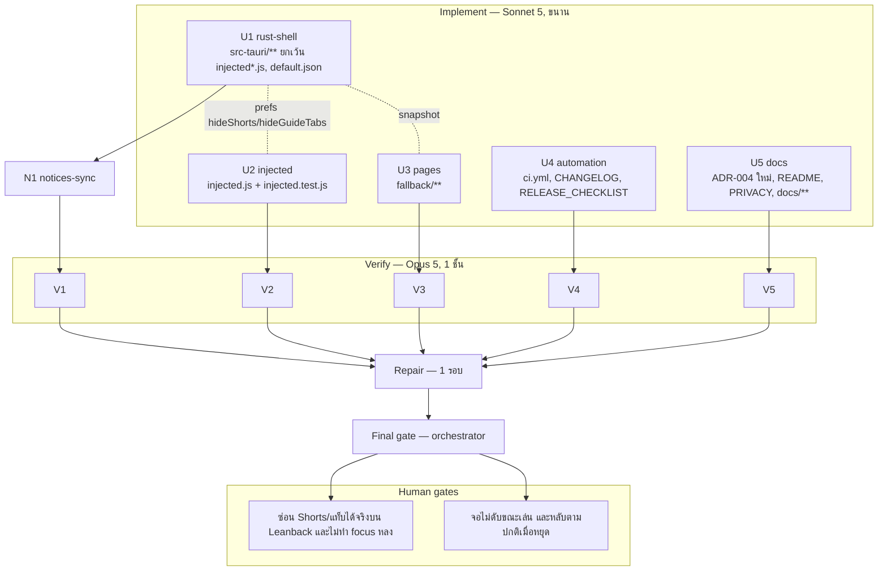

# Lalin Cast — Wave 8 "Client-side boundary": DAG และแผนดำเนินการ

## สถานะและขอบเขต

**CANDIDATE — approved for execution on branch `feat/wave8-boundary`** (แตกจาก `main` ที่ `0b932fd` หลัง merge #10)

Wave 8 ลงมือตามการตัดสิน escalation ก ที่เพิ่งได้ข้อสรุป และเก็บงานที่ค้างเพราะรอการตัดสินนั้น

| การตัดสิน | ผล | ทำใน wave นี้ |
|---|---|---|
| Ad filtering | **ไม่ทำ ถาวร** | บันทึกเป็น ADR + ประกาศจุดยืน Premium-friendly |
| SponsorBlock / DeArrow / RYD | **ไม่ทำ** (ผลพลอยได้: ไม่ต้องขอ license เชิงพาณิชย์) | บันทึกใน ADR |
| ซ่อน Shorts / guide tabs | **ทำ** แบบ opt-in ปิดเป็นค่าเริ่มต้น **ด้วย CSS/DOM เท่านั้น** | U2 + U1 + U3 |
| Userstyles ที่ผู้ใช้ใส่เอง | **ไม่ทำตอนนี้** (ต้องมี sandbox + ADR แยก) | บันทึกใน ADR |
| Low-memory ที่แก้ config JSON ของ YouTube | **ไม่ทำ** | บันทึกใน ADR |
| keep-display-awake | **ทำ** พร้อมอนุมัติข้อยกเว้นกฎสองข้อ | U1 |
| H20 ปลด `continue-on-error` ของ smoke job | **ทำ** (เขียวสองรอบติดใน #9 และ #10) | U4 |

### ข้อยกเว้นกฎเฉพาะ wave นี้ (ได้รับอนุมัติแล้ว)

1. เปิด feature `Win32_System_Power` ของ `windows-sys` ได้ **เฉพาะตัวเดียว** (ยังห้าม feature อื่น)
2. เพิ่ม `unsafe` block ได้ **เฉพาะจุดเดียว** คือการเรียก `SetThreadExecutionState` ใน `src/power.rs` พร้อม `// SAFETY:` comment

**ห้ามเพิ่ม crate ใด ๆ** (กฎเดิมกลับมาเต็มรูปแบบหลัง wave 7)

### เส้นที่ห้ามข้ามใน wave นี้ (สำคัญที่สุด)

การซ่อน Shorts และ guide tabs ของ upstream (`reference/vacuumtube/src/preload/modules/hide-shorts.js`,
`guide-tabs.js`) ทำงานด้วยการ **ดักและเขียนทับ response ของ `/youtubei/v1/browse` และ `/youtubei/v1/guide`**
ซึ่งเป็นกลไกประเภทเดียวกับ ad filtering ที่เราตัดสินว่าไม่ทำ

**เราจึงไม่ port สองไฟล์นี้** และ wave นี้ต้องไม่มีสิ่งเหล่านี้แม้แต่บรรทัดเดียว:

- การแทนที่/ห่อ `XMLHttpRequest`, `window.fetch`, `Response`, `.open`, `.send` หรือ network API ใด ๆ
- การอ่านหรือแก้ response ของ YouTube
- การแก้ config JSON ของ YouTube
- การลบ node ออกจาก DOM ของ YouTube

สิ่งที่ทำได้คือ **อ่าน DOM ที่หน้าเว็บ render ออกมาแล้ว แล้วติดคลาสของเราเอง + ใช้ stylesheet ของเราเอง
ซ่อนด้วย CSS** ซึ่งเป็นประเภทเดียวกับ touch overlay และ help overlay ที่ผ่านมาแล้วหก wave

Complexity: **C-2**. Risk: **MEDIUM** (selector ของ Leanback ไม่มีสัญญาว่าจะคงที่; การกันจอดับแตะ power API ของระบบ)

## ค่าคงที่และ contract (ทุกสายต้องใช้ตรงกัน)

### 1. Store keys ใหม่ (`media-settings.json`)

| key | type | default | ความหมาย |
|---|---|---|---|
| `keepDisplayAwake` | bool | `true` | กันจอดับ/เครื่องหลับ **เฉพาะขณะกำลังเล่นวิดีโอจริง** (อิงสถานะจาก event `lalin-cast-media` ของ wave 5) |
| `hideShorts` | bool | `false` | ซ่อนชั้น Shorts บนหน้าแรกด้วย CSS ของเรา |
| `hideGuideTabs` | bool | `false` | ซ่อนแท็บ Shorts ในแถบนำทางด้านข้างด้วย CSS ของเรา |

ทั้งสามปรากฏใน `settings` ของ snapshot; `hideShorts`/`hideGuideTabs` ส่งต่อไปหน้า YouTube ผ่าน prefs และ
`lalin-cast-prefs` (มีผลทันที ไม่ต้องโหลดหน้าใหม่); `keepDisplayAwake` อยู่ฝั่ง Rust ล้วน ไม่ส่งไปหน้าเว็บ

### 2. keep-display-awake (U1: `src/power.rs`)

- pure fn `execution_state_flags(enabled: bool, playing: bool) -> u32`
  - `enabled && playing` → `ES_CONTINUOUS | ES_DISPLAY_REQUIRED | ES_SYSTEM_REQUIRED` = `0x8000_0000 | 0x0000_0002 | 0x0000_0001`
  - กรณีอื่นทั้งหมด → `ES_CONTINUOUS` = `0x8000_0000` (ปล่อยการจอง)
  - tests ครบสี่ combination โดยไม่เรียก API จริง
- **`SetThreadExecutionState` มีผลต่อ thread ที่เรียกเท่านั้น และผลหายไปเมื่อ thread จบ** จึงต้องมี worker
  thread เดียวที่อายุยืนเป็นเจ้าของสถานะ: managed `PowerState` ถือ `mpsc::Sender<u32>`, thread รับ flag แล้ว
  เรียก API, และก่อนจบ thread ต้องเรียกด้วย `ES_CONTINUOUS` เพื่อคืนสถานะเสมอ
- จุดที่สั่งอัปเดต: `apply_media_event` (playing → จอง, paused/idle → ปล่อย), `settings_set` เมื่อ
  `keepDisplayAwake` เปลี่ยน (ปิด → ปล่อยทันที), และ `RunEvent::Exit` (ปล่อยก่อนออก)
- `unsafe` **บล็อกเดียว** รอบการเรียก `SetThreadExecutionState` พร้อม `// SAFETY:` อธิบายว่า argument เป็น
  bitmask คงที่และ API ไม่มี precondition ด้านหน่วยความจำ
- non-Windows: ทั้งโมดูลเป็น no-op ที่ compile ได้
- `diagnostics.rs` เพิ่ม `keepDisplayAwake=<bool>` ต่อท้ายบรรทัด `settings:`

### 3. ซ่อน Shorts / guide tabs (U2: `injected.js`)

- prefs เพิ่ม `hideShorts` (default `false`), `hideGuideTabs` (default `false`) อ่านจาก `__LALIN_PREFS__` และ
  อัปเดตจาก `lalin-cast-prefs`
- `<style id="lalin-cast-hide-style">` หนึ่งอัน ใส่ครั้งเดียว เนื้อหาคงที่ กฎทุกข้อ scope ด้วย attribute ของเราเอง
  บน `documentElement` เพื่อให้เปิด/ปิดได้ทันทีโดยไม่ต้องแก้ CSS:

```css
html[data-lalin-hide-shorts="true"] .lalin-cast-hidden-shorts { display: none !important; }
html[data-lalin-hide-guide-tabs="true"] .lalin-cast-hidden-guide-tab { display: none !important; }
```

- เปิด/ปิด = ตั้งหรือลบ `documentElement.dataset.lalinHideShorts` / `lalinHideGuideTabs`
- การติดคลาส: MutationObserver บน `document` (coalesce ด้วย `requestAnimationFrame` ครั้งละหนึ่งรอบ ห้าม
  scan ซ้ำถี่กว่านั้น) เรียก pure matcher แล้ว `classList.add` คลาสของเราเท่านั้น
- pure fns ที่ต้องมีและต้องมี test: `isShortsShelf(el)` และ `isShortsGuideTab(el)` รับ object แบบ element
  (`tagName`, `getAttribute`, `classList`, `querySelector`) เพื่อทดสอบได้โดยไม่ต้องมี DOM จริง
- **การระบุองค์ประกอบต้องไม่พึ่งข้อความ** (ห้าม match คำว่า "Shorts" จาก `textContent`/`aria-label` เพราะ
  เปลี่ยนตามภาษา) ให้ใช้ tag ของ Leanback, attribute ที่ไม่ใช่ข้อความ, หรือ icon type ที่ปรากฏเป็น attribute;
  รวบ selector ทั้งหมดไว้ใน constant เดียวที่มีชื่อ พร้อม comment ว่านี่คือพฤติกรรมที่สังเกตได้ ไม่ใช่สัญญา
- **ข้อห้ามเด็ดขาด:** ห้ามลบ node, ห้าม `innerHTML`, ห้ามแตะ `XMLHttpRequest`/`fetch`/`Response`, ห้ามซ่อน
  element ที่กำลังถูก focus อยู่ (`document.activeElement` หรือบรรพบุรุษของมัน) และ **ห้ามซ่อนแท็บ Home**
  (upstream บันทึกไว้เองว่าการปิดแท็บ home ทำให้หน้าเว็บพัง)
- ถ้า matcher ไม่เจออะไรเลย ต้องเงียบ ไม่ throw ไม่ log
- ทุก section ของ wave 1–7 ต้องคงพฤติกรรมเดิม

### 4. หน้า settings (U3: `fallback/**`)

- กลุ่ม Playback เพิ่ม `#keep-display-awake-toggle` (`keepDisplayAwake`) + `#keep-display-awake-note`
  ("กันจอดับเฉพาะตอนที่กำลังเล่นวิดีโอ / Only while a video is actually playing")
- กลุ่มใหม่ "หน้า YouTube / YouTube page" (`#youtube-page-heading`) มี `#hide-shorts-toggle` (`hideShorts`) และ
  `#hide-guide-tabs-toggle` (`hideGuideTabs`) + `#hide-note` สองภาษาที่ระบุตรง ๆ ว่า **ซ่อนด้วย CSS ของ
  Lalin Cast เท่านั้น ไม่ได้แก้ข้อมูลหรือการทำงานของ YouTube และอาจหยุดทำงานเมื่อ YouTube เปลี่ยนหน้าเว็บ**
- ทั้งสามใช้ `wireBooleanToggle` เดิม error แสดง inline เหมือน toggle อื่น
- `settings.test.js` ครอบ toggle ใหม่ทั้งสาม (สำเร็จ/Err) และข้อความกำกับทั้งสองภาษา
- หน้าอื่นไม่เปลี่ยน

### 5. Automation (U4)

- `.github/workflows/ci.yml`: ลบ `continue-on-error: true` ของ job `smoke` และแทน comment เดิมด้วยบันทึกว่า
  human gate H20 ปิดแล้วจากการรันเขียวสองรอบติดกัน (PR #9 และ PR #10) **ห้ามแก้ step ภายใน job หรือ job อื่น**
- `CHANGELOG.md` รายการ wave 8 (Added: สาม toggle; Changed: smoke เป็น check บังคับ; Security: ยืนยันว่าไม่มี
  การดักหรือแก้ทราฟฟิกของ YouTube)
- `docs/runbooks/RELEASE_CHECKLIST.md` เพิ่ม H24 และ H25 เป็นรายการก่อน tag

### 6. เอกสารและ ADR (U5)

- **ใหม่ `docs/architecture/ADR-004-CLIENT-SIDE-MODIFICATION-BOUNDARY.md`** (ตามรูปแบบ ADR-001/ADR-003):
  บันทึกการตัดสิน escalation ก ให้ครบทั้งเจ็ดแถวในตารางด้านบน พร้อมเหตุผล ทางเลือกที่พิจารณาแล้วไม่เลือก และ
  **เส้นแบ่งที่ใช้ตัดสินกรณีในอนาคต**: เปลี่ยนการแสดงผลฝั่ง client ในหน้าต่างของเราเอง = ทำได้ถ้า opt-in และ
  บันทึกเป็นพฤติกรรมที่สังเกตได้; ดัก แก้ หรือปลอมแปลงทราฟฟิก/ข้อมูลของ YouTube = ไม่ทำ; ระบุว่า ADR นี้ปิด
  escalation ก และทำให้คำถาม license ของ SponsorBlock/DeArrow ตกไป
- `ADR-001`: feature rows ใหม่ + security rule ว่าไม่มี network interception และชี้ไป ADR-004 + CHANGELOG row
- README: ส่วน Settings สามตัวเลือกใหม่, ส่วนจุดยืนที่ระบุว่า **ไม่มีและจะไม่มีตัวกรองโฆษณา** และผู้ใช้ Premium
  ใช้งานได้ตามปกติ, หมายเหตุว่าการซ่อนเป็น CSS ฝั่งเราและอาจหยุดทำงาน
- PRIVACY: key ใหม่สามตัว (local ทั้งหมด), ระบุว่า keep-display-awake เรียก API ของ Windows เพื่อบอกว่ายัง
  ใช้งานอยู่ ไม่ได้ส่งข้อมูลใด และการซ่อนไม่ได้อ่านหรือส่งเนื้อหาที่แสดง
- `LALIN_PROVENANCE.md`: บันทึกว่า `hide-shorts.js` และ `guide-tabs.js` ของ upstream **ถูกพิจารณาแล้วไม่ port**
  พร้อมเหตุผล และของเราเป็นงานใหม่ทั้งหมด
- DOCS_INDEX: แผนนี้ + ADR-004
- **ห้ามอ้างว่าแอปปลอดโฆษณาหรือกรองโฆษณาได้ ทั้งในทางบวกและทางเลี่ยง**

### 7. N1 notices-sync (หลัง U1)

- การเปิด feature ของ `windows-sys` อาจไม่เพิ่ม package เลย — รายงานตัวเลขจริงและ sync ถ้าเปลี่ยน

## DAG



## File ownership matrix (บังคับ)

| Stream | เขียนได้เฉพาะ | ห้ามแตะ |
|---|---|---|
| U1 rust-shell | `src-tauri/**` ยกเว้น `injected.js`, `injected.test.js`, `capabilities/default.json` | `injected*.js`, **`capabilities/default.json`**, `fallback/**`, เอกสาร, `.github/**` |
| U2 injected | `src-tauri/injected.js`, `src-tauri/injected.test.js` | อื่น ๆ ใน `src-tauri/**` |
| U3 pages | `fallback/**` | โค้ดอื่น, เอกสาร, capabilities |
| U4 automation | `.github/workflows/ci.yml`, `CHANGELOG.md`, `docs/runbooks/RELEASE_CHECKLIST.md` | `release.yml`, dependabot, ISSUE_TEMPLATE, `scripts/**`, โค้ด, เอกสารอื่น |
| U5 docs | `README.md`, `PRIVACY.md`, `LALIN_PROVENANCE.md`, `docs/**` (ยกเว้น `docs/plans/**`, `docs/runbooks/RELEASE_CHECKLIST.md`), `.brain/**` | `THIRD_PARTY_NOTICES.md`, `TERMS.md`, `SECURITY.md`, `CHANGELOG.md`, โค้ด, `.github/**` |
| N1 notices-sync | `THIRD_PARTY_NOTICES.md` | อื่น ๆ |

กฎร่วมเหมือน wave 1–7 (ห้าม commit/push/branch, ห้ามติดตั้ง, ห้ามลบไฟล์นอกสิทธิ์, คำขอข้ามสาย → `openQuestions`,
ห้าม log/เก็บ TV code, cookie, token, URL ที่มี query) **ห้ามเพิ่ม crate**; feature และ `unsafe` เพิ่มได้เฉพาะสองข้อที่
ระบุไว้ข้างบนและเฉพาะสาย U1

## Stream specs และ acceptance criteria

### U1 rust-shell

1. `src/power.rs` ตาม contract 2 ครบ (pure fn + tests, worker thread เดียว, ปล่อยก่อนจบ thread, no-op บน non-Windows)
2. store key สามตัวใน `apply_setting`/`settings_set` + side effects + snapshot + tests ทุก key (type ผิดต้อง Err)
3. prefs init script และ `lalin-cast-prefs` ส่ง `hideShorts`, `hideGuideTabs`
4. ต่อ `apply_media_event`, `settings_set`, `RunEvent::Exit` เข้ากับ power state
5. `Cargo.toml` เพิ่ม **เฉพาะ** feature `Win32_System_Power`; ห้าม crate ใหม่; `unsafe` เพิ่มได้จุดเดียว
6. `reset_plan` รวม `hideShorts`, `hideGuideTabs`, `keepDisplayAwake` กลับค่าเริ่มต้น + test
7. `diagnostics.rs` เพิ่ม `keepDisplayAwake`
8. **Quality gate:** fmt, clippy -D warnings, test, check, `git diff` ของ `capabilities/default.json` และ
   `injected*.js` ว่าง, `grep -rn VacuumTube src-tauri/src` ว่าง, จำนวน `unsafe` เพิ่มจาก 3 เป็น 4 เท่านั้น

### U2 injected

1. section `hide` ตาม contract 3 ครบ พร้อม provenance comment ที่อธิบายชัดว่า **ไม่ได้ port** upstream และเพราะอะไร
2. wave 1–7 sections คงพฤติกรรม
3. `injected.test.js` ครอบ: `isShortsShelf`/`isShortsGuideTab` ทั้ง match และ not-match, การไม่ซ่อน element ที่ focus,
   การไม่ซ่อนแท็บ Home, การเปิด/ปิดผ่าน prefs ทำให้ attribute เปลี่ยน, การไม่มีอะไรเกิดขึ้นเมื่อ matcher ไม่เจอ
4. **Quality gate:** `node --check`, `node src-tauri/injected.test.js` exit 0, และ grep
   `XMLHttpRequest|window\.fetch|fetch *=|\.open *=|\.send *=|Response\(|innerHTML|eval\(|new Function|removeChild|\.remove\(\)`
   ต้องไม่มี hit ใหม่ **hit ที่มีอยู่เดิมสามรายการถือว่ายอมรับแล้ว** (ตรวจที่ final gate ของ wave 8): สองรายการที่
   `removeChild` เป็นการสร้าง OSD ระดับเสียง **ของ Lalin Cast เอง** ขึ้นใหม่ ไม่ใช่ node ของ YouTube และอีกหนึ่ง
   รายการเป็นคำว่า `innerHTML` ในคอมเมนต์ที่ระบุว่าไม่ได้ใช้

### U3 pages

1. `fallback/settings.*` ตาม contract 4 + tests; หน้าอื่นไม่เปลี่ยน
2. **Quality gate:** `node --check` ทุกไฟล์, `node fallback/*.test.js` ผ่าน, grep inline script/handler ว่าง

### U4 automation

1. ปลด `continue-on-error` ของ job `smoke` และปรับ comment ตาม contract 5; ไม่แตะ step หรือ job อื่น
2. CHANGELOG + RELEASE_CHECKLIST (H24, H25)
3. **Acceptance:** YAML parse ได้, ทุก `uses:` ยัง pin SHA, `git diff` ของ `release.yml` และ dependabot ว่าง

### U5 docs

1. ADR-004 ใหม่ตาม contract 6 ครบทั้งเจ็ดการตัดสิน + เส้นแบ่งสำหรับอนาคต
2. ADR-001, README, PRIVACY, PROVENANCE, DOCS_INDEX ตาม contract 6
3. **Acceptance:** ลิงก์ resolve, forbidden-word grep ว่าง (รวมคำกล่าวอ้างเรื่องโฆษณา), ตรง contract

### N1 notices-sync (หลัง U1)

- ตาม contract 7

## Verify gate rubric (Opus 5)

เหมือน wave 7 เพิ่ม:

- **ไม่มีการแตะ network layer ใด ๆ ใน `injected.js`** (grep ตาม U2 quality gate ต้องว่าง) และไม่มีการลบ node
- ไม่มีการซ่อนแท็บ Home และไม่ซ่อน element ที่กำลัง focus (test)
- matcher ไม่พึ่งข้อความที่เปลี่ยนตามภาษา
- `SetThreadExecutionState` ถูกเรียกจาก thread เดียวที่อายุยืน และมีการปล่อยด้วย `ES_CONTINUOUS` ทั้งตอนปิด
  setting ตอนหยุดเล่น และตอนออกจากแอป; `unsafe` เพิ่มจุดเดียวและมี `// SAFETY:`
- feature ของ `windows-sys` เพิ่มเฉพาะ `Win32_System_Power`; ไม่มี crate ใหม่
- job `smoke` ไม่มี `continue-on-error` แล้ว และ step ภายในไม่เปลี่ยน
- เอกสารไม่มีคำกล่าวอ้างเรื่องการกรองโฆษณาในทุกรูปแบบ
- Regression wave 1–7 ทั้งหมด

## Final gate (orchestrator)

1. integrated: fmt --check, clippy -D warnings, test, check, `node --check` ทุก `.js`, `node` ทุก suite, YAML parse,
   PowerShell parse
2. `git diff` ว่างของ `capabilities/default.json`, `release.yml`, `dependabot.yml`; `unsafe` = 4; grep network layer ว่าง
3. diff review: `power.rs` (ทุกเส้นทางการปล่อย), matcher และ observer, การปลด `continue-on-error`, ADR-004
4. THIRD_PARTY_NOTICES เทียบ lock
5. รายงาน + human gates H24–H25; ไม่ commit จนกว่าผู้ใช้จะสั่ง

## Out of scope / wave 9

Userstyles แบบ sandbox (ต้องมี ADR แยก), low-memory mode, Lalin Remote, macOS/Linux, deep link ฝั่งมือถือ,
การจดทะเบียน scheme ตอนติดตั้ง

## Rollback

`git checkout -- . && git clean -fd` บน `feat/wave8-boundary` (ยกเว้นไฟล์นี้) คืนสภาพ `0b932fd`

## CHANGELOG

| Version | Date | Status | Summary | Commit Hash | Agent |
|---|---|---|---|---|---|
| 0.1.0b | 2026-09-21 | candidate | Wave 8 DAG, the escalation ก decision table, CSS-only hide contracts with an explicit no-network-interception boundary, keep-display-awake via a single owning thread, and the smoke-job promotion; 5 parallel streams + notices sync, gates | uncommitted | LALIN |
