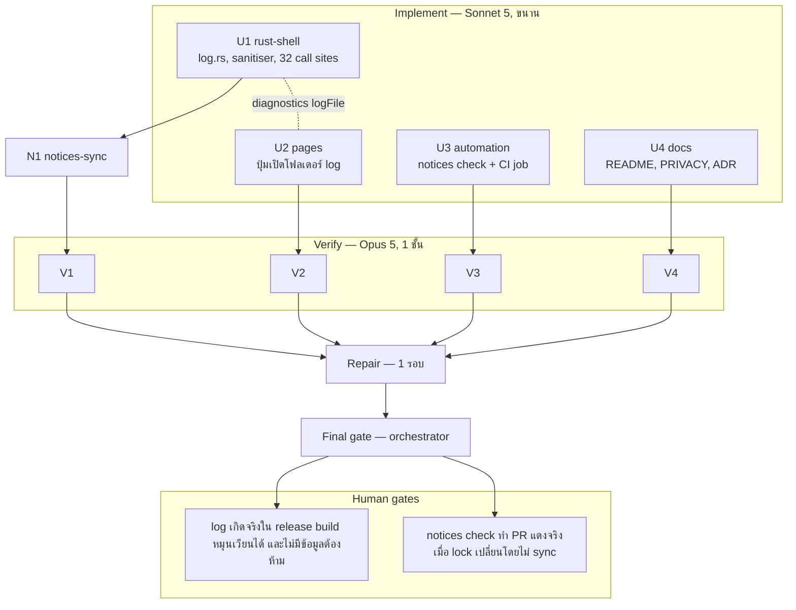

# Lalin Cast — Wave 9 "Supportability & guardrails": DAG และแผนดำเนินการ

## สถานะและขอบเขต

**CANDIDATE — approved for execution on branch `feat/wave9-supportability`** (แตกจาก `main` ที่ `00e32e4`)

Wave 9 เก็บช่องว่างสองข้อที่พิสูจน์ตัวเองแล้วว่าเป็นปัญหาจริง ไม่ใช่การเดา

**ข้อแรก — log ที่หายไปทั้งหมดใน release build** `src-tauri/src/main.rs` ประกาศ
`windows_subsystem = "windows"` สำหรับ build ที่ไม่ใช่ debug แปลว่าไม่มี console และ `eprintln!` **32 จุด**
ทั่วโค้ดเบสเขียนลง stderr ที่ไม่มีใครอ่านได้ ผู้ใช้ที่เจอ DIAL bind ไม่สำเร็จ, updater ล้ม, หรือหน้าต่างสร้างไม่ได้
จึงไม่มีอะไรส่งให้เราเลยนอกจากคำบรรยายด้วยปาก รีวิวเปิดตัวระบุข้อนี้ไว้ตั้งแต่ต้นและยังไม่เคยทำ

**ข้อสอง — invariant ของ notices หลุดได้เงียบ ๆ** ตอน merge Dependabot `tauri-plugin-store` 2.4.3 → 2.4.5
`THIRD_PARTY_NOTICES.md` หลุดจาก `Cargo.lock` ทันทีโดยไม่มี check ใดจับได้ ต้องตามเก็บด้วย PR แยก
(#12) หลังจากนั้น `cargo-deny` ตรวจ license ของ lock แต่ไม่รู้จักไฟล์ notices ของเราเลย

สิ่งที่ **ยังกันไว้:** ad filtering และทุกกลไกที่ดัก/แก้ทราฟฟิก (ปิดถาวรโดย ADR-004), userstyles,
low-memory, Lalin Remote, macOS/Linux

**ห้ามเพิ่ม crate, ห้ามเพิ่ม feature ของ `windows-sys`, ห้าม `unsafe` ใหม่** (กฎเต็มรูปแบบกลับมาทั้งหมด —
wave นี้ไม่มีข้อยกเว้น)

Complexity: **C-2**. Risk: **LOW–MEDIUM** (การเขียนไฟล์จาก thread หลายตัว; ความเสี่ยงสำคัญที่สุดคือ log
เผลอบันทึกข้อมูลที่ห้ามบันทึก)

| งาน | สาย | ที่มา |
|---|---|---|
| `src/log.rs` ไฟล์ log แบบหมุนเวียน + sanitiser + แทนที่ `eprintln!` ทั้ง 32 จุด | U1 | review 4.2 |
| command `settings_open_log_folder` + บรรทัด `logFile:` ใน diagnostics | U1 | support workflow |
| ปุ่มเปิดโฟลเดอร์ log ในหน้าตั้งค่า | U2 | — |
| CI job `notices` เทียบ `THIRD_PARTY_NOTICES.md` กับ `Cargo.lock` สองทาง (blocking) + สคริปต์ | U3 | บทเรียนจาก #6/#12 |
| README/PRIVACY/ADR-001/DOCS_INDEX | U4 | — |
| THIRD_PARTY_NOTICES sync (คาดว่าไม่เปลี่ยน) | N1 | — |
| ไม่ทำ: `injected.js` ไม่ต้องแก้เลยใน wave นี้ | — | — |

## ค่าคงที่และ contract (ทุกสายต้องใช้ตรงกัน)

### 1. ไฟล์ log (U1: `src/log.rs`)

- ที่อยู่: `<app_local_data_dir>/logs/lalin-cast.log` (โฟลเดอร์เดียวกับ `lifecycle.json`
  คือ `%LOCALAPPDATA%\ai.lalin.cast\logs\`) สร้างโฟลเดอร์ให้เองถ้ายังไม่มี
- หมุนเวียน: เมื่อไฟล์ปัจจุบัน **เกิน 512 KiB** ให้ `rename` ไปเป็น `lalin-cast.log.1` (ทับของเดิม) แล้วเริ่ม
  ไฟล์ใหม่ เก็บไว้ **สองไฟล์เท่านั้น** เพดานรวมจึงประมาณ 1 MiB และไม่โตต่อไม่มีที่สิ้นสุด
- รูปแบบบรรทัด: `<unix seconds> <LEVEL> <module>: <message>` โดย `LEVEL` ∈ {`INFO`, `WARN`, `ERROR`}
  (ใช้ unix seconds เพราะมี `lifecycle::now_unix` อยู่แล้ว ไม่ต้องเพิ่ม crate สำหรับ format เวลา)
- API: `log::info(app, module, message)`, `log::warn(...)`, `log::error(...)` ทั้งสามรับ `&AppHandle`
- **ทุกการเขียนต้องเงียบเมื่อล้มเหลว** ห้าม panic ห้าม block startup ห้าม propagate error
- thread safety: managed `LogState` ถือ `Mutex<()>` (หรือ `Mutex<Option<File>>`) ให้การ append + การตรวจ
  ขนาด + การหมุนเวียน เป็น critical section เดียว ไม่แย่งกันเขียนจนบรรทัดปนกัน
- ใน build ที่เป็น debug ให้ยัง `eprintln!` ควบคู่ไปด้วย เพื่อไม่ให้ developer เสียการเห็นข้อความทันที

### 2. Sanitiser — ข้อบังคับด้านความเป็นส่วนตัวของ wave นี้

pure fn `sanitize_log_message(raw: &str) -> String` ที่ต้องแทนที่สิ่งต่อไปนี้ **ก่อน** เขียนลงไฟล์เสมอ:

| รูปแบบที่พบ | แทนที่ด้วย |
|---|---|
| URL ที่ขึ้นต้นด้วย `http://`, `https://`, `lalin-cast://` (ถึงช่องว่างถัดไป) | `<url>` |
| path แบบ Windows ที่ขึ้นต้นด้วย `<ตัวอักษร>:\` หรือ `\\` (ถึงช่องว่างถัดไป) | `<path>` |
| ตัวอักษรควบคุมทุกตัว รวม `\r` `\n` | ช่องว่าง (หนึ่งบรรทัด log = หนึ่งบรรทัดไฟล์เสมอ) |

และตัดความยาวที่ **512 ตัวอักษร** (นับตัวอักษร ไม่ใช่ไบต์ เพื่อไม่ตัดกลางอักขระไทย)

tests ที่ต้องมี: URL ทั้งสาม scheme, path ทั้งสองแบบ, ข้อความปนกันหลายรายการในบรรทัดเดียว, ตัวอักษรควบคุม,
การตัดความยาว, และข้อความปกติที่ต้องไม่ถูกแตะเลย

**เหตุผล:** call site หลายจุดใส่ `{error}` ของ OS ลงไป ซึ่งฝัง path ของผู้ใช้ (จึงฝังชื่อบัญชี) ได้ การ sanitise
ที่ชั้นเดียวก่อนเขียนไฟล์ทำให้กฎ "ห้าม log TV code / cookie / token / URL / path" บังคับใช้ได้จริงโดยไม่ต้อง
ไว้ใจทุก call site

### 3. แทนที่ `eprintln!` (U1)

- `eprintln!` **ทั้ง 32 จุด** ใน `src-tauri/src/**` ต้องเปลี่ยนมาเรียก `log::warn`/`log::error` โดยคง
  ข้อความเดิมไว้ให้มากที่สุด และใส่ `module` เป็นชื่อโมดูลของจุดนั้น (`dial`, `updater`, `status`, ...)
- ข้อยกเว้นเดียว: จุดที่อยู่ก่อน `AppHandle` จะมีอยู่จริง (ถ้ามี) ให้คง `eprintln!` ไว้พร้อม comment อธิบาย
- หลังแก้เสร็จ `grep -rn "eprintln!" src-tauri/src` ต้องเหลือเฉพาะจุดที่มี comment อธิบายไว้ และใน
  `log.rs` เอง (debug mirror)

### 4. เปิดโฟลเดอร์ log (U1 + U2)

- command `settings_open_log_folder(window) -> Result<(), String>` label guard `settings`
  permission `allow-settings-open-log-folder` ใน `capabilities/settings.json` เท่านั้น
- เปิดด้วย `cmd /c start "" <โฟลเดอร์>` รูปแบบเดียวกับ `setup_open_network_settings` ที่มีอยู่แล้ว
  โดย path มาจาก `app_local_data_dir` เท่านั้น ไม่รับ argument จากหน้าเว็บ
- `diagnostics.rs` เพิ่มบรรทัด `logFile: <ชื่อไฟล์เท่านั้น ไม่ใช่ path เต็ม> (<ขนาดเป็น KiB>)` เพื่อไม่ให้
  diagnostics ที่ผู้ใช้แปะในรายงานปัญหามี path ที่มีชื่อบัญชี
- หน้า settings (U2): ปุ่ม `#open-log-folder-btn` ในกลุ่ม Updates/About + `#log-note` สองภาษา ระบุว่า log
  เก็บไว้ในเครื่องเท่านั้น ไม่ถูกส่งที่ใด หมุนเวียนสูงสุดประมาณ 1 MiB และไม่มีรหัสจับคู่ทีวีหรือลิงก์
- `settings.test.js` ครอบปุ่มใหม่ (สำเร็จ/Err)

### 5. CI check: notices เทียบ lock (U3)

- `scripts/check-notices.mjs` (Node ล้วน ไม่มี dependency): อ่าน `src-tauri/Cargo.lock` เก็บคู่
  `(name, version)` ของทุก `[[package]]` **ยกเว้น** `lalin-cast` เอง แล้วอ่านตารางใน
  `THIRD_PARTY_NOTICES.md` เก็บคู่เดียวกัน เทียบ **สองทาง** พิมพ์รายการที่ขาดในแต่ละทิศ และ `process.exit(1)`
  เมื่อไม่ตรง; ตรงกันให้พิมพ์จำนวนแล้ว exit 0
- job ใหม่ใน `ci.yml` ชื่อ `notices` (ubuntu-latest, **blocking** ไม่มี `continue-on-error`) ที่ checkout
  ด้วย SHA pin เดิมแล้วรัน `node scripts/check-notices.mjs` — ไม่ต้องใช้ Rust toolchain จึงเร็วเหมือน
  `supply-chain`
- ต้องรัน script นี้กับสภาพปัจจุบันแล้วผ่าน (528/528) และต้องสาธิตว่า **จับได้จริง** ด้วยการทดสอบชั่วคราว
  (แก้ไฟล์สำเนาในโฟลเดอร์ชั่วคราว ไม่แตะไฟล์จริง) แล้วรายงานผลทั้งสองกรณีใน notes
- `CHANGELOG.md` รายการ wave 9; `docs/runbooks/RELEASE_CHECKLIST.md` เพิ่ม H26

### 6. เอกสาร (U4)

- README: ส่วน "Support" หรือใกล้เคียง อธิบายว่ามีไฟล์ log ในเครื่อง ที่อยู่ ขนาดสูงสุด และปุ่มเปิดโฟลเดอร์
  พร้อมบอกว่าควรแนบอะไรเวลารายงานปัญหา
- PRIVACY (ไทย+อังกฤษ): หัวข้อใหม่สำหรับไฟล์ log — อยู่ในเครื่องเท่านั้น, ไม่ถูกส่งออกโดยอัตโนมัติ,
  ระบุชัดว่า URL และ path ถูกแทนที่ก่อนเขียน, ไม่มีรหัสจับคู่ทีวี คุกกี้ หรือ token, หมุนเวียนสูงสุดประมาณ
  1 MiB, และวิธีลบ (ลบโฟลเดอร์ `logs`) — เพิ่มลงหัวข้อ "การลบข้อมูล" ที่มีอยู่แล้วด้วย
- ADR-001: feature row + security rule ว่าการ log ผ่าน sanitiser ชั้นเดียวเป็นการบังคับใช้กฎ ไม่ใช่การ
  พึ่งวินัยของ call site + CHANGELOG row
- DOCS_INDEX: แผนนี้

### 7. N1 notices-sync (หลัง U1)

- ไม่มี crate ใหม่จึงคาดว่าไม่เปลี่ยน — รายงานตัวเลขและยืนยันด้วยสคริปต์เดียวกับที่ U3 สร้าง ถ้ามีอยู่แล้ว

## DAG

**Dependency scan:** `injected.js` ไม่ต้องแก้เลย จึงไม่มีสาย injected — ผู้ตรวจต้องยืนยันว่า
`src-tauri/injected.js` และ `injected.test.js` ไม่มี diff

## File ownership matrix (บังคับ)

| Stream | เขียนได้เฉพาะ | ห้ามแตะ |
|---|---|---|
| U1 rust-shell | `src-tauri/**` ยกเว้น `injected.js`, `injected.test.js`, `capabilities/default.json` | `injected*.js`, **`capabilities/default.json`**, `fallback/**`, เอกสาร, `.github/**`, `scripts/**` |
| U2 pages | `fallback/**` | โค้ดอื่น, เอกสาร, capabilities |
| U3 automation | `.github/workflows/ci.yml`, `scripts/**`, `CHANGELOG.md`, `docs/runbooks/RELEASE_CHECKLIST.md` | `release.yml`, dependabot, ISSUE_TEMPLATE, โค้ด, เอกสารอื่น |
| U4 docs | `README.md`, `PRIVACY.md`, `LALIN_PROVENANCE.md`, `docs/**` (ยกเว้น `docs/plans/**`, `docs/runbooks/RELEASE_CHECKLIST.md`), `.brain/**` | `THIRD_PARTY_NOTICES.md`, `TERMS.md`, `SECURITY.md`, `CHANGELOG.md`, โค้ด, `.github/**`, `scripts/**` |
| N1 notices-sync | `THIRD_PARTY_NOTICES.md` | อื่น ๆ |

กฎร่วมเหมือน wave 1–8 (ห้าม commit/push/branch, ห้ามติดตั้ง, ห้ามลบไฟล์นอกสิทธิ์, คำขอข้ามสาย →
`openQuestions`, ห้าม log/เก็บ TV code, cookie, token, URL ที่มี query) **ห้ามเพิ่ม crate/feature/`unsafe`**

## Stream specs และ acceptance criteria

### U1 rust-shell

1. `src/log.rs` ตาม contract 1 และ 2 ครบ พร้อม tests ของ sanitiser ทุกกรณีที่ระบุ และ test ของการหมุนเวียน
   ที่เขียนลง temp dir จริง (ไม่ใช่ `app_local_data_dir`) โดยไม่ sleep
2. แทนที่ `eprintln!` ครบตาม contract 3
3. `settings_open_log_folder` + permission + `logFile:` ใน diagnostics ตาม contract 4
4. `capabilities/default.json` diff ว่าง; `capabilities/settings.json` เพิ่ม permission เดียว
5. ห้าม crate/feature/`unsafe` ใหม่ — `unsafe` ต้องเท่ากับ 4 เท่าเดิม
6. **Quality gate:** fmt, clippy -D warnings, test, check, `git diff` ของ `injected*.js` ว่าง,
   `grep -rn VacuumTube src-tauri/src` ว่าง, `grep -rn "eprintln!" src-tauri/src` เหลือเฉพาะที่อธิบายไว้

### U2 pages

1. `fallback/settings.*` ตาม contract 4 + tests; หน้าอื่นไม่เปลี่ยน
2. **Quality gate:** `node --check` ทุกไฟล์, `node fallback/*.test.js` ผ่าน, grep inline script/handler ว่าง

### U3 automation

1. `scripts/check-notices.mjs` + job `notices` ตาม contract 5 พร้อมหลักฐานทั้งกรณีผ่านและกรณีจับได้
2. CHANGELOG + RELEASE_CHECKLIST (H26)
3. **Acceptance:** YAML parse ได้, ทุก `uses:` ยัง pin SHA, `release.yml`/dependabot diff ว่าง,
   job ใหม่ไม่มี `continue-on-error`

### U4 docs

1. ทุกข้อใน contract 6
2. **Acceptance:** ลิงก์ resolve, forbidden-word grep ว่าง, ตรง contract (โดยเฉพาะข้อความเรื่องสิ่งที่ log
   **ไม่** มี ต้องตรงกับ sanitiser จริง)

### N1 notices-sync (หลัง U1)

- ตาม contract 7

## Verify gate rubric (Opus 5)

เหมือน wave 8 เพิ่ม:

- sanitiser ถูกเรียก **ทุกเส้นทาง** ก่อนเขียนไฟล์ ไม่มีทางลัดที่เขียน raw ลงไฟล์ได้
- การหมุนเวียนมีเพดานจริง (ไฟล์ไม่โตไม่สิ้นสุด และไม่เก็บเกินสองไฟล์)
- การเขียน log ล้มเหลวแล้วเงียบจริง ไม่ panic ไม่ block startup
- `settings_open_log_folder` ไม่รับ path จากหน้าเว็บ และไม่มี permission ของมันในหน้าอื่น
- diagnostics ไม่มี path เต็มของไฟล์ log
- `injected.js` / `injected.test.js` diff ว่าง
- job `notices` เป็น blocking และสคริปต์ล้มจริงเมื่อข้อมูลไม่ตรง
- ไม่มี crate/feature/`unsafe` เพิ่ม
- Regression wave 1–8 ทั้งหมด

## Final gate (orchestrator)

1. integrated: fmt --check, clippy -D warnings, test, check, `node --check` ทุก `.js`, `node` ทุก suite,
   `node scripts/check-notices.mjs`, YAML parse, PowerShell parse
2. `git diff` ว่างของ `capabilities/default.json`, `injected*.js`, `release.yml`, `dependabot.yml`;
   `unsafe` = 4; ไม่มี crate ใหม่ใน `Cargo.toml`
3. diff review: sanitiser และทุก call site ของ log, การหมุนเวียน, สคริปต์ตรวจ notices
4. รายงาน + human gates H26–H27; ไม่ commit จนกว่าผู้ใช้จะสั่ง

## Out of scope / wave 10

LICENSE (human gate H1 — ต้องให้ผู้ก่อตั้งเลือกเอง), Authenticode signing (H4), portable mode,
userstyles แบบ sandbox, Lalin Remote, macOS/Linux

## Rollback

`git checkout -- . && git clean -fd` บน `feat/wave9-supportability` (ยกเว้นไฟล์นี้) คืนสภาพ `00e32e4`

## CHANGELOG

| Version | Date | Status | Summary | Commit Hash | Agent |
|---|---|---|---|---|---|
| 0.1.0b | 2026-09-21 | candidate | Wave 9 DAG, rotating-log and sanitiser contracts replacing 32 invisible eprintln calls, the log-folder command, and a blocking notices-vs-lock CI check; 4 parallel streams + notices sync, gates | uncommitted | LALIN |
